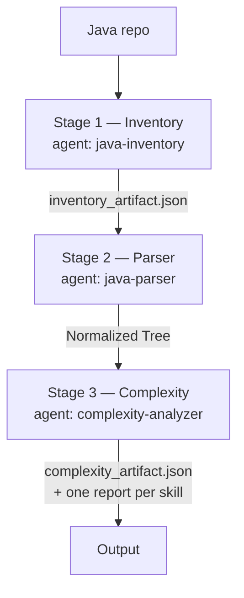

# adaptive-legacy-code-complexity-harness

Adaptive, language-aware harness for identifying legacy source code, selecting applicable
complexity analyses, orchestrating execution, generating traceable metric-level reports,
and consolidating results into a unified code complexity artifact.

**Input:** a Java repository (or any parse tree — ANTLR, AST, or an upstream parser artifact).
**Output:** one unified complexity artifact.
**Shape:** three agents, twenty skills, one contract.

---

## Table of contents

- [Architecture](#architecture)
  - [Data flow](#data-flow)
  - [Directory map](#directory-map)
  - [The three layers, and why they are separate](#the-three-layers-and-why-they-are-separate)
  - [Execution order](#execution-order)
  - [Stage 1 has no skills, deliberately](#stage-1-has-no-skills-deliberately)
- [The twenty complexities](#the-twenty-complexities)
- [Run it](#run-it)
- [The rule everything rests on](#the-rule-everything-rests-on)
- [Audited, not asserted](#audited-not-asserted)
- [Add complexity #21](#add-complexity-21)
- [Known limits](#known-limits)

---

# Architecture

## Data flow

Three stages, each owning one job and handing off a documented artifact. Each
stage is one agent that calls one deterministic script — the agent decides
*when* and *how* to run it and reports the outcome; the script is what
actually does the work, not the other way around.



| Stage | Agent | Agent file | Script the agent runs | What the script does | Produces | Schema |
|---|---|---|---|---|---|---|
| 1 — Inventory | `java-inventory` | `.claude/agents/1_inventory_agent.md` | `.claude/inventory/scanner.py` | Regex/heuristic scan. Declarations only — never enters a method body. | `inventory_artifact.json` | `docs/inventory-contract.md` |
| 2 — Parser | `java-parser` | `.claude/agents/2_parser_agent.md` | `.claude/parser/parser.py` | Hand-written tokenizer, standard library only. Reads inside each method body — which stage 1 deliberately does not — and builds the control-flow graph, call graph and dependency graph. | `normalized_tree.json` (the Normalized Tree) | `docs/analyzer-contract.md` |
| 3 — Complexity | `complexity-analyzer` | `.claude/agents/3_complexity_agent.md` | `.claude/complexities/run_pipeline.py` | discover → order → gate → run → merge across 20 skills | `complexity_artifact.json` + one report per skill | `docs/analyzer-contract.md` |

Stage 3 never sees source text — only the Normalized Tree stage 2 produced.
That is what makes the same 20 analyzers score COBOL, PL/SQL and Java without
modification: stage 2 is the only place that changes per language.

## Directory map

```
adaptive-legacy-code-complexity-harness/
│
├── CLAUDE.md                       Project memory. Loaded into every Claude Code
│                                   session: commands, conventions, the rules.
├── README.md                       This file.
│
├── .claude/                        ⚠ Contains PRODUCT CODE, not just tool config
│   │
│   ├── settings.json               Shared permissions. Checked in. Denies all
│   │                               access to plsql_to_brd/.
│   │
│   ├── agents/                     WHO orchestrates
│   │   ├── 1_inventory_agent.md      name: java-inventory
│   │   ├── 2_parser_agent.md         name: java-parser
│   │   └── 3_complexity_agent.md     name: complexity-analyzer
│   │
│   ├── rules/                      Path-scoped instructions. Load only when
│   │   └── analyzer-code.md        touching *.py under complexities/ or tools/.
│   │
│   ├── skills/                     WHAT each complexity is, and WHEN to use it
│   │   ├── cyclomatic-complexity/SKILL.md
│   │   ├── runtime-complexity/SKILL.md
│   │   └── … 20 in total, one per complexity
│   │
│   ├── complexities/               HOW each complexity is computed  ← product code
│   │   ├── _core.py                The shared contract. Read this first.
│   │   ├── 01_…20_*.py             One implementation per skill, paired by number
│   │   ├── run_pipeline.py         The runner
│   │   └── _superseded_style_a/    Original Style-A analyzers, preserved
│   │
│   ├── inventory/                  Stage 1                        ← product code
│   │   └── scanner.py              Java repo scanner
│   │
│   └── parser/                     Stage 2                        ← product code
│       └── parser.py               Tokenizer + statement scanner; builds the Normalized Tree
│
├── docs/
│   ├── system-overview.md          Start here
│   ├── inventory-contract.md       Shape of inventory_artifact.json
│   ├── analyzer-contract.md        How to build complexity #21
│   └── architecture-decisions.md   Why it is built this way, and what would reverse it
│
├── samples/
│   └── cobol_payroll.tree.json     Reference tree. Exercises every field.
│
└── tools/
    ├── judge.py                    Audits the analyzers — 10 adversarial checks each
    ├── 99_canary_complexity.py     Defective on purpose; proves the judge has teeth
    └── tree_bridge.py              Converts legacy Style-A trees
```

## The three layers, and why they are separate

| Layer | Answers | Lives in | Changes when |
|---|---|---|---|
| **Agent** | How do I run the whole thing? | `.claude/agents/` | The workflow changes |
| **Skill** | What is this complexity, when do I use it? | `.claude/skills/` | The concept changes |
| **Implementation** | How is the number computed? | `.claude/complexities/` | The algorithm changes |

Skill *N* pairs with implementation *N* by number:
`skills/runtime-complexity/` ↔ `complexities/17_runtime_complexity.py`.

Nothing holds a list of the 20. The agent and pipeline **discover** them by scanning
`.claude/complexities/[0-9][0-9]_*.py` and reading each file's `SPEC`. Drop in
`21_*.py` and it joins the next run with no edit anywhere else.

> **`.claude/` is not editor configuration here.** It holds the deliverable.
> Deleting it deletes the product. This is a deliberate choice matching the
> `plsql_to_brd` house convention; see `docs/architecture-decisions.md`.

## Execution order

Dependency depth decides order first, not band. A skill that consumes another
skill's finished report — declared in its own `depends_on` — never runs before
that report exists, regardless of which band either one sits in. Band is only
the tie-break among skills that don't depend on anything, which is most of
them:

```
size → structural → data → coupling → hazard → composite
```

Number (`sno`) is the final tie-break, so two runs over the same tree always
produce an identical plan. Depth is primary rather than band because depth is
derived from the real dependency graph in `depends_on`; band is a hand-assigned
label with nothing enforcing it stays consistent with that graph. In practice
`composite` still runs last — Maintainability consumes Cyclomatic and
Structural, Testability consumes Cyclomatic and Coupling, and Migration
consumes Control Flow, Database, Testability, Runtime and Architectural — but
that is a consequence of today's dependencies, not a rule the sort enforces by
band alone.

## Stage 1 has no skills, deliberately

Inventory is one deterministic scan, not twenty selectable analyses. There is
nothing to discover or choose among at runtime, so it has a scanner and no
`skills/` directory. Adding one would imply a choice that does not exist.

```bash
python .claude/inventory/scanner.py --repo-root <path-to-java-repo> -o out
```

---

## The twenty complexities

Every one is language-agnostic — they read a tree, never source text, so the same script
scores COBOL, PL/SQL and Java.

| Band | # | Complexity | Measures |
|---|---|---|---|
| size | 07 | Structural | Size and its distribution — where the mass sits |
| structural | 01 | Cyclomatic | Independent paths; the floor on test cases |
| | 02 | Cognitive | Readability cost; penalises nesting |
| | 03 | Control Flow | Unstructuredness; whether translation is viable |
| | 05 | Nesting | Control-structure depth |
| | 06 | NPath | Acyclic paths; what branch coverage misses |
| | 17 | Runtime | Growth class O(1)…O(2ⁿ) from loop nesting |
| data | 12 | Data Flow | How values and shared state move |
| coupling | 04 | Coupling | Fan-in/out; what can be extracted |
| | 08 | Cohesion | Whether a type's members belong together |
| | 09 | Dependency | Weight and kind of module dependencies |
| | 10 | Change Impact | Blast radius of a change |
| | 13 | Inheritance | Hierarchy depth and width |
| | 14 | Interface / API | Exposed contract surface |
| | 20 | Architectural | Cycles, Martin zones, layering, hubs |
| hazard | 15 | Database | SQL surface, dynamic SQL, N+1 patterns |
| | 18 | Configuration | External surface, build variants, hardcoding |
| composite | 11 | Maintainability | Maintainability Index |
| | 16 | Testability | Test burden vs test friction |
| | 19 | Migration | Volume vs blockers → migration strategy |

---

## Run it

```bash
# all twenty
python .claude/complexities/run_pipeline.py samples/cobol_payroll.tree.json -o out

# one skill, standalone or piped
python .claude/complexities/17_runtime_complexity.py tree.json
cat tree.json | python .claude/complexities/01_cyclomatic_complexity.py

# what is installed and what each needs
python .claude/complexities/run_pipeline.py --list
```

Embedded in any harness:

```python
from importlib import import_module
report = import_module("17_runtime_complexity").analyze(tree)
```

Reference run:

```
measured 20/20 (100%)   not measured: 0   errors: 0
overall level L5   hotspots 3
```

---

## The rule everything rests on

**A skill starved of its declared inputs returns `insufficient_input` naming the gap.
It never returns a zero.**

This is not a style preference. Analyzers here once returned clean-looking zeros — and
one batch printed complete reports built from hardcoded sample data — when handed input
they could not read. Verified: given a file declaring `language: ZZZ-MY-FILE` with 1
unit, one analyzer reported `language: java` with 2 units. Running the suite would have
produced 7 genuine results and 13 fabricated ones, with nothing distinguishing them.

Zeros look like good news. The gate is enforced centrally in `_core.run()` before a skill
is ever invoked, so it cannot be forgotten by an individual author.

---

## Audited, not asserted

```bash
python tools/judge.py samples/cobol_payroll.tree.json --self-test
# 20 pass   0 minor   0 CRITICAL
# self-test OK: canary correctly flagged CRITICAL
```

Ten adversarial checks per skill: contract conformance, starvation behaviour,
determinism, evidence behind severe scores, honest input declaration.

`C10` is the one that matters. `C2` can only exercise the central gate, so it proves a
SPEC is *wired*, not *complete*. `C10` strips undeclared inputs and fails a skill whose
score moves while confidence stays at 1.0. It caught two real defects on its first run —
skills #18 and #19 both read line counts they never declared, and #18 treated an unknown
line count as maximal scatter, manufacturing a finding out of missing data.

`tools/99_canary_complexity.py` is defective on purpose and **must** come back CRITICAL.
The judge passed all 20 skills on its first run, which is equally consistent with a judge
that cannot detect anything — the canary is how you tell the difference.

---

## Add complexity #21

```bash
cp .claude/complexities/01_cyclomatic_complexity.py .claude/complexities/21_my_complexity.py
mkdir .claude/skills/my-complexity
```

Edit the `SPEC`, write `analyze()`, add the `SKILL.md`. Nothing else changes — the agent
and pipeline discover it by scanning. Full contract in
[docs/analyzer-contract.md](docs/analyzer-contract.md).

---

## Known limits

- **Band calibration is judgement, not measurement.** Thresholds reflect published
  practice and field experience, not a statistical study of a reference corpus. Re-fit
  them against your own codebase once enough runs exist.
- **A tree is only as good as its parser.** Skills report what the tree carries. If the
  parser drops comments, data references or a control-flow graph, the affected skills say
  `insufficient_input` — which is a parser gap, not a clean codebase.
- **`_superseded_style_a/`** holds the original Style-A analyzers, preserved unmodified.
  `tools/tree_bridge.py` converts a Style-A tree if you still have one.
