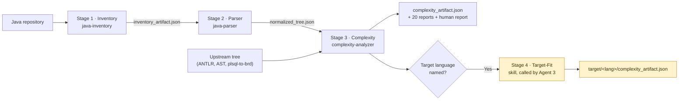
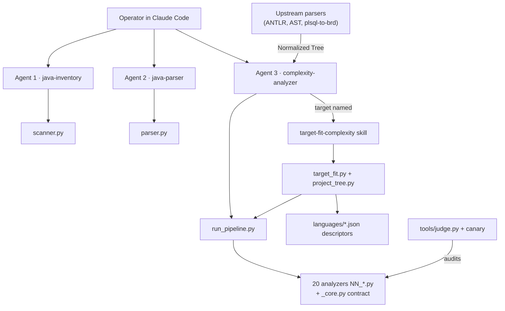
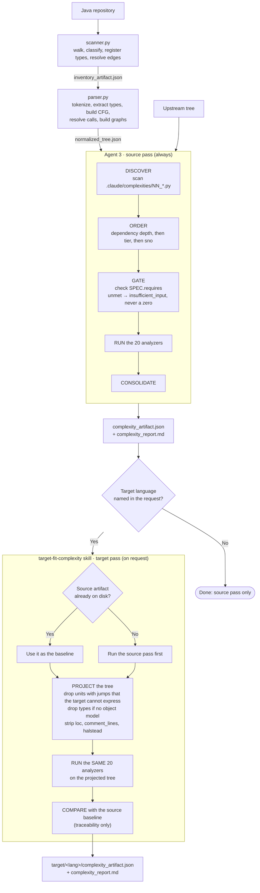
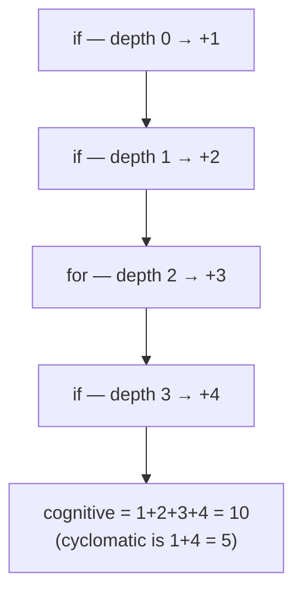
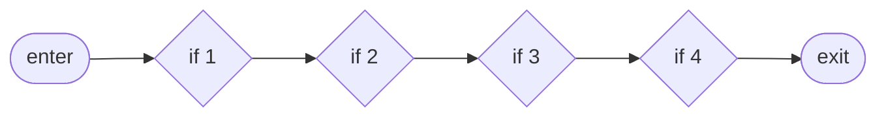
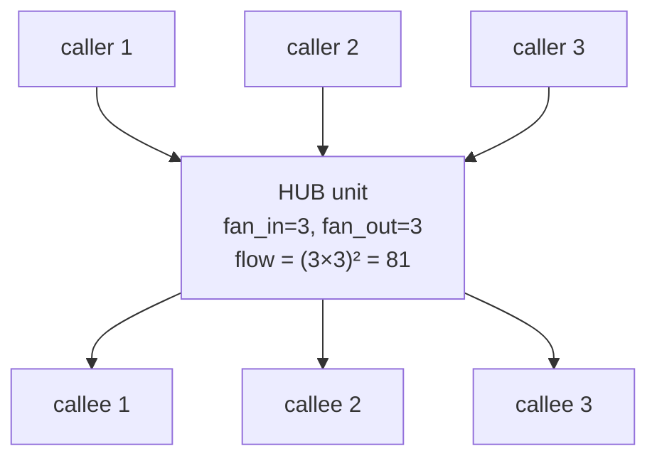
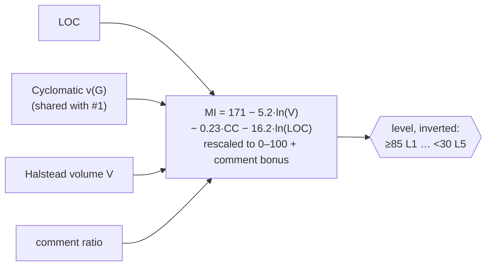

<div align="center">

# adaptive-legacy-code-complexity-harness — Language-Aware Complexity Measurement for Legacy Code Modernization

**adaptive-legacy-code-complexity-harness is an agentic harness that measures the complexity of legacy source code. It takes a Java repository or a parse tree through these steps to one unified complexity artifact that you can trace to its source:**

`scan the repository` → `parse the method bodies` → `discover the analyzers` → `order them` → `gate their inputs` → `run 20 complexities` → `consolidate` → `project onto a target language (optional)`.


**[Summary](#1-summary)** ·
**[Agents](#23-the-3-agents-and-the-target-fit-skill)** ·
**[Complexities](#8-the-20-complexity-skills)** ·
**[Workflow](#4-the-end-to-end-workflow)** ·
**[Target-Fit](#10-stage-4--the-target-fit-skill)** ·
**[Run it](#13-how-to-run-adaptive-legacy-code-complexity-harness)** ·
**[Glossary](#18-glossary)**

</div>

> [!NOTE]
> This README uses ASD-STE100 Simplified Technical English. The writing rules and the project
> vocabulary are in [`docs/ste-style-guide.md`](docs/ste-style-guide.md). Each term in the
> [Glossary](#18-glossary) has only one meaning.

>

The harness measures the complexity of legacy code from a **parse tree**, not from source text.
Twenty analyzers read one language-neutral shape, the Normalized Tree. Thus, the same analyzers score Java, COBOL and PL/SQL with no change.
For Java, the harness makes the tree itself in two stages. For other languages, an upstream parser makes the tree.
An optional fourth stage projects the tree onto a target language and runs the same 20 analyzers again.

This README is the **one location that explains all of the harness**. It gives these topics:

- the general design
- each of the 3 agents and the target-fit skill
- each of the 20 complexities, and the five most important formulas in detail
- the decision rules
- the audit of the analyzers
- the data map
- the runbook
- the validation results and the known problems

| If you are… | Read |
|---|---|
| A manager or reviewer | [1](#1-summary), [3](#3-design-rules), [4](#4-the-end-to-end-workflow), [15](#15-validation-results), [17](#17-key-points) |
| A developer who joins the project | All sections, in sequence. Keep [13](#13-how-to-run-adaptive-legacy-code-complexity-harness), [14](#14-how-to-extend-adaptive-legacy-code-complexity-harness) and [16](#16-known-problems) open while you work |
| An operator who runs an analysis | [13](#13-how-to-run-adaptive-legacy-code-complexity-harness), then the section for the stage that you run (sections [5](#5-stage-1--inventory) to [10](#10-stage-4--the-target-fit-skill)) |
| A person who needs one complexity | The [complexity index](#8-the-20-complexity-skills), then the file `.claude/skills/<name>/SKILL.md` |

---

## Table of contents

1. 🧭 [Summary](#1-summary)
2. 🏗️ [How adaptive-legacy-code-complexity-harness is built](#2-how-adaptive-legacy-code-complexity-harness-is-built)
   - 2.1 [Agents, skills and analyzers: the three layers](#21-agents-skills-and-analyzers-the-three-layers)
   - 2.2 [System context](#22-system-context)
   - 2.3 [The 3 agents and the target-fit skill](#23-the-3-agents-and-the-target-fit-skill)
   - 2.4 [Repository layout](#24-repository-layout)
3. 🛡️ [Design rules](#3-design-rules)
4. 🔄 [The end-to-end workflow](#4-the-end-to-end-workflow)
   - 4.1 [Full flow](#41-full-flow)
   - 4.2 [Execution order](#42-execution-order)
   - 4.3 [The life cycle of one run](#43-the-life-cycle-of-one-run)
5. 🔵 [Stage 1 · Inventory](#5-stage-1--inventory)
6. 🟢 [Stage 2 · Parser](#6-stage-2--parser)
7. 🟣 [Stage 3 · Complexity](#7-stage-3--complexity)
   - 7.1 [The Normalized Tree](#71-the-normalized-tree)
   - 7.2 [The report envelope and the levels](#72-the-report-envelope-and-the-levels)
   - 7.3 [The complexity artifact and the hotspots](#73-the-complexity-artifact-and-the-hotspots)
   - 7.4 [The human report](#74-the-human-report)
8. 📊 [The 20 complexity skills](#8-the-20-complexity-skills)
9. 🔬 [The top 5 complexities in detail](#9-the-top-5-complexities-in-detail)
   - 9.1 [Cyclomatic Complexity](#91-cyclomatic-complexity) · 9.2 [Cognitive Complexity](#92-cognitive-complexity) · 9.3 [NPath Complexity](#93-npath-complexity) · 9.4 [Coupling Complexity](#94-coupling-complexity) · 9.5 [Maintainability Complexity](#95-maintainability-complexity)
10. 🎯 [Stage 4 · The target-fit skill](#10-stage-4--the-target-fit-skill)
    - 10.1 [The three projection rules](#101-the-three-projection-rules)
    - 10.2 [Target descriptors and their review](#102-target-descriptors-and-their-review)
    - 10.3 [The target artifact](#103-the-target-artifact)
11. ⚖️ [The audit: judge and canary](#11-the-audit-judge-and-canary)
12. 🗂️ [Data and file map](#12-data-and-file-map)
13. ▶️ [How to run adaptive-legacy-code-complexity-harness](#13-how-to-run-adaptive-legacy-code-complexity-harness)
    - 13.1 [Prerequisites](#131-prerequisites) · 13.2 [Installation](#132-installation) · 13.3 [Run the stages](#133-run-the-stages) · 13.4 [Run through the agents](#134-run-through-the-agents) · 13.5 [Checks before a pull request](#135-checks-before-a-pull-request) · 13.6 [Environment variables](#136-environment-variables)
14. 🧩 [How to extend adaptive-legacy-code-complexity-harness](#14-how-to-extend-adaptive-legacy-code-complexity-harness)
15. ✅ [Validation results](#15-validation-results)
16. ⚠️ [Known problems](#16-known-problems)
17. 📌 [Key points](#17-key-points)
18. 📖 [Glossary](#18-glossary)
19. 📄 [License](#19-license)

---

## 1. Summary

**The problem.** A modernization programme must know which parts of a legacy codebase will cause difficulty, how much difficulty, and why. These questions are difficult:

- How do you measure Java, COBOL and PL/SQL with the same rules?
- How do you tell "no complexity found" from "nothing was measured"?
- How do you show that each number comes from a real input, not from a guess?
- How do you know that the measurement code itself is correct?
- What does each measurement become if the code moves to a different language?

The harness gives each of these questions its own mechanism. Each stage writes a documented artifact that the next stage reads.

| Item | Value |
|---|---|
| Input | A Java repository, or a Normalized Tree from an upstream parser (ANTLR, AST JSON or the `plsql-to-brd` parser artifact) |
| Output | `complexity_artifact.json`, one report `reports/NN_<id>.json` for each analyzer, and `complexity_report.md` (written by Agent 3) |
| Optional output | `target/<lang>/complexity_artifact.json` and its reports, when the request names a target language |
| Stages | **4**: Inventory → Parser → Complexity → Target-Fit (Stage 4 only on request) |
| Agents | **3**: `java-inventory`, `java-parser`, `complexity-analyzer` |
| Skills | **21**: 20 complexity skills and the `target-fit-complexity` skill |
| Tiers | **6**: `size` → `structural` → `data` → `coupling` → `hazard` → `composite` |
| Levels | **5**: `L1` trivial · `L2` low · `L3` moderate · `L4` high · `L5` severe |
| Dependencies | Python standard library only, in all analyzers, the scanner, the parser and the target-fit scripts |
| Central rule | An analyzer without its declared inputs returns `insufficient_input`. It never returns a zero. |
| Audit | `tools/judge.py`: 10 checks for each analyzer, and a canary analyzer that must fail |
| Target descriptors | **5**: `cobol`, `cpp`, `java`, `plsql`, `python`. All have `"reviewed": false`. |
| Tests | **21** unit tests for the target-fit skill (`tests/test_target_fit.py`). There is no CI. |


```mermaid
flowchart LR
    IN["Java repository"] --> S1["Stage 1 · Inventory<br/>java-inventory"]
    S1 -->|"inventory_artifact.json"| S2["Stage 2 · Parser<br/>java-parser"]
    S2 -->|"normalized_tree.json"| S3["Stage 3 · Complexity<br/>complexity-analyzer"]
    EXT["Upstream tree<br/>(ANTLR, AST, plsql-to-brd)"] --> S3
    S3 --> OUT["complexity_artifact.json<br/>+ 20 reports + human report"]
    S3 --> Q{"Target language<br/>named?"}
    Q -->|"Yes"| S4["Stage 4 · Target-Fit<br/>skill, called by Agent 3"]
    S4 --> OUT2["target/&lt;lang&gt;/complexity_artifact.json"]

    classDef optional fill:#fff3cd,stroke:#b8901f,color:#3d2f00
    class S4,OUT2 optional
```

| Stage | Done by | The question that the stage answers |
|---|---|---|
| 🔵 **1 · Inventory** | Agent `java-inventory` | What Java types does this repository declare, and what does each type depend on? |
| 🟢 **2 · Parser** | Agent `java-parser` | What does each method do: its control flow, its calls and its data? |
| 🟣 **3 · Complexity** | Agent `complexity-analyzer` | Which parts of this codebase will cause difficulty, how much, and why do we believe it? |
| 🎯 **4 · Target-Fit** | Skill `target-fit-complexity` | If the destination is language X, what does each of the 20 measurements become? |

---

## 2. How adaptive-legacy-code-complexity-harness is built

### 2.1 Agents, skills and analyzers: the three layers

The harness has three layers. Each layer has one job and changes for one reason.

| Layer | Answers | Location | Changes when |
|---|---|---|---|
| **Agent** | How do I run the full stage? | `.claude/agents/` | The workflow changes |
| **Skill** | What is this complexity, and when do I use it? | `.claude/skills/` | The concept changes |
| **Analyzer** (implementation) | How is the number calculated? | `.claude/complexities/` | The algorithm changes |

Skill *N* pairs with analyzer *N* by number. For example, `skills/runtime-complexity/` pairs with `complexities/17_runtime_complexity.py`.

No file holds a list of the 20 analyzers. The agent and the pipeline **discover** them. They scan `.claude/complexities/[0-9][0-9]_*.py` and read the `SPEC` of each file. If you add `21_*.py`, it joins the next run with no other change.

> **`.claude/` is not editor configuration in this repository.** It holds the product code.
> If you delete `.claude/`, you delete the product. This choice follows the `plsql_to_brd`
> convention. `docs/architecture-decisions.md` gives the reasons.

Each stage is one agent that calls one deterministic script. The agent decides *when* and *how* to run the script, and it reports the result. The script does the work.

### 2.2 System context


```mermaid
flowchart TB
    U["Operator in Claude Code"] --> A1["Agent 1 · java-inventory"]
    U --> A2["Agent 2 · java-parser"]
    U --> A3["Agent 3 · complexity-analyzer"]
    A1 --> SC["scanner.py"]
    A2 --> PA["parser.py"]
    A3 --> RP["run_pipeline.py"]
    RP --> AN["20 analyzers NN_*.py<br/>+ _core.py contract"]
    A3 -->|"target named"| SK["target-fit-complexity skill"]
    SK --> TF["target_fit.py + project_tree.py"]
    TF --> RP
    TF --> LD["languages/*.json descriptors"]
    J["tools/judge.py + canary"] -->|"audits"| AN
    UP["Upstream parsers<br/>(ANTLR, AST, plsql-to-brd)"] -->|"Normalized Tree"| A3
```

### 2.3 The 3 agents and the target-fit skill

| Stage | Agent or skill | Definition file | Script that it runs | What the script does | Output | Schema |
|---|---|---|---|---|---|---|
| 1 · Inventory | Agent `java-inventory` | `.claude/agents/1_inventory_agent.md` | `.claude/inventory/scanner.py` | A regex and heuristic scan. Declarations only. It never reads a method body. | `inventory_artifact.json` | `docs/inventory-contract.md` |
| 2 · Parser | Agent `java-parser` | `.claude/agents/2_parser_agent.md` | `.claude/parser/parser.py` | A hand-written tokenizer, standard library only. It reads each method body and makes the CFG, the call graph and the dependency graph. | `normalized_tree.json` | `docs/analyzer-contract.md` and the header of `_core.py` |
| 3 · Complexity | Agent `complexity-analyzer` | `.claude/agents/3_complexity_agent.md` | `.claude/complexities/run_pipeline.py` | Discover → order → gate → run → consolidate, over 20 analyzers | `complexity_artifact.json`, one report for each analyzer, `complexity_report.md` | `docs/analyzer-contract.md` |
| 4 · Target-Fit | Skill `target-fit-complexity`. Agent 3 calls it only when the request names a target language. | `.claude/skills/target-fit-complexity/SKILL.md` | `.claude/target_fit/target_fit.py` | Projects the tree onto the target language. Then it runs the same 20 analyzers with the functions of `run_pipeline.py`, with no copy of their code. | `target/<lang>/complexity_artifact.json` and one report for each analyzer | `docs/target-fit-contract.md` |

Stage 3 never reads source text. It reads only the Normalized Tree. Thus, the same 20 analyzers score COBOL, PL/SQL and Java with no change. Stage 2 is the only stage that changes for each language.

Stage 4 uses the same fact in the other direction. The 20 analyzers do not expect a language. Thus, they can run a second time on a *projected* tree and give independent target scores. These scores are not a copy of the Stage 3 numbers, and they are not a guess.

**Stage 1 has no skills, by design.** The inventory is one deterministic scan, not twenty analyses to select from. Nothing is discovered or selected at runtime. Thus, Stage 1 has a scanner and no `skills/` folder. A skill folder suggests a choice that does not exist.

### 2.4 Repository layout

```
adaptive-legacy-code-complexity-harness/
├── CLAUDE.md                       project memory for each Claude Code session: commands, conventions, rules
├── README.md                       this file
├── explain.md                      every BankingSystem score, explained in plain words
├── LICENSE                         MIT
├── .claude/                        ⚠ contains the PRODUCT CODE, not only tool configuration
│   ├── settings.json               shared permissions; denies all access to plsql_to_brd/
│   ├── agents/                     WHO runs each stage
│   │   ├── 1_inventory_agent.md      name: java-inventory
│   │   ├── 2_parser_agent.md         name: java-parser
│   │   └── 3_complexity_agent.md     name: complexity-analyzer (calls the target-fit skill on request)
│   ├── rules/analyzer-code.md      path-scoped rules for the analyzer and tool code
│   ├── skills/                     WHAT each complexity is, and WHEN to use it (21 SKILL.md files)
│   │   ├── cyclomatic-complexity/SKILL.md
│   │   ├── …                       20 complexity skills, one for each complexity
│   │   └── target-fit-complexity/SKILL.md   Stage 4
│   ├── complexities/               HOW each complexity is calculated  ← product code
│   │   ├── _core.py                the shared contract; read this first
│   │   ├── 01_…20_*.py             one analyzer for each skill, paired by number
│   │   ├── run_pipeline.py         the runner
│   │   └── _superseded_style_a/    the original Style-A analyzers (7 files), kept unchanged
│   ├── inventory/scanner.py        Stage 1                          ← product code
│   ├── parser/parser.py            Stage 2                          ← product code
│   └── target_fit/                 Stage 4 (the skill runs it)      ← product code
│       ├── project_tree.py         projects a tree onto a target language
│       ├── target_fit.py           project → run the 20 analyzers → compare with Stage 3
│       ├── schema.md               the fields that a descriptor must declare
│       ├── config.json             default target language (not read today)
│       └── languages/              cobol, cpp, java, plsql, python + _pending/ for drafts
├── docs/
│   ├── system-overview.md          start here
│   ├── inventory-contract.md       the shape of inventory_artifact.json
│   ├── analyzer-contract.md        how to build complexity #21
│   ├── target-fit-contract.md      how Stage 4 projects a tree
│   ├── architecture-decisions.md   AD-01 to AD-12: the decisions and what can reverse them
│   └── ste-style-guide.md          writing rules and project vocabulary
├── samples/
│   ├── cobol_payroll.tree.json     reference tree; it uses every field
│   └── java_bank/                  11 Java files for the Stage 1 + 2 reference run
├── tests/
│   ├── test_target_fit.py          21 unit tests for Stage 4
│   ├── sample_tree_cobol.json      a COBOL tree for those tests
│   └── java_sample/                a small Java project for the inventory scanner
├── tools/
│   ├── judge.py                    audits the analyzers: 10 checks each
│   ├── 99_canary_complexity.py     defective on purpose; proves that the judge can fail
│   └── tree_bridge.py              converts a Style-A tree into a Normalized Tree
└── outputs/                        committed demonstration results (Section 12)
```

---

## 3. Design rules

The file `docs/architecture-decisions.md` records each decision, what it prevents and what can reverse it.

### 3.1 One tree format (AD-01)
All analyzers read the same Normalized Tree. Before this rule, the 20 analyzers used two shapes with no shared field names. A tree in the wrong shape did not cause an error. It gave `units seen: 0` and a result that looked clean.

### 3.2 Declared inputs, gated in one location (AD-02)
Each analyzer declares `requires`, `requires_any` and `optional` in its `SPEC`. `_core.run()` checks them **before** the analyzer runs. A missing required input gives `insufficient_input` with the name of the field. An analyzer cannot run without its inputs, even if its author forgot the check.

### 3.3 A pure function first, the CLI second (AD-03)
Each analyzer is `analyze(tree) -> dict`. It has no file IO, no global values and no output to the screen. The CLI is a thin shell around the function. Any harness can import the function, test it directly and call it many times in one process.

### 3.4 Self-describing analyzers, no registry (AD-04)
The pipeline finds analyzers by their file names and reads each `SPEC`. There is no list to update. If one file has an import error, the pipeline reports it and continues with the other files.

### 3.5 A deterministic order (AD-05)
Dependency depth decides the order first. The tier is the next key, and the number (`sno`) is the last key. Two runs on the same tree make the same plan. Section [4.2](#42-execution-order) gives the details.

### 3.6 Levels, not raw scores (AD-06)
Each analyzer reports a level `L1` to `L5` and a score. The level thresholds change with the language where it is necessary. For example, the Cyclomatic thresholds are `(10, 20, 35, 50)` by default and `(15, 35, 55, 75)` for COBOL.

### 3.7 Two analyzers must agree before a unit is a hotspot (AD-07)
A unit is a hotspot only when **two or more independent analyzers** put it at `L4` or `L5`. One analyzer alone often shows only its own bias. For example, a long paragraph of straight-line assignments is large but not complex.

### 3.8 The judge must be able to fail (AD-08)
`tools/judge.py` runs 10 checks on each analyzer. `tools/99_canary_complexity.py` is defective on purpose, and it must fail with `CRITICAL`. A test suite that always reports PASS gives no information about the code.

### 3.9 Standard library only (AD-09)
No analyzer, no scanner and no parser uses a third-party package. Legacy modernization often occurs in air-gapped client networks. In those networks, a new package can need a change request of several weeks.

### 3.10 Deterministic output (AD-10)
An analyzer report has no timestamp. The pipeline adds one timestamp to the artifact. Thus, you can compare the reports of two runs to see if the complexity changed.

### 3.11 `plsql_to_brd/` is never committed (AD-11)
`plsql_to_brd/` is in `.gitignore` with a warning comment, and `.claude/settings.json` denies all access to it.

### 3.12 A target descriptor needs a review before full confidence (AD-12)
`target_fit.py` reads descriptors only from `.claude/target_fit/languages/`. A new draft goes into `languages/_pending/`, which no run reads. An unreviewed descriptor sets the confidence of the target artifact to 0.6.

### 3.13 Code conventions
- `skills/` describes and `complexities/` implements.
- An analyzer writes only its final JSON to stdout. Diagnostics go to stderr, because a stray `print()` corrupts the report.
- Do not calculate again what `_core.py` already gives: `Tree.cyclomatic()`, `Tree.max_depth()`, `Tree.walk_depth()`, `Tree.count()`, `level_from()`, `worst()`.

---

## 4. The end-to-end workflow

### 4.1 Full flow


```mermaid
flowchart TD
    R["Java repository"] --> S1["scanner.py<br/>walk, classify, register types, resolve edges"]
    S1 -->|"inventory_artifact.json"| S2["parser.py<br/>tokenize, extract types, build CFG,<br/>resolve calls, build graphs"]
    S2 -->|"normalized_tree.json"| CORE
    UP["Upstream tree"] --> CORE
    subgraph CORE["Agent 3 · source pass (always)"]
        direction TB
        D1["DISCOVER<br/>scan .claude/complexities/NN_*.py"] --> D2["ORDER<br/>dependency depth, then tier, then sno"]
        D2 --> D3["GATE<br/>check SPEC.requires<br/>unmet → insufficient_input, never a zero"]
        D3 --> D4["RUN the 20 analyzers"]
        D4 --> D5["CONSOLIDATE"]
    end
    CORE --> SRC["complexity_artifact.json<br/>+ complexity_report.md"]
    SRC --> Q{"Target language<br/>named in the request?"}
    Q -->|"No"| DONE(["Done: source pass only"])
    Q -->|"Yes"| SKILL
    subgraph SKILL["target-fit-complexity skill · target pass (on request)"]
        direction TB
        T0{"Source artifact<br/>already on disk?"}
        T0 -->|"Yes"| REUSE["Use it as the baseline"]
        T0 -->|"No"| RUNSRC["Run the source pass first"]
        REUSE --> P["PROJECT the tree<br/>drop units with jumps that the target cannot express<br/>drop types if no object model<br/>strip loc, comment_lines, halstead"]
        RUNSRC --> P
        P --> R2["RUN the SAME 20 analyzers<br/>on the projected tree"]
        R2 --> CMP["COMPARE with the source baseline<br/>(traceability only)"]
    end
    CMP --> OUT["target/&lt;lang&gt;/complexity_artifact.json<br/>+ complexity_report.md"]
```

The flow keeps two promises. The source pass runs **one time at most**: Agent 3 uses it again if it exists, and makes it if it does not exist. The target scores are **calculated on the projected tree**. The source artifact is read only to make the comparison, never to make a target number.

### 4.2 Execution order

Dependency depth decides the order first. An analyzer that reads the finished report of another analyzer declares it in `depends_on`. It never runs before that report exists, in all tiers. The tier is the next key, and it orders the analyzers that do not depend on another analyzer:

```
size → structural → data → coupling → hazard → composite
```

The number (`sno`) is the last key. Thus, two runs on the same tree make the same plan.

Depth is the first key because it comes from the real dependency graph in `depends_on`. The tier is a label that a person gives, and nothing checks it against that graph. Today, the `composite` tier still runs last, because only composites have a depth above 0:

- Maintainability (11) depends on Cyclomatic (1) and Structural (7).
- Testability (16) depends on Cyclomatic (1) and Coupling (4).
- Migration (19) depends on Control Flow (3), Database (15), Testability (16), Runtime (17) and Architectural (20).

### 4.3 The life cycle of one run

1. The operator asks Agent 3 to analyze a tree, and can name a target language.
2. Agent 3 checks that the tree exists and is valid JSON.
3. `run_pipeline.py` discovers each `NN_*.py` that exports `SPEC` and `analyze()`. It skips other files and tells why.
4. The pipeline sorts the analyzers by depth, tier and `sno`.
5. For each analyzer, `_core.run()` checks `requires` and `requires_any`. If an input is missing, the result is `insufficient_input` and the analyzer does not run.
6. The analyzer runs. A composite gets the reports of the analyzers in its `depends_on` that `run_pipeline.py` maps in `_UPSTREAM_KEYS`.
7. If an analyzer raises an exception, the pipeline records `status: error` and continues.
8. `consolidate()` merges the reports, rolls up the levels for each unit and finds the hotspots.
9. The pipeline writes `reports/NN_<id>.json` and `complexity_artifact.json`.
10. Agent 3 writes `complexity_report.md` with the `Write` tool. No script writes this file.
11. If the request named a target language, Agent 3 calls the target-fit skill one time for each target.

---

## 5. Stage 1 · Inventory

**Purpose.** Answer one question that you can defend: *what is in this repository, and what does each Java type declare that it depends on?*

| Input | Output |
|---|---|
| A repository root | `OUTPUT_DIR/inventory_artifact.json` |

**Procedure** (`scanner.py`)

1. Check that the repository root exists and is a folder.
2. Walk the tree one time in sorted order. Skip the excluded folders: `.git`, `target`, `build`, `out`, `bin`, `dist`, `.idea`, `.gradle`, `.mvn`, `.settings`, `.vscode`, `node_modules`. `--exclude-dirs` adds folders to this list.
3. Classify each file: Java source, build, configuration, SQL or unclassified.
4. Register each top-level type (class, interface, enum, record, annotation) with its package, file and line.
5. After all types are known, resolve the `import`, `extends` and `implements` edges in a second pass. A file that is read early can extend a type in a file that is read later.
6. If no `.java` file is found, stop with exit code 2.
7. Print the summary: file, type and edge counts, and the number of issues.

**Rules**

- **Declaration level only.** No method body, no call graph, no control flow.
- **Never invent a fact.** A file with no top-level type registers nothing and logs an `issue`. An edge that does not resolve to a type in this repository stays with `resolved: false`. It is not dropped and not guessed.
- **An unresolved edge is not an error.** Most targets are JDK or library types. Only issues with severity `warning` or `error` need a person: duplicate type id, file name mismatch, no declaration found, possible inheritance cycle.
- **Heuristic.** Resolution is best-effort. Two classes with the same simple name in different packages, or a class that only a wildcard import refers to, can resolve incorrectly.

The full field-by-field schema is in [`docs/inventory-contract.md`](docs/inventory-contract.md).

---

## 6. Stage 2 · Parser

**Purpose.** Start where the inventory stops. Read each method body and make the Normalized Tree that every analyzer reads.

| Input | Output |
|---|---|
| `inventory_artifact.json` (preferred) or a repository root | `OUTPUT_DIR/normalized_tree.json` |

**Procedure** (`parser.py`)

1. Check that the inventory artifact is valid JSON, and that its `meta.repo_root` (or `--repo-root`) is a folder.
2. Tokenize each `.java` file. Extract each type, including nested types that the inventory does not see.
3. For each method and constructor, make a CFG, extract the field references and writes, and resolve the calls.
4. Resolve a call against the declared receiver types: `this`, `super`, fields, parameters, local variables, a static `TypeName` and `new Type`.
5. Write the units, the types, the call graph and the type-level dependency graph.
6. If no `.java` file is found, stop with exit code 2.

**CFG vocabulary that the Java parser writes:** `SEQUENCE`, `BLOCK`, `IF`, `ELIF`, `ELSE`, `CASE`, `DEFAULT`, `TERNARY`, `AND`, `OR`, `FOR`, `FOREACH`, `WHILE`, `DO_WHILE`, `CATCH`, `FINALLY`, `RAISE`, `RETURN`, `CALL`. `ELSE`, `DEFAULT` and `FINALLY` open a nesting level only. They are never decisions.

**Rules**

- **Never invent a fact.** A method body that the parser cannot scan still gives a unit with an empty `SEQUENCE` CFG, and an `issue`. A call with a receiver type that the parser cannot infer is not in the call graph.
- **Traceability.** Each unit traces to a type, a file and a line span. Each CFG node has its source line.
- **Known limits** (listed at the top of `parser.py`):
  - Overloads resolve by name and number of arguments only.
  - Calls on chained expressions, generics and JDK return values are not in the call graph.
  - Lambdas and anonymous classes are scanned into the CFG of the method that contains them.
  - Annotations are skipped.

**Verification.** After the parse, run the pipeline and the judge on the new tree. On `samples/java_bank`, the reference result is `measured 18/20 (90%)`. Database and Configuration correctly give `insufficient_input`.

---

## 7. Stage 3 · Complexity

**Purpose.** Answer one question that you can defend: *which parts of this codebase will cause difficulty, how much, and why do we believe it?*

| Parameter | Description | Required |
|---|---|---|
| `TREE` | The path to the Normalized Tree JSON | Yes |
| `OUTPUT_DIR` | The folder for the reports and the artifact | No (default `./out/`) |
| `ONLY` | A comma-separated list of `sno` values, for example `1,3,17` | No |
| `LANGUAGE` | A replacement for `tree.language` when the tree does not declare one | No |
| `TARGET_LANGUAGE` | A target language to score as well. It starts the target-fit skill. | No |

**Rules for Agent 3**

- **Read-only on the tree.** Do not change, parse again or make the tree again. A wrong tree is an upstream defect. Report it.
- **No fixed list of skills.** Skills come from the scan.
- **No override of the gate.** No operator and no flag can run an analyzer without its inputs.
- **Zero is a result. Absence is not a result.** An analyzer that measured and found nothing reports `0` with `status: ok`. An analyzer that could not measure reports `insufficient_input`.
- **One failed analyzer does not stop the run.** Record it, continue and mark the artifact incomplete.
- **Show incomplete coverage in the headline.** Coverage below 20 of 20 is not a footnote.

### 7.1 The Normalized Tree

The header of `.claude/complexities/_core.py` documents the shape. This is a short version:

```
tree = {
  "language": "cobol|plsql|java|...",
  "source_file": "path",                                   # optional
  "units": [ { "id", "name", "owner_type", "loc", "comment_lines",
               "start_line", "end_line", "params", "references", "globals", "writes",
               "cfg": { "node_type": "SEQUENCE", "children": [...] },
               "halstead", "sql", "cursors", "transactions", "platform_calls",
               "dynamic_constructs", "config_reads", "feature_flags",
               "conditional_compilation", "literals", "meta" } ],
  "types": [ { "id", "name", "kind", "module", "fields", "methods", "extends", "implements" } ],
  "call_graph":       { "nodes": [id], "edges": [ { "from", "to" } ] },
  "dependency_graph": { "nodes": [id], "edges": [ { "from", "to", "kind" } ] },
  "layers": { ... }, "module_layer": { ... }                # optional
}
```

The CFG `node_type` vocabulary is uppercase and language-neutral:

| Group | Node types |
|---|---|
| Structure | `SEQUENCE` `BLOCK` |
| Branch | `IF` `ELIF` `ELSE` `CASE` `DEFAULT` `TERNARY` `AND` `OR` |
| Loop | `FOR` `WHILE` `DO_WHILE` `UNTIL` `LOOP` `PERFORM_UNTIL` `PERFORM_VARYING` `CURSOR_LOOP` `FOREACH` |
| Error | `CATCH` `FINALLY` `RAISE` |
| Jump | `GOTO` `ALTER` `PERFORM_THRU` `FALL_THROUGH` `RETURN` `EXIT` |
| Effect | `CALL` `SQL` `EXEC_SQL` `DB` `QUERY` `IO` `FILE` `NETWORK` `SCREEN` `DISPLAY` `PLATFORM` `SYSTEM` `SORT` `SEARCH` |

`DECISION_NODES` is the branch set and the loop set, without `ELSE` and `DEFAULT`. The false path of a branch already exists. If you count `ELSE`, each unit gets one extra path for each branch.

### 7.2 The report envelope and the levels

All analyzers return the same envelope, so a harness merges the results with no special case. `_core.py` does these jobs for each analyzer:

| Job | Location |
|---|---|
| Check `requires` before `analyze` runs | `_core.run()` |
| Lower the confidence when an `optional` input is missing | `_core.normalize()` |
| Put an exception into the envelope | `_core.run()` |
| CLI, stdin, `-o`, `--spec` | `_core.cli_main()` |
| Tier order and dependency depth | `run_pipeline.py` |
| Upstream reports for composites | `run_pipeline.py` |

| Status | Exit code | Meaning |
|---|---|---|
| `ok` | 0 | The analyzer measured. A score of 0 is a real result. |
| `insufficient_input` | 2 | A declared input is missing. The report names the field. |
| `error` | 1 | The analyzer raised an exception. |

The five levels are `L1` trivial, `L2` low, `L3` moderate, `L4` high and `L5` severe. A higher level is worse.

### 7.3 The complexity artifact and the hotspots

`consolidate()` merges all reports into `complexity_artifact.json`. It never calculates a score again. Each number traces to one report.

| Field | Contents |
|---|---|
| `artifact_version`, `pipeline_version`, `generated_at` | Version `1.0`, pipeline `1.0.0`, one UTC timestamp for the run |
| `tree` | Path, language, source file, number of units, and `capabilities` (which tree fields are present) |
| `coverage` | Analyzers discovered, `ok`, `insufficient_input` and `error`, `completeness`, and `not_measured` with the reasons |
| `overall` | `level` (the worst level of all measured analyzers), `mean_level`, `mean_confidence` |
| `by_tier` | The level, score and status of each analyzer, grouped by tier |
| `hotspots` | Up to 25 units that two or more analyzers put at `L4` or `L5`, sorted by the number of analyzers |
| `reports` | One line for each analyzer: status, level, score, headline, confidence |

The worst level stops one real problem from hiding behind many good results. The mean level stops one outlier from overstating the full codebase.

### 7.4 The human report

Agent 3 also writes `complexity_report.md` for a reader with no technical background. No script writes this file. Each claim in it must trace to one of four sources:

- `complexity_artifact.json`
- the reports in `OUTPUT_DIR/reports/`
- the **Purpose** and **Method** sections of each `SKILL.md`
- `inventory_artifact.json` and the Normalized Tree

The report has 12 sections in a fixed sequence: title, table of contents, about this report, about this codebase, why we ran this analysis, the pipeline steps, the overall score, the order of analysis, what was measured, one deep section for each measured complexity, the complexities not measured, and the conclusion. It never scores again, and it gives a missing measurement the same weight as a measured one.

---

## 8. The 20 complexity skills

Each analyzer reads a tree, never source text. Thus, the same script scores COBOL, PL/SQL and Java. The `requires` and `optional` columns come from the `SPEC` of each analyzer.

| Tier | # | Complexity | Measures | Requires | Optional | Depends on |
|---|---|---|---|---|---|---|
| size | 07 | Structural | Size and its distribution: where the mass of the code is | `units` | `cfg`, `loc`, `comment_lines` | — |
| structural | 01 | Cyclomatic | Independent paths: the minimum number of test cases | `units`, `cfg` | `loc` | — |
| | 02 | Cognitive | Cost to read, with a penalty for nesting | `units`, `cfg` | `loc` | — |
| | 03 | Control Flow | Unstructured flow: can a tool translate the code mechanically? | `units`, `cfg` | — | — |
| | 05 | Nesting | Maximum and mean depth of control structures | `units`, `cfg` | — | — |
| | 06 | NPath | Acyclic execution paths: what branch coverage does not test | `units`, `cfg` | — | — |
| | 17 | Runtime | Growth class O(1) to O(2ⁿ) from loop nesting | `units`, `cfg` | `call_graph` | — |
| data | 12 | Data Flow | How much data, and shared state, each unit moves | `units` + one of `references`, `params` | `cfg` | — |
| coupling | 04 | Coupling | Fan-in, fan-out and information flow: what you can extract | `units`, `call_graph` | `dependency_graph` | — |
| | 08 | Cohesion | Do the members of a type belong together? (LCOM4 / LCOM-HS) | `units`, `types` + one of `references`, `call_graph` | — | — |
| | 09 | Dependency | Weight, kind and shape of the module dependencies | `dependency_graph` | — | — |
| | 10 | Change Impact | Transitive reach of a change to each unit | `call_graph` | `dependency_graph`, `units` | — |
| | 13 | Inheritance | Depth (DIT) and width (NOC) of type hierarchies | `types` | — | — |
| | 14 | Interface / API | Size and shape of the exposed contract | `units` + one of `types`, `params` | `meta`, `dependency_graph` | — |
| | 20 | Architectural | Dependency cycles, Martin zones, layer violations, hubs | `dependency_graph` | `types`, `call_graph`, `layers`, `units` | — |
| hazard | 15 | Database | SQL surface, schema reach, dynamic SQL, queries in loops | `units` + one of `sql`, `cursors`, `transactions` | `cfg`, `dependency_graph` | — |
| | 18 | Configuration | External surface, build variants, hard-coded values, scattered configuration | `units` + one of `config_reads`, `literals`, `conditional_compilation`, `feature_flags` | `dependency_graph`, `loc` | — |
| composite | 11 | Maintainability | Maintainability Index from size, branches, volume and comments | `units`, `cfg`, `loc` | `halstead`, `comment_lines` | 1, 7 |
| | 16 | Testability | Test burden (paths) apart from test friction (obstacles) | `units`, `cfg` | `references`, `globals`, `writes`, `call_graph`, `dependency_graph`, `meta` | 1, 4 |
| | 19 | Migration | Volume against blockers, mapped to a migration strategy for each unit | `units`, `cfg` | `sql`, `platform_calls`, `dynamic_constructs`, `dependency_graph`, `conditional_compilation`, `loc` | 3, 15, 16, 17, 20 |

Migration (19) gives a strategy for each unit: rehost, replatform, refactor, rearchitect or rebuild.

To see what is installed and what each analyzer needs, run `python .claude/complexities/run_pipeline.py --list`.

---

## 9. The top 5 complexities in detail

These five are the classic metrics with a formula. Each one is a published software-engineering measure with an exact definition, not a heuristic. Each section gives what the complexity means, the exact formula, the logic of the formula and a worked number. The worked numbers come from the BankingSystem run in `outputs/BankingSystem/complexity_artifact.json`. The file [`explain.md`](explain.md) explains that run in full. Each formula is what the paired `.claude/complexities/NN_*.py` calculates.

Two conventions apply to all five:

- **A higher value is worse for four of them. Maintainability is inverted:** a higher MI is better, so its level thresholds go down.
- **`ELSE` and `DEFAULT` never add a value.** That path already exists as the other side of the branch above it. To count it is the most frequent error in these metrics.

### 9.1 Cyclomatic Complexity

> `.claude/complexities/01_cyclomatic_complexity.py` · McCabe 1976, *A Complexity Measure*, IEEE TSE SE-2(4)

**What it means.** The number of linearly independent paths through a unit. It is the minimum number of test cases for full branch coverage.

**Formula.**

```
v(G) = 1 + (number of decision nodes in the CFG of the unit)
```

**The logic.** Each decision node (`IF`, `WHILE`, `FOR`, a `CASE` arm, `CATCH`, a boolean `AND` or `OR`) adds one independent path. The count starts at 1 for the one straight path that always exists. The harness does not count `ELSE` or `DEFAULT`, because the false side is not a *new* path.


```mermaid
flowchart TD
    S([enter]) --> D1{if a?}
    D1 -->|yes| B1[do X]
    D1 -->|no| D2{while b?}
    B1 --> D2
    D2 -->|yes| B2[loop body]
    B2 --> D2
    D2 -->|no| E([exit])
    %% 2 decision nodes (if a, while b) -> v(G) = 1 + 2 = 3
```

**Worked example (BankingSystem).** The method with the most branches, `Bank.Bank.withdraw`, has **4** decision points, so `v(G) = 1 + 4 = 5`. This is below the default threshold of 10, so the level is **L1 (trivial)**. For all 38 methods, full branch coverage needs **70** test cases. The thresholds change with `tree.language`, because a COBOL paragraph usually has many more branches than a Java method. The default thresholds are `(10, 20, 35, 50)`.

### 9.2 Cognitive Complexity

> `.claude/complexities/02_cognitive_complexity.py` · Campbell / SonarSource 2018, *Cognitive Complexity — A new way of measuring understandability*

**What it means.** How difficult the unit is for a person to read and understand. It does not count tests. It relates to the time that a change takes.

**Formula.** Walk the CFG. For each node, add:

```
cognitive = Σ over flow-breaking nodes of ( 1 + nesting_depth_at_that_node )
          + Σ over flat boolean chains (AND / OR / TERNARY) of ( 1 )     # no nesting bonus
          ( ELSE / DEFAULT add 0 )
```

**The logic.** Cyclomatic gives the same value to a flat `switch` with 20 arms and to four nested `if` statements. But a person can read the first one quickly and not the second one. Cognitive complexity adds a **nesting penalty**: a branch at depth 3 costs `1 + 3 = 4`, and the same branch at the top level costs `1`. A boolean chain (`a && b && c`) adds 1 for the full chain, with no nesting penalty. The **difference between cognitive and cyclomatic is a finding**: a large difference means that the difficulty comes from the structure (reduce the nesting), not from the number of branches.


```mermaid
flowchart TD
    A["if — depth 0 → +1"] --> B["  if — depth 1 → +2"]
    B --> C["    for — depth 2 → +3"]
    C --> D["      if — depth 3 → +4"]
    D --> E["cognitive = 1+2+3+4 = 10<br/>(cyclomatic is 1+4 = 5)"]
```

**Worked example (BankingSystem).** The most difficult unit, `Data.FileIO.Read`, scores **8**. Two `catch` blocks and two `if` checks cause this score, not deep nesting. No code in this codebase goes deeper than 2 levels. The difficulty comes from the number of branches, so the level is **L2 (low)** on the thresholds `(5, 15, 25, 40)`.

### 9.3 NPath Complexity

> `.claude/complexities/06_npath_complexity.py` · Nejmeh 1988, *NPATH: a measure of execution path complexity*

**What it means.** The number of different acyclic execution paths through a unit. Cyclomatic counts the paths that you must test to cover each **edge**. NPath counts the **combinations**. The two numbers can differ by a large amount.

**Formula.** Paths multiply through a sequence, and each construct multiplies by its own factor:

```
NPath(unit) = Π over the CFG of the per-construct factor
  IF / ELIF / TERNARY / AND / OR / CATCH → 2   (taken / not taken)
  loop                                   → 2   (entered / skipped)
  CASE with n arms                       → n
  (the count stops at 10¹² — a larger exact value gives no more information)
```

**The logic.** Ten `if` statements in sequence give `v(G) = 1 + 10 = 11` but `NPath = 2¹⁰ = 1,024`. Branch coverage needs 11 tests to touch each branch. NPath shows 1,013 *combinations* of those branches that the tests do not cover. Thus, "full branch coverage" and "all combinations tested" are different claims. NPath is an **upper limit**, because it assumes that the branches are independent. Related conditions make the real number of paths lower. For this reason, its confidence is 0.85.


```mermaid
flowchart LR
    S([enter]) --> A{if 1}
    A --> B{if 2}
    B --> C{if 3}
    C --> D{if 4}
    D --> E([exit])
    %% four independent binary decisions in sequence
    %% NPath = 2 x 2 x 2 x 2 = 16    (cyclomatic = 1 + 4 = 5)
```

**Worked example (BankingSystem).** The worst method has 4 independent binary decisions in sequence, so it has `2 × 2 × 2 × 2 = 16` combinations. This agrees with the cyclomatic score `1 + 4 = 5` of the same method: the same four decisions, *multiplied* and not *added*. You can test all 16 combinations, so the level is **L1 (trivial)** on the thresholds `(200, 2000, 20000, 200000)`.

### 9.4 Coupling Complexity

> `.claude/complexities/04_coupling_complexity.py` · Henry & Kafura 1981, *Software Structure Metrics Based on Information Flow*

**What it means.** How tightly a unit connects to the rest of the system. Coupling, not the internal complexity, decides *what you can move*. A simple unit can be impossible to extract if forty other units call it.

**Formula.** For each unit, from the call graph:

```
fan_in  = number of distinct units that call this one
fan_out = number of distinct units that this one calls
information_flow = (fan_in × fan_out)²
```

**The logic.** The **square** is the important part. A unit that many units call, and that calls many units, is a routing hub. To remove it is a project, not a task, and the square makes this combination dominant. High fan-in with low fan-out is a leaf utility. It is safe while its contract stays the same. High fan-out with low fan-in is an orchestrator, and it moves with the units that it calls. The analyzer gives each unit a shape: `hub` (fan_in ≥ 3 **and** fan_out ≥ 3), `utility`, `orchestrator` or `isolated`. The shape of the coupling is more important than its volume.


```mermaid
flowchart TD
    C1[caller 1] --> H
    C2[caller 2] --> H
    C3[caller 3] --> H
    H["HUB unit<br/>fan_in=3, fan_out=3<br/>flow = (3×3)² = 81"]
    H --> D1[callee 1]
    H --> D2[callee 2]
    H --> D3[callee 3]
```

**Worked example (BankingSystem).** No method is a hub. The maximum fan-in is 3 and the maximum fan-out is 6, but no method has both high values. 35 of the 38 methods can be extracted independently, and 10 are fully isolated. The level is **L1 (trivial)** on the thresholds `(4, 16, 64, 256)`, which grow as a square like the metric. Call targets that do not resolve lower the confidence, because each fan-out is then a lower limit.

### 9.5 Maintainability Complexity

> `.claude/complexities/11_maintainability_complexity.py` · Oman & Hagemeister 1992 · SEI/Microsoft Maintainability Index. **Inverted: a higher value is better.**

**What it means.** The one 0 to 100 number that stakeholders ask for. An AI must never *invent* it. Its value comes from a **transparent calculation** from measured inputs, so each point traces to a real input.

**Formula (SEI/Microsoft variant).**

```
MI = max(0, 171 − 5.2·ln(V) − 0.23·CC − 16.2·ln(LOC)) × 100 / 171
        + 50·sin(√(2.4 · comment_ratio))          # comment-density bonus, with a limit

  V   = Halstead volume        (the value from the parser if present, else an estimate from size)
  CC  = cyclomatic complexity  (the SAME v(G) as metric #1, from Tree.cyclomatic, so the two always agree)
  LOC = lines of code
```

**The logic.** Three independent properties make code more difficult to maintain: **size** (`LOC`), **branches** (`CC`) and code **volume** (`V`, operators and operands). The MI equation weights each with coefficients that come from real maintenance data. Because of the logarithms, the first few hundred lines cost much more for each line than line ten thousand. MI is "higher is better", so its level thresholds go **down**: `MI ≥ 85 → L1 (easy)` and `MI < 30 → L5 (severe)`. The function `level_from_inverted` reads them. MI uses the cyclomatic number of metric #1 directly, so the two metrics can never disagree.


```mermaid
flowchart LR
    LOC[LOC] --> MI
    CC["Cyclomatic v(G)<br/>(shared with #1)"] --> MI
    V["Halstead volume V"] --> MI
    CR[comment ratio] --> MI
    MI["MI = 171 − 5.2·ln(V)<br/>− 0.23·CC − 16.2·ln(LOC)<br/>rescaled to 0–100 + comment bonus"]
    MI --> B{{"level, inverted:<br/>≥85 L1 … <30 L5"}}
```

**Worked example (BankingSystem).** The MI of all 38 methods, weighted by LOC, is **37.8 / 100**. This is low on a scale where a higher value is better. The overall level **L5 (severe)** comes from the *worst method*, not from the mean: 12 of the 38 methods are at L5. The confidence is only **0.7**, because two optional inputs were missing. The Halstead volume was an *estimate* from size and branches, and no comment data was available for the bonus. Both gaps move the estimate toward a worse value than the real one.

---

## 10. Stage 4 · The target-fit skill

**Purpose.** Answer a different question from Stage 3. Not "how complex is this code", but "if the destination of this codebase is language X, what is each of the 20 measurements?"

Stage 4 is the `target-fit-complexity` **skill**, not a separate agent. Ask Agent 3 for a run and **name a target language**, for example "check complexity for target Python". The agent finds the named target and calls the skill. If the request names no target, the skill does not run. Agent 3 never assumes a target. If the request names more than one target, Agent 3 calls the skill one time for each target.

Stage 4 does **not** copy the Stage 3 numbers or weight them again. It projects the Normalized Tree onto the target, then runs the **same** 20 analyzers a second time on the projected tree. It uses the functions `discover()`, `order()`, `execute()` and `consolidate()` of `run_pipeline.py`. It has no copy of their code.

```
Normalized Tree  +  Target descriptor
        |
        v
  project_tree()  --  drops units with jumps that the target cannot express,
        |             drops `types` if no object model, strips loc/comment_lines/halstead
        v
  Projected Tree   (a second, valid Normalized Tree)
        |
        v
  run_pipeline.discover() / order() / execute() / consolidate()
        |             the SAME functions and the SAME 20 analyzers as Agent 3
        v
  Target complexity artifact
        |
        v
  + comparison section, made from the complexity_artifact.json of Agent 3
    (read only here, never used to calculate a target score)
```

### 10.1 The three projection rules

The rules are generic and come from the descriptor. No rule names a specific source or target language.

1. **Jump constructs.** If the CFG of a unit contains `GOTO`, `ALTER`, `PERFORM_THRU` or `FALL_THROUGH` (the `JUMP_NODES` set of `_core.py`), and the descriptor says that the target cannot express it (`supports_goto`, `supports_alter_style_dynamic_jump`), the unit is dropped. The skill does not try a mechanical rewrite. `projection.units_dropped` records the reason. If the target supports the construct, the node stays.
2. **Object model.** If `multiple_inheritance` is `null` in the descriptor (no object model, as for COBOL and PL/SQL), `types` is dropped. Cohesion (8) and Inheritance (13) then give `insufficient_input` through the usual central gate.
3. **Volume fields.** `loc`, `comment_lines` and `halstead` are stripped from each unit, for each target, always. Nobody can project the size of code that does not exist yet, and the skill does not invent a ratio. Structural (7) declares `loc` optional, so it still runs with lower confidence and counts CFG nodes. Maintainability (11) declares `loc` required, so it gives `insufficient_input`.

All other fields describe what the code *does*, not the language. They go through the projection with no change: `references`, `writes`, `globals`, `params`, `meta`, `sql`, `cursors`, `transactions`, `platform_calls`, `dynamic_constructs`, `config_reads`, `feature_flags`, `conditional_compilation`, `literals`, `call_graph` and `dependency_graph`.

**The one sharp edge.** The central gate stops an analyzer only for a missing *required* field. Migration (19) declares `loc` as *optional*. When `loc` is stripped, its code `unit.get("loc", 0)` uses zero and continues. `_core.normalize()` lowers the confidence and names `loc` in `confidence.reasons`. Thus, a target score can be different from the source score for a reason that has no relation to the target language. The projection log has a `fields_stripped_caveat` entry that states this. Before you read a difference as a finding, check `confidence.reasons` in that report.

### 10.2 Target descriptors and their review

A target language is one descriptor file in `.claude/target_fit/languages/`. The file name is the language id: `python.json` answers `--target python`. `schema.md` lists the fields.

| Required field | Meaning |
|---|---|
| `id` | The language id. It must agree with the file name. |
| `display_name` | The name for generated text |
| `structured_control_flow_only` | `false` if the language allows unrestricted jumps |
| `supports_goto` | A `GOTO` equivalent exists |
| `supports_alter_style_dynamic_jump` | A jump target can change at runtime (COBOL `ALTER`) |
| `typing` | `static` or `dynamic` |
| `numeric_model.native_fixed_point` | The language has a native exact decimal type |
| `exception_model` | How errors propagate |
| `native_sql_access` | How the code gets to SQL |
| `native_screen_io` | The language itself talks to a screen |
| `source` | `drafted` or `reviewed` |
| `reviewed` | A person checked each field against real documentation |

Optional fields: `garbage_collected`, `manual_memory_management`, `concurrency_model`, `multiple_inheritance`, `multiple_inheritance_notes`, `notes`.

| Descriptor | `supports_goto` | `supports_alter_style_dynamic_jump` | `multiple_inheritance` | `reviewed` |
|---|---|---|---|---|
| `cobol` | true | true | null (no object model) | false |
| `cpp` | true | false | true | false |
| `java` | false | false | false | false |
| `plsql` | true | false | null (no object model) | false |
| `python` | false | false | true | false |

**The review cycle.**

1. **Draft.** Write a new `<language>.json` in `languages/_pending/` with `"source": "drafted"` and `"reviewed": false`.
2. **Review.** A person checks each field against the documented behaviour of the language and corrects it.
3. **Promote.** Move the file into `languages/` and set `"reviewed"` to `true`.

No file leaves `_pending/` automatically. If a target has no descriptor in `languages/`, the run stops with `insufficient_input` and lists the available targets. It never uses a guessed profile.

### 10.3 The target artifact

```
outputs/<project>/target/<language>/
  reports/NN_*.json          ← one for each analyzer, the same shape as Stage 3
  complexity_artifact.json   ← the Stage 3 shape, plus the fields below
  complexity_report.md       ← written by the agent
```

| Added field | Contents |
|---|---|
| `source_language`, `target_language` | The two languages |
| `descriptor_source`, `descriptor_reviewed` | The provenance of the descriptor |
| `confidence` | `1.0` for a reviewed descriptor, `0.6` with a reason for an unreviewed one |
| `projection` | Units projected, units dropped with reasons, fields stripped, object model dropped, and the caveat |
| `source_baseline` | Whether the source artifact was found, and its path |
| `comparison` | For each `sno`: source status, score and level, and target status, score and level |

By default, `target_fit.py` looks for `complexity_artifact.json` next to the tree file. `--source-artifact` gives a different path. `-o` changes the output folder from `<tree_dir>/target/<target>/`.

---

## 11. The audit: judge and canary

```bash
python tools/judge.py samples/cobol_payroll.tree.json --self-test
# 20 pass   0 minor   1 CRITICAL      (the CRITICAL line is the canary)
# self-test OK: canary correctly flagged CRITICAL
```

The judge runs 10 checks on each analyzer:

| Check | What it checks |
|---|---|
| `C1` | The full envelope and the correct id |
| `C2` | Without its declared inputs, the analyzer gives `insufficient_input`, not a zero |
| `C3` | An empty tree gives the same result |
| `C4` | The same tree two times gives the same bytes |
| `C5` | With no input, the analyzer fails visibly. It does not print an invented demo report. |
| `C6` | An `L4` or `L5` level has items or hotspots as evidence |
| `C7` | The confidence is declared, and each value below 1.0 has a reason |
| `C8` | The score is finite, not negative, and not at the limit of its thresholds |
| `C9` | The analyzer runs with any language label |
| `C10` | **Honest SPEC.** Remove the inputs that the analyzer did not declare. If the score changes while the confidence stays at 1.0, the SPEC is incomplete. |

**`C10` is the most important check.** `C2` can only test the central gate. Thus, it proves that a SPEC is *connected*, not that it is *complete*. On its first run, `C10` found two real defects. Analyzers #18 and #19 read line counts that they did not declare. #18 also used an unknown line count as maximum scatter, and so made a finding from missing data. The fix was a score of 0 with lower confidence, not a guess.

**The canary.** `tools/99_canary_complexity.py` is defective on purpose, and it **must** return `CRITICAL`. The judge passed all 20 analyzers on its first run. That result is also what a judge that finds nothing gives. The canary shows the difference. In its first version, the canary found 4 of 5 planted defects and missed one. That miss showed the limit of `C2` and caused the addition of `C10`. Today, the canary fails on `C4_determinism`, `C5_no_demo`, `C6_evidence` and `C7_confidence`.

**The rule that all of this protects.** *An analyzer without its declared inputs returns `insufficient_input` and names the gap. It never returns a zero.* In the past, analyzers here returned clean zeros when they could not read their input. One group of analyzers printed full reports from hard-coded sample data. In one test, a file declared `language: ZZZ-MY-FILE` with 1 unit, and one analyzer reported `language: java` with 2 units. In that state, a full run of the suite can give 7 real results and 13 invented results, with no visible difference between them. A zero looks like good news. For this reason, the gate is in `_core.run()`, and no author can forget it.

---

## 12. Data and file map

**Committed demonstration results: `outputs/`.** Git commits this folder. It holds named results for demonstration.

| Folder | Source | Contents |
|---|---|---|
| `outputs/BankingSystem/` | A Java repository in `input/BankingSystem` (not committed) | Inventory, tree, 20 reports, artifact, `complexity_report.md` |
| `outputs/BankingSystem/target/python/` | Stage 4 on the tree above | 20 reports, artifact, `complexity_report.md`, `source_vs_target_comparison.md` |
| `outputs/java_bank/` | `samples/java_bank` | Inventory, tree, 20 reports, artifact, `complexity_report.md` |
| `outputs/java_bank/target/python/`, `target/cpp/` | Stage 4 on the tree above | 20 reports, artifact, `complexity_report.md` |
| `outputs/java_sample/` | `tests/java_sample` | `inventory_artifact.json` only |
| `outputs/SAMPLE-PROGRAM/` | An older run | 7 Style-A reports (cyclomatic, cognitive, control flow, coupling, nesting, NPath, structural) |

**Scratch output (not committed).** `.gitignore` excludes `out/` and `output/` (ad hoc `-o out` runs) and `input/` (cloned third-party repositories to scan).

**Input samples.**

| Path | Use |
|---|---|
| `samples/cobol_payroll.tree.json` | The reference tree. It uses every field, so all 20 analyzers measure. |
| `samples/java_bank/` | 11 Java files for the Stage 1 and Stage 2 reference run |
| `tests/sample_tree_cobol.json` | A COBOL tree for the target-fit tests |
| `tests/java_sample/` | A small Java project with a `pom.xml` and an `application.properties` file |

---

## 13. How to run adaptive-legacy-code-complexity-harness

### 13.1 Prerequisites

| Need | For |
|---|---|
| Python 3 (the checks in Section 15 ran on Python 3.11.9) | All scripts |
| No third-party package | All scripts use the standard library only |
| Git | Clone and commit |
| Claude Code | Only to run the stages through the agents and the skills |

### 13.2 Installation

```bash
gh repo clone KrishnaAnnavaram/adaptive-legacy-code-complexity-harness
cd adaptive-legacy-code-complexity-harness
```

There is no `requirements.txt` and no package to install.

### 13.3 Run the stages

Run each command from the repository root.

```bash
# Stage 1: scan a Java repository
python .claude/inventory/scanner.py --repo-root <path-to-java-repo> -o out

# Stage 2: parse it into a Normalized Tree
python .claude/parser/parser.py --inventory out/inventory_artifact.json -o out
python .claude/parser/parser.py --repo-root <path-to-java-repo> -o out      # no join-key cross-check

# Stage 3: all 20 analyzers
python .claude/complexities/run_pipeline.py samples/cobol_payroll.tree.json -o out

# Stage 3: some analyzers only
python .claude/complexities/run_pipeline.py TREE.json -o out --only 1,3,17

# one analyzer, from a file or from a pipe
python .claude/complexities/17_runtime_complexity.py tree.json
cat tree.json | python .claude/complexities/01_cyclomatic_complexity.py

# what is installed and what each analyzer needs
python .claude/complexities/run_pipeline.py --list

# Stage 4: project a tree onto a target language and score it
python .claude/target_fit/target_fit.py outputs/<project>/normalized_tree.json --target python
python .claude/target_fit/target_fit.py TREE.json --target python -o out

# convert a Style-A tree
python tools/tree_bridge.py tree_a.json -o tree_b.json --language cobol
python tools/tree_bridge.py tree_a.json --report      # gap report only
```

To use one analyzer in a different harness:

```python
from importlib import import_module
report = import_module("17_runtime_complexity").analyze(tree)
```

Reference run on `samples/cobol_payroll.tree.json`:

```
measured 20/20 (100%)   not measured: 0   errors: 0
overall level L5   hotspots 3
```

### 13.4 Run through the agents

Give these requests to Claude Code, in this sequence:

```
run the java-inventory agent on <repo>          → inventory_artifact.json
run the java-parser agent                       → normalized_tree.json
run the complexity-analyzer agent on <tree>     → complexity_artifact.json, reports, complexity_report.md
check complexity for target Python              → Agent 3 calls the target-fit-complexity skill
```

`.claude/settings.json` allows the commands of the pipeline, the analyzers, the scanner, the judge, the bridge, `python -m unittest` and read-only git commands.

### 13.5 Checks before a pull request

There is no CI. These manual checks are the only protection between a defect and `main`.

1. Run `python .claude/complexities/run_pipeline.py samples/cobol_payroll.tree.json -o out`.
2. Run `python tools/judge.py samples/cobol_payroll.tree.json --self-test`.
3. Run `python -m unittest discover -s tests -v`.
4. Make sure that `git status` shows no `plsql_to_brd/` and no `out/`.

Expected result: `measured 20/20 (100%)`, `20 pass 0 minor`, the canary flagged `CRITICAL`, and the unit tests `OK`.

### 13.6 Environment variables

The harness reads no environment variable. All settings are command-line options:

| Option | Script | Meaning |
|---|---|---|
| `--repo-root`, `--exclude-dirs`, `-o` | `scanner.py`, `parser.py` | The repository, extra folders to skip, the output folder |
| `--inventory` | `parser.py` | The inventory artifact to start from |
| `-o`, `--only`, `--list` | `run_pipeline.py` | Output folder, `sno` filter, list the analyzers |
| `--target`, `--languages-dir`, `--source-artifact`, `-o` | `target_fit.py` | Target id, descriptor folder, source baseline, output folder |
| `--self-test`, `--json` | `judge.py` | Audit the canary too, write the full verdict to a file |
| `-o`, `--language`, `--report` | `tree_bridge.py` | Output file, language label, gap report only |

---

## 14. How to extend adaptive-legacy-code-complexity-harness

| You want to… | Do this | Code change? |
|---|---|---|
| Add complexity #21 | Copy an analyzer (`cp .claude/complexities/01_cyclomatic_complexity.py .claude/complexities/21_my_complexity.py`). Edit its `SPEC`, write `analyze()` and add `.claude/skills/my-complexity/SKILL.md`. The scan finds it. | New file only |
| Add a target language | Copy a descriptor into `languages/_pending/<id>.json`. Fill each required field from real documentation. After a review, move it into `languages/` and set `"reviewed": true`. | No |
| Analyze a non-Java language | Make a Normalized Tree with an upstream parser. Give it to Agent 3. | No |
| Use an old Style-A tree | Convert it with `tools/tree_bridge.py`. The bridge names the analyzers that will measure less (12, 15, 16, 18, 19, 20). | No |
| Skip more folders in a scan | Add `--exclude-dirs a,b,c`. The list adds to the defaults. | No |
| Change a level threshold | Edit the thresholds in the analyzer, for example `BANDS` in `01_cyclomatic_complexity.py`. Run the judge. | Yes |

The skeleton of a new analyzer, from [`docs/analyzer-contract.md`](docs/analyzer-contract.md):

```python
from _core import Spec, Tree, cli_main, result, level_from, worst

SPEC = Spec(
    id="my_complexity", sno=21, name="My Complexity", tier="structural",
    requires=["units", "cfg"],          # hard: absent -> insufficient_input
    requires_any=["sql", "cursors"],    # at least one must be present
    optional=["loc"],                   # absent -> confidence drops automatically
    depends_on=[1, 7],                  # composites only
    summary="one line for the harness listing",
)

def analyze(tree_raw):
    tree = Tree(tree_raw)
    degraded = tree.require(SPEC)
    ...
    return result(SPEC, tree, level=..., score=..., headline=..., metrics=...,
                  items=..., hotspots=..., confidence=...)

if __name__ == "__main__":
    raise SystemExit(cli_main(analyze, SPEC))
```

After each change to an analyzer or a tool, run the pipeline and the judge (Section [13.5](#135-checks-before-a-pull-request)).

---

## 15. Validation results

**Results recorded in the repository** (committed outputs and documents):

| Validation | Result | Evidence |
|---|---|---|
| Reference tree, all analyzers | `measured 20/20 (100%)`, overall `L5`, mean level 2.9, 3 hotspots | `docs/system-overview.md`, a fresh run |
| Judge on the reference tree | 20 analyzers pass, 0 minor. The canary fails as `CRITICAL`. | `tools/judge.py --self-test` |
| `samples/java_bank`, Stages 1 to 3 | 36 units. `measured 18/20 (90%)`. Overall `L3`, mean level 1.94, mean confidence 0.93, 0 hotspots. Database and Configuration not measured. | `outputs/java_bank/complexity_artifact.json` |
| BankingSystem, Stages 1 to 3 | 21 Java files, 21 types, 4 packages, 38 units. `measured 18/20`. Overall `L5`, mean level 2.28, mean confidence 0.93, 9 hotspots (all GUI units). The worst finding is Data Flow `L5` (score 144). | `outputs/BankingSystem/`, `explain.md` |
| BankingSystem → Python, Stage 4 | 38 of 38 units projected, 0 dropped. `measured 17/20`: Maintainability also gives `insufficient_input` because `loc` is stripped. Overall `L5`, mean level 2.12. Confidence 0.6 (unreviewed descriptor). | `outputs/BankingSystem/target/python/` |
| java_bank → Python and → C++, Stage 4 | 36 of 36 units projected, 0 dropped. `measured 17/20`, overall `L3`, mean level 1.88. Confidence 0.6. | `outputs/java_bank/target/` |

**Checks that ran again for this README** (Python 3.11.9):

| Check | Result |
|---|---|
| `run_pipeline.py --list` | 20 analyzers discovered |
| `run_pipeline.py samples/cobol_payroll.tree.json` | `measured 20/20 (100%)`, `overall level L5`, `hotspots 3` |
| `judge.py samples/cobol_payroll.tree.json --self-test` | `20 pass 0 minor 1 CRITICAL`, then `self-test OK: canary correctly flagged CRITICAL` |
| `python -m unittest discover -s tests -v` | 21 tests ran, `OK` |

The Stage 4 tests cover only `project_tree.py` and `target_fit.py`. No automated test covers the scanner, the parser or the analyzers, other than the judge.

---

## 16. Known problems

Read these problems before you use the results or extend the harness.

| # | Area | Problem | Impact and action |
|---|---|---|---|
| 1 | Level thresholds | The thresholds come from published practice and field experience. They are not from a statistical study of a reference corpus. | Fit the thresholds again against your own codebase when you have enough runs. |
| 2 | Parser coverage | A tree is only as good as its parser. The Java parser does not write `sql`, `cursors`, `transactions`, `config_reads`, `literals`, `halstead` or `comment_lines`. | On Java, Database and Configuration give `insufficient_input`, and Maintainability estimates the Halstead volume (confidence 0.7). This is a parser gap, not a clean codebase. |
| 3 | Parser accuracy | Overloads resolve by name and argument count only. Calls with a receiver type that cannot be inferred are not in the call graph. Lambdas are scanned inline. | Coupling and Change Impact values are lower limits. |
| 4 | Inventory accuracy | Resolution is regex-based. Two classes with the same simple name in different packages, or a wildcard import, can resolve incorrectly. | Treat `resolved: true` as "probably correct". |
| 5 | Stage 4 audit | Stage 4 has no judge and no canary. It has only 21 hand-written unit tests. | Check by hand: `descriptor_reviewed`, the reasons in `projection.units_dropped`, and byte-identical output on a second run. |
| 6 | Descriptors | All 5 descriptors in the live `languages/` folder have `"reviewed": false`. The review cycle says that drafts stay in `_pending/`. | Every target score has confidence 0.6. Review each descriptor and set `"reviewed": true`. |
| 7 | Descriptor use | Only three fields change the projection: `supports_goto`, `supports_alter_style_dynamic_jump`, `multiple_inheritance`. `numeric_model`, `exception_model`, `native_screen_io` and `native_sql_access` do not change a score. | Code that needs fixed-point arithmetic or platform screen calls gets no score effect for that risk yet. |
| 8 | Optional fields | Migration (19) declares `loc` optional and uses 0 when Stage 4 strips it. | A target score can change for a reason that is not the target language. Read `confidence.reasons` first. |
| 9 | Dropped units | Stage 4 drops a unit with an unsupported jump. It does not restructure it. | The target artifact has no score for that unit. A correct restructuring step is deferred. |
| 10 | Default target | `config.json` has `default_target_language`, but `target_fit.py` does not read it. | Give `--target` on each run. |
| 11 | Upstream reports | `run_pipeline.py` passes upstream reports only for `sno` 11, 15, 16, 17, 18 and 20. Maintainability (11) and Testability (16) get none, and calculate their inputs again from the tree. Migration (19) reads a `configuration` report but does not declare 18 in `depends_on`. | Migration never gets the Configuration report. Add 18 to its `depends_on` if it needs it. |
| 12 | Documentation | `AD-05` states "tier, then dependency depth". The code sorts by depth first. `AD-12` and `target-fit-contract.md` refer to "four" descriptors, but there are five (`cpp.json` is new). `.claude/rules/analyzer-code.md` names `NotComputable` and `risk_band`, which no Python file in the repository defines. | Correct these documents. |
| 13 | Committed outputs | 114 files in `outputs/` contain local absolute paths such as `D:/adaptive-legacy-code-complexity-harness/...`. The BankingSystem source is in `input/`, which git ignores. | You cannot make the BankingSystem run again from this repository alone. |
| 14 | Long paths on Windows | During this check, the scanner and the parser could not read 2 files of `samples/java_bank` when the clone path was longer than 260 characters. They logged `file_read_error` and continued. | Clone the repository into a short path on Windows. |
| 15 | No CI | No workflow runs the pipeline, the judge or the tests. | Run the checks in Section [13.5](#135-checks-before-a-pull-request) before each pull request. |
| 16 | Old analyzers | `_superseded_style_a/` holds the 7 original Style-A analyzers, unchanged. | Do not use them. Convert an old tree with `tools/tree_bridge.py`. |

---

## 17. Key points

1. **Four stages, one direction:** Inventory → Parser → Complexity → Target-Fit. Stage 4 runs only when the request names a target language.
2. **Three agents, 21 skills, one contract.** The contract is `_core.py`.
3. **The analyzers read a tree, never source text.** Thus, the same 20 analyzers score Java, COBOL and PL/SQL.
4. **No zero without a measurement.** A missing input gives `insufficient_input` with the name of the field. The gate is in `_core.run()`.
5. **No registry.** The pipeline discovers each `NN_*.py` and reads its `SPEC`. A new file joins the next run.
6. **The order is deterministic:** dependency depth, then tier, then `sno`.
7. **A hotspot needs two independent analyzers** at `L4` or `L5`.
8. **The artifact never scores again.** Each number traces to one report.
9. **The judge must be able to fail.** The canary must return `CRITICAL`, and `C10` proves that each SPEC is honest.
10. **Stage 4 projects, it does not guess.** It runs the same 20 analyzers on a projected tree and reads the source artifact only for the comparison.
11. **An unreviewed descriptor gives confidence 0.6.** All five descriptors are unreviewed today.
12. **Standard library only, deterministic output.** The harness runs in an air-gapped network, and you can compare two runs.
13. **Do not commit `plsql_to_brd/`.**

---

## 18. Glossary

| Term | Meaning |
|---|---|
| **Harness** | This repository: the agents, the skills, the scripts and the contracts together |
| **Stage** | One of the four steps: Inventory, Parser, Complexity, Target-Fit |
| **Agent** | A Markdown persona file in `.claude/agents/` that Claude Code follows to run one stage |
| **Skill** | A `SKILL.md` folder that tells what one complexity is and when to use it |
| **Analyzer** | The Python file `NN_*.py` that calculates one complexity with `analyze(tree) -> dict` |
| **Complexity** | One of the 20 measurements, for example Cyclomatic or Migration |
| **Normalized Tree** | The one language-neutral JSON shape that every analyzer reads |
| **Unit** | One method, routine or paragraph in the tree |
| **Type** | One class, interface or enum in the `types` list of the tree |
| **CFG** | Control-flow graph. The tree of `node_type` values inside one unit. |
| **Decision node** | A CFG node that adds one independent path. `ELSE` and `DEFAULT` are not decision nodes. |
| **Inventory artifact** | `inventory_artifact.json`, the output of Stage 1 |
| **Complexity artifact** | `complexity_artifact.json`, the consolidated output of Stage 3 or Stage 4 |
| **Report** | One `reports/NN_<id>.json` file, the output of one analyzer |
| **Human report** | `complexity_report.md`, the prose file that Agent 3 writes for a reader with no technical background |
| **Envelope** | The fixed shape of every report |
| **SPEC** | The declaration of an analyzer: id, `sno`, tier, `requires`, `requires_any`, `optional`, `depends_on`, summary |
| **Tier** | One of the six groups `size`, `structural`, `data`, `coupling`, `hazard`, `composite` |
| **Level** | `L1` trivial, `L2` low, `L3` moderate, `L4` high, `L5` severe |
| **Level thresholds** | The four numbers that map a score to a level. Some change with the language. |
| **Confidence** | A value from 0 to 1 that tells how sure an analyzer is of its score. A value below 1.0 has reasons. |
| **Coverage** | The number of analyzers that measured, of all analyzers that were discovered |
| **Hotspot** | A unit that two or more independent analyzers put at `L4` or `L5` |
| **`insufficient_input`** | The status of an analyzer that did not get its declared inputs. It is not a zero. |
| **Judge** | `tools/judge.py`, the audit with 10 checks for each analyzer |
| **Canary** | `tools/99_canary_complexity.py`, an analyzer with intentional defects that the judge must catch |
| **Target language** | The language that the codebase will move to, named in the request |
| **Descriptor** | A `languages/<id>.json` file that declares the capabilities of a target language |
| **Projected tree** | The tree after `project_tree()` applies the rules of one descriptor |
| **Source pass / target pass** | The run of the 20 analyzers on the source tree / on the projected tree |
| **Comparison** | The section of the target artifact that puts the source and target results side by side, for traceability only |
| **Style-A tree** | The old recursive `{kind, children[]}` tree shape |
| **Air-gapped** | A network with no connection to the internet or to package repositories |

---

## 19. License

[MIT](LICENSE) © 2026 KrishnaAnnavaram
