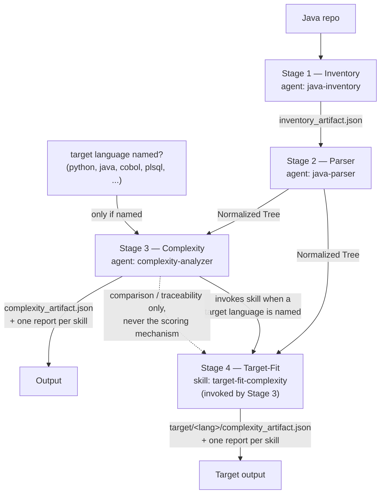
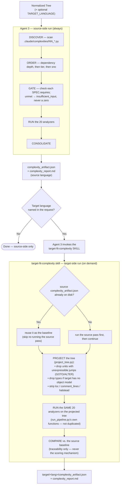
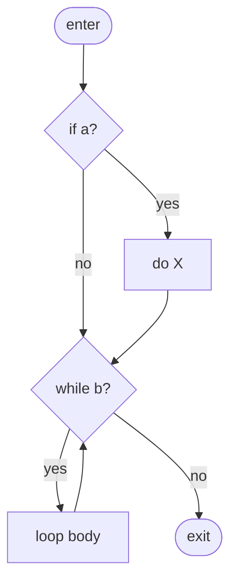
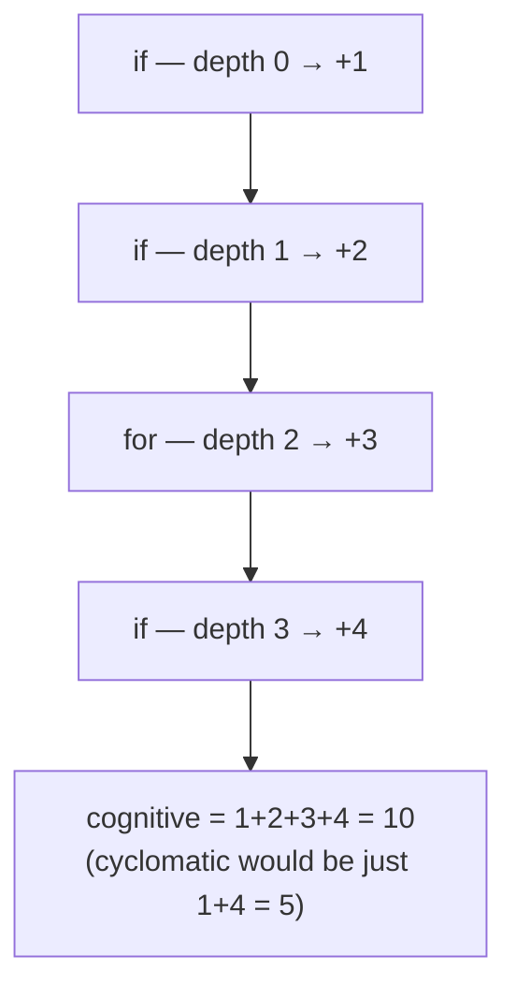
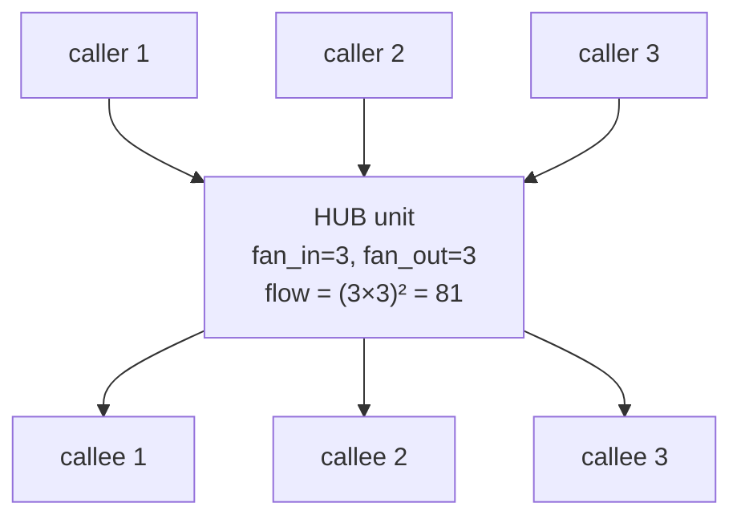

# adaptive-legacy-code-complexity-harness

Adaptive, language-aware harness for identifying legacy source code, selecting applicable
complexity analyses, orchestrating execution, generating traceable metric-level reports,
and consolidating results into a unified code complexity artifact.

**Input:** a Java repository (or any parse tree — ANTLR, AST, or an upstream parser artifact).
**Output:** one unified complexity artifact — and, optionally, the same artifact projected onto a target migration language.
**Shape:** four agents, twenty skills, one contract.

---

## Table of contents

- [Architecture](#architecture)
  - [Data flow](#data-flow)
  - [Directory map](#directory-map)
  - [The three layers, and why they are separate](#the-three-layers-and-why-they-are-separate)
  - [Execution order](#execution-order)
  - [Stage 1 has no skills, deliberately](#stage-1-has-no-skills-deliberately)
  - [Agent 3 up close — the complexity run and the target-fit skill](#agent-3-up-close--the-complexity-run-and-the-target-fit-skill)
- [The twenty complexities](#the-twenty-complexities)
- [The top 5 complexities, in depth](#the-top-5-complexities-in-depth)
  - [1. Cyclomatic Complexity](#1-cyclomatic-complexity)
  - [2. Cognitive Complexity](#2-cognitive-complexity)
  - [3. NPath Complexity](#3-npath-complexity)
  - [4. Coupling Complexity](#4-coupling-complexity)
  - [5. Maintainability Complexity](#5-maintainability-complexity)
- [Run it](#run-it)
- [Stage 4 — projecting onto a target language](#stage-4--projecting-onto-a-target-language)
- [The rule everything rests on](#the-rule-everything-rests-on)
- [Audited, not asserted](#audited-not-asserted)
- [Add complexity #21](#add-complexity-21)
- [Known limits](#known-limits)

---

# Architecture

## Data flow

Four stages, each owning one job and handing off a documented artifact. Stages
1–3 are each one agent that calls one deterministic script — the agent decides
*when* and *how* to run it and reports the outcome; the script is what
actually does the work, not the other way around. Stage 4 is **not a separate
agent**: it is the `target-fit-complexity` **skill**, which the Stage 3
Complexity Agent invokes on demand — only when the request names a target
language. No target named, no Stage 4.


```mermaid
flowchart TD
    R[Java repo] --> S1
    S1["Stage 1 — Inventory\nagent: java-inventory"] -->|inventory_artifact.json| S2
    S2["Stage 2 — Parser\nagent: java-parser"] -->|Normalized Tree| S3
    S3["Stage 3 — Complexity\nagent: complexity-analyzer"] -->|complexity_artifact.json\n+ one report per skill| OUT[Output]
    S2 -->|Normalized Tree| S4
    TL["target language named?\n(python, java, cobol, plsql, ...)"] -->|only if named| S3
    S3 -->|invokes skill when a\ntarget language is named| S4
    S4["Stage 4 — Target-Fit\nskill: target-fit-complexity\n(invoked by Stage 3)"] -->|target/&lt;lang&gt;/complexity_artifact.json\n+ one report per skill| OUT2[Target output]
    S3 -.->|comparison / traceability only,\nnever the scoring mechanism| S4
```

| Stage | Agent / Skill | Definition file | Script it runs | What the script does | Produces | Schema |
|---|---|---|---|---|---|---|
| 1 — Inventory | agent `java-inventory` | `.claude/agents/1_inventory_agent.md` | `.claude/inventory/scanner.py` | Regex/heuristic scan. Declarations only — never enters a method body. | `inventory_artifact.json` | `docs/inventory-contract.md` |
| 2 — Parser | agent `java-parser` | `.claude/agents/2_parser_agent.md` | `.claude/parser/parser.py` | Hand-written tokenizer, standard library only. Reads inside each method body — which stage 1 deliberately does not — and builds the control-flow graph, call graph and dependency graph. | `normalized_tree.json` (the Normalized Tree) | `docs/analyzer-contract.md` |
| 3 — Complexity | agent `complexity-analyzer` | `.claude/agents/3_complexity_agent.md` | `.claude/complexities/run_pipeline.py` | discover → order → gate → run → merge across 20 skills | `complexity_artifact.json` + one report per skill | `docs/analyzer-contract.md` |
| 4 — Target-Fit | skill `target-fit-complexity`, invoked by the Stage 3 agent when a target language is named | `.claude/skills/target-fit-complexity/SKILL.md` | `.claude/target_fit/target_fit.py` | Projects the Normalized Tree onto a named target language (drops units the target can't express, drops the class model if the target has none, strips volume fields no one can honestly project), then re-runs the SAME 20 skills — via `run_pipeline.py`'s own functions, never duplicated — against the projected tree | `target/<lang>/complexity_artifact.json` + one report per skill | `docs/target-fit-contract.md` |

Stage 3 never sees source text — only the Normalized Tree stage 2 produced.
That is what makes the same 20 analyzers score COBOL, PL/SQL and Java without
modification: stage 2 is the only place that changes per language. Stage 4
reuses that same fact from the other direction: because the 20 analyzers
never assume a language, they can be run a second time against a *projected*
tree and produce genuinely independent target-language scores — not a copy
of stage 3's numbers, and not a guess.

## Directory map

```
adaptive-legacy-code-complexity-harness/
│
├── CLAUDE.md                       Project memory. Loaded into every Claude Code
│                                   session: commands, conventions, the rules.
├── README.md                       This file.
│
├── .claude/                        ⚠ Contains PRODUCT CODE, not just tool config
│   │
│   ├── settings.json               Shared permissions. Checked in. Denies all
│   │                               access to plsql_to_brd/.
│   │
│   ├── agents/                     WHO orchestrates
│   │   ├── 1_inventory_agent.md      name: java-inventory
│   │   ├── 2_parser_agent.md         name: java-parser
│   │   └── 3_complexity_agent.md     name: complexity-analyzer
│   │                                 (invokes the target-fit-complexity skill
│   │                                  when a target language is named)
│   │
│   ├── rules/                      Path-scoped instructions. Load only when
│   │   └── analyzer-code.md        touching *.py under complexities/ or tools/.
│   │
│   ├── skills/                     WHAT each complexity is, and WHEN to use it
│   │   ├── cyclomatic-complexity/SKILL.md
│   │   ├── runtime-complexity/SKILL.md
│   │   ├── … 20 in total, one per complexity
│   │   └── target-fit-complexity/SKILL.md   Stage 4 — the on-demand target-language
│   │                                        counterpart to Stage 3, invoked only
│   │                                        when a target language is named
│   │
│   ├── complexities/               HOW each complexity is computed  ← product code
│   │   ├── _core.py                The shared contract. Read this first.
│   │   ├── 01_…20_*.py             One implementation per skill, paired by number
│   │   ├── run_pipeline.py         The runner
│   │   └── _superseded_style_a/    Original Style-A analyzers, preserved
│   │
│   ├── inventory/                  Stage 1                        ← product code
│   │   └── scanner.py              Java repo scanner
│   │
│   ├── parser/                     Stage 2                        ← product code
│   │   └── parser.py               Tokenizer + statement scanner; builds the Normalized Tree
│   │
│   └── target_fit/                 Stage 4 (driven by the skill)  ← product code
│       ├── project_tree.py         Projects a Normalized Tree onto a target language
│       ├── target_fit.py           Orchestrator the skill runs: project → re-run the 20 skills → compare vs. stage 3
│       ├── schema.md               What a target-language descriptor must declare
│       └── languages/              One JSON per target (cobol, plsql, java, python, …), plus
│                                    _pending/ for drafts not yet reviewed
│
├── docs/
│   ├── system-overview.md          Start here
│   ├── inventory-contract.md       Shape of inventory_artifact.json
│   ├── analyzer-contract.md        How to build complexity #21
│   ├── target-fit-contract.md      How stage 4 projects a tree and stays honest about it
│   └── architecture-decisions.md   Why it is built this way, and what would reverse it
│
├── samples/
│   └── cobol_payroll.tree.json     Reference tree. Exercises every field.
│
└── tools/
    ├── judge.py                    Audits the analyzers — 10 adversarial checks each
    ├── 99_canary_complexity.py     Defective on purpose; proves the judge has teeth
    └── tree_bridge.py              Converts legacy Style-A trees
```

## The three layers, and why they are separate

| Layer | Answers | Lives in | Changes when |
|---|---|---|---|
| **Agent** | How do I run the whole thing? | `.claude/agents/` | The workflow changes |
| **Skill** | What is this complexity, when do I use it? | `.claude/skills/` | The concept changes |
| **Implementation** | How is the number computed? | `.claude/complexities/` | The algorithm changes |

Skill *N* pairs with implementation *N* by number:
`skills/runtime-complexity/` ↔ `complexities/17_runtime_complexity.py`.

Nothing holds a list of the 20. The agent and pipeline **discover** them by scanning
`.claude/complexities/[0-9][0-9]_*.py` and reading each file's `SPEC`. Drop in
`21_*.py` and it joins the next run with no edit anywhere else.

> **`.claude/` is not editor configuration here.** It holds the deliverable.
> Deleting it deletes the product. This is a deliberate choice matching the
> `plsql_to_brd` house convention; see `docs/architecture-decisions.md`.

## Execution order

Dependency depth decides order first, not band. A skill that consumes another
skill's finished report — declared in its own `depends_on` — never runs before
that report exists, regardless of which band either one sits in. Band is only
the tie-break among skills that don't depend on anything, which is most of
them:

```
size → structural → data → coupling → hazard → composite
```

Number (`sno`) is the final tie-break, so two runs over the same tree always
produce an identical plan. Depth is primary rather than band because depth is
derived from the real dependency graph in `depends_on`; band is a hand-assigned
label with nothing enforcing it stays consistent with that graph. In practice
`composite` still runs last — Maintainability consumes Cyclomatic and
Structural, Testability consumes Cyclomatic and Coupling, and Migration
consumes Control Flow, Database, Testability, Runtime and Architectural — but
that is a consequence of today's dependencies, not a rule the sort enforces by
band alone.

## Stage 1 has no skills, deliberately

Inventory is one deterministic scan, not twenty selectable analyses. There is
nothing to discover or choose among at runtime, so it has a scanner and no
`skills/` directory. Adding one would imply a choice that does not exist.

```bash
python .claude/inventory/scanner.py --repo-root <path-to-java-repo> -o out
```

---

## Agent 3 up close — the complexity run and the target-fit skill

Agent 3 (`complexity-analyzer`) always does one thing: run the 20 analyzers over
the Normalized Tree and consolidate them into a source-side artifact. It does a
**second** thing *only when the request names a target language* — it invokes the
`target-fit-complexity` **skill**, which projects the tree onto that target and
runs the very same 20 analyzers again against the projected tree. No target named,
no skill; the source-side run stands alone.

The diagram below is the whole decision, end to end — the left half is Agent 3's
own run, the right half is the skill's work:


```mermaid
flowchart TD
    IN["Normalized Tree<br/>(+ optional TARGET_LANGUAGE)"] --> CORE

    subgraph CORE["Agent 3 — source-side run (always)"]
        direction TB
        D1["DISCOVER — scan .claude/complexities/NN_*.py"] --> D2["ORDER — dependency depth, then tier, then sno"]
        D2 --> D3["GATE — check each SPEC.requires;<br/>unmet → insufficient_input, never a zero"]
        D3 --> D4["RUN the 20 analyzers"]
        D4 --> D5["CONSOLIDATE"]
    end

    CORE --> SRC["complexity_artifact.json<br/>+ complexity_report.md<br/>(source language)"]

    SRC --> Q{"Target language<br/>named in the request?"}
    Q -->|No| DONE(["Done — source-side only"])
    Q -->|Yes| INVOKE["Agent 3 invokes the<br/>target-fit-complexity SKILL"]

    subgraph SKILL["target-fit-complexity skill — target-side run (on demand)"]
        direction TB
        S0{"source complexity_artifact.json<br/>already on disk?"}
        S0 -->|Yes| REUSE["reuse it as the baseline<br/>(skip re-running the source pass)"]
        S0 -->|No| RUNSRC["run the source pass first, then continue"]
        REUSE --> P
        RUNSRC --> P
        P["PROJECT the tree (project_tree.py):<br/>• drop units with unexpressible jumps (GOTO/ALTER)<br/>• drop types if target has no object model<br/>• strip loc / comment_lines / halstead"]
        P --> R2["RUN the SAME 20 analyzers on the projected tree<br/>(run_pipeline.py's own functions — not duplicated)"]
        R2 --> CMP["COMPARE vs. the source baseline<br/>(traceability only — never the scoring mechanism)"]
    end

    INVOKE --> SKILL
    CMP --> OUT["target/&lt;lang&gt;/complexity_artifact.json<br/>+ complexity_report.md"]
```

Two guarantees this flow keeps: the **source pass runs at most once** (reused if
already present, produced if not), and the target scores are **computed for real**
against the projected tree — the source artifact is read only to build the
comparison, never to produce a target number.

---

## The twenty complexities

Every one is language-agnostic — they read a tree, never source text, so the same script
scores COBOL, PL/SQL and Java.

| Band | # | Complexity | Measures |
|---|---|---|---|
| size | 07 | Structural | Size and its distribution — where the mass sits |
| structural | 01 | Cyclomatic | Independent paths; the floor on test cases |
| | 02 | Cognitive | Readability cost; penalises nesting |
| | 03 | Control Flow | Unstructuredness; whether translation is viable |
| | 05 | Nesting | Control-structure depth |
| | 06 | NPath | Acyclic paths; what branch coverage misses |
| | 17 | Runtime | Growth class O(1)…O(2ⁿ) from loop nesting |
| data | 12 | Data Flow | How values and shared state move |
| coupling | 04 | Coupling | Fan-in/out; what can be extracted |
| | 08 | Cohesion | Whether a type's members belong together |
| | 09 | Dependency | Weight and kind of module dependencies |
| | 10 | Change Impact | Blast radius of a change |
| | 13 | Inheritance | Hierarchy depth and width |
| | 14 | Interface / API | Exposed contract surface |
| | 20 | Architectural | Cycles, Martin zones, layering, hubs |
| hazard | 15 | Database | SQL surface, dynamic SQL, N+1 patterns |
| | 18 | Configuration | External surface, build variants, hardcoding |
| composite | 11 | Maintainability | Maintainability Index |
| | 16 | Testability | Test burden vs test friction |
| | 19 | Migration | Volume vs blockers → migration strategy |

---

## The top 5 complexities, in depth

The five below are the classic, formula-driven metrics — each is a published
software-engineering measure with a precise definition, not a heuristic. For
each: **what it means**, **the exact formula the analyzer computes**, **the logic
behind that formula**, and a **worked number** from the shipped BankingSystem run
(`outputs/BankingSystem/complexity_artifact.json`, narrated in full in
[`explain.md`](explain.md)). Every formula here is exactly what the paired
`.claude/complexities/NN_*.py` computes — not a paraphrase.

Two conventions hold for all five:

- **Higher is worse for four of them; Maintainability is inverted** (higher MI is
  *better*), which is why its level bands descend.
- **`ELSE` / `DEFAULT` never add anything.** That path already exists as the
  not-taken arm of the branch above it. Counting it inflates every unit by one
  per branch — the single most common way these metrics are computed wrong.

---

### 1. Cyclomatic Complexity

> `.claude/complexities/01_cyclomatic_complexity.py` · McCabe 1976, *A Complexity Measure*, IEEE TSE SE-2(4)

**What it means.** The number of linearly independent paths through a unit — the
lower bound on how many test cases you need for full branch coverage.

**Formula.**

```
v(G) = 1 + (number of decision nodes in the unit's control-flow graph)
```

**The logic.** Every decision node (`IF`, `WHILE`, `FOR`, `CASE` arm, `CATCH`, a
boolean `AND`/`OR`) forks the flow into one more independent path. Start at 1 for
the single straight-line path that always exists, then add one for each fork. The
harness excludes `ELSE`/`DEFAULT` on purpose — the false arm is not a *new* path,
it is the other side of a fork already counted.


```mermaid
flowchart TD
    S([enter]) --> D1{if a?}
    D1 -->|yes| B1[do X]
    D1 -->|no| D2{while b?}
    B1 --> D2
    D2 -->|yes| B2[loop body]
    B2 --> D2
    D2 -->|no| E([exit])
    %% 2 decision nodes (if a, while b) -> v(G) = 1 + 2 = 3
```

**Worked example (BankingSystem).** The most branch-heavy method,
`Bank.Bank.withdraw`, has **4** decision points → `v(G) = 1 + 4 = 5`. That is well
under the default "worth a second look" threshold of 10, so it bands **L1
(trivial)**. Summed across all 38 methods the codebase needs **70** test cases for
full branch coverage. Thresholds are language-calibrated (COBOL paragraphs
routinely branch far more than a Java method), so the bands shift by
`tree.language`; the default is `(10, 20, 35, 50)`.

---

### 2. Cognitive Complexity

> `.claude/complexities/02_cognitive_complexity.py` · Campbell / SonarSource 2018, *Cognitive Complexity — A new way of measuring understandability*

**What it means.** How hard the unit is for a human to *read and hold in their
head* — not how many tests it needs. It is the metric that correlates with how
long a change actually takes.

**Formula.** Walk the control-flow graph; for each node accumulate:

```
cognitive = Σ over flow-breaking nodes of ( 1 + nesting_depth_at_that_node )
          + Σ over flat boolean chains (AND / OR / TERNARY) of ( 1 )     # no nesting bonus
          ( ELSE / DEFAULT add 0 )
```

**The logic.** Cyclomatic treats a flat `switch` with 20 arms and a 4-deep nest of
`if`s as equal — same path count. But one is skimmable and the other is not.
Cognitive complexity fixes that with a **nesting penalty**: a branch buried three
levels deep costs `1 + 3 = 4`, while the same branch at the top level costs `1`.
Boolean operator chains (`a && b && c`) increment once for the whole chain and take
no nesting bonus — reading them is one mental step. The **gap between cognitive and
cyclomatic is itself the finding**: a large gap means the difficulty is *structural*
(flatten the nesting), not a matter of too many branches.


```mermaid
flowchart TD
    A["if — depth 0 → +1"] --> B["  if — depth 1 → +2"]
    B --> C["    for — depth 2 → +3"]
    C --> D["      if — depth 3 → +4"]
    D --> E["cognitive = 1+2+3+4 = 10<br/>(cyclomatic would be just 1+4 = 5)"]
```

**Worked example (BankingSystem).** The hardest unit, `Data.FileIO.Read`, scores
**8** — driven by two `catch` blocks plus two `if` checks, *not* by deep nesting
(nothing in this codebase nests past 2 levels). Because the difficulty is branch
*count* rather than *nesting*, it lands **L2 (low)** on bands `(5, 15, 25, 40)`.

---

### 3. NPath Complexity

> `.claude/complexities/06_npath_complexity.py` · Nejmeh 1988, *NPATH: a measure of execution path complexity*

**What it means.** The number of distinct acyclic execution paths that actually
*exist* through a unit. Cyclomatic counts the paths you must test to cover every
**edge**; NPath counts the **combinations**. The two diverge violently.

**Formula.** Paths multiply through sequence and multiply in each construct's own
branching factor:

```
NPath(unit) = Π over the CFG of the per-construct factor
  IF / ELIF / TERNARY / AND / OR / CATCH → 2   (taken / not taken)
  loop                                   → 2   (entered / skipped)
  CASE with n arms                       → n
  (counting is capped at 10¹² — beyond that the exact figure conveys nothing)
```

**The logic.** Ten `if` statements *in sequence* give `v(G) = 1 + 10 = 11` but
`NPath = 2¹⁰ = 1,024`. Branch coverage says "11 tests and we've touched every
branch"; NPath says "there are 1,013 untested *combinations* of those branches."
That gap is why "we have full branch coverage" and "we tested the combinations" are
different claims — and why some units cannot be exhaustively tested at all. NPath
is an **upper bound** (it assumes branches are independent; correlated conditions
make the true reachable count lower), which is why its confidence is 0.85.


```mermaid
flowchart LR
    S([enter]) --> A{if 1}
    A --> B{if 2}
    B --> C{if 3}
    C --> D{if 4}
    D --> E([exit])
    %% four independent binary decisions in sequence
    %% NPath = 2 x 2 x 2 x 2 = 16    (cyclomatic = 1 + 4 = 5)
```

**Worked example (BankingSystem).** The worst method has 4 independent binary
decisions in sequence → `2 × 2 × 2 × 2 = 16` combinations. That lines up exactly
with the same method's cyclomatic score of `1 + 4 = 5` — same four decisions,
*multiplied* instead of *added*. 16 is small enough to test every combination →
**L1 (trivial)** on bands `(200, 2000, 20000, 200000)`.

---

### 4. Coupling Complexity

> `.claude/complexities/04_coupling_complexity.py` · Henry & Kafura 1981, *Software Structure Metrics Based on Information Flow*

**What it means.** How tightly a unit is wired to the rest of the system —
because coupling, not internal complexity, decides *what you can move*. A trivially
simple unit can be impossible to extract because forty things call it.

**Formula.** Per unit, from the call graph:

```
fan_in  = number of distinct units that call this one
fan_out = number of distinct units this one calls
information_flow = (fan_in × fan_out)²
```

**The logic.** The **square is the whole point.** A unit that is *both* heavily
called *and* calls widely is a routing hub — removing it is a project, not a task —
and squaring makes that combination dominate the score. High fan-in with low
fan-out is just a leaf utility (safe while its contract holds); high fan-out with
low fan-in is an orchestrator (moves with its callees). The analyzer labels each
unit by shape — `hub` (fan_in ≥ 3 **and** fan_out ≥ 3), `utility`, `orchestrator`,
`isolated` — because coupling *shape* matters more than coupling *volume*.


```mermaid
flowchart TD
    C1[caller 1] --> H
    C2[caller 2] --> H
    C3[caller 3] --> H
    H["HUB unit<br/>fan_in=3, fan_out=3<br/>flow = (3×3)² = 81"]
    H --> D1[callee 1]
    H --> D2[callee 2]
    H --> D3[callee 3]
```

**Worked example (BankingSystem).** No method qualifies as a hub — max fan-in is
3, max fan-out is 6, but none has *both* high at once. 35 of 38 methods are
independently extractable and 10 are fully isolated → **L1 (trivial)** on bands
`(4, 16, 64, 256)` (which grow as a square, matching the metric). Unresolved call
targets lower confidence, since every fan-out is then a lower bound.

---

### 5. Maintainability Complexity

> `.claude/complexities/11_maintainability_complexity.py` · Oman & Hagemeister 1992; SEI/Microsoft Maintainability Index. **Inverted: higher is better.**

**What it means.** The single 0–100 number stakeholders ask for — and the one an
AI must never *invent*. Its value is that it is **derived transparently** from
measurable inputs, so every point traces to something real.

**Formula (SEI/Microsoft variant).**

```
MI = max(0, 171 − 5.2·ln(V) − 0.23·CC − 16.2·ln(LOC)) × 100 / 171
        + 50·sin(√(2.4 · comment_ratio))          # bounded comment-density bonus

  V   = Halstead volume        (parser's value if present, else estimated from size)
  CC  = cyclomatic complexity  (the SAME v(G) as metric #1, via Tree.cyclomatic — they never disagree)
  LOC = lines of code
```

**The logic.** Three things independently make code harder to maintain — sheer
**size** (`LOC`), **branching** (`CC`), and code **volume** (`V`, operators +
operands) — and the MI equation weights each by coefficients fit against real
maintenance data. The logarithms mean the first few hundred lines hurt far more per
line than the ten-thousandth. Because `MI` is higher-is-better, its level bands
**descend** — `MI ≥ 85 → L1 (easy)`, `MI < 30 → L5 (severe)` — read via
`level_from_inverted`. It reuses metric #1's cyclomatic number directly, so
Maintainability and Cyclomatic can never contradict each other.


```mermaid
flowchart LR
    LOC[LOC] --> MI
    CC["Cyclomatic v(G)<br/>(shared with #1)"] --> MI
    V["Halstead volume V"] --> MI
    CR[comment ratio] --> MI
    MI["MI = 171 − 5.2·ln(V)<br/>− 0.23·CC − 16.2·ln(LOC)<br/>rescaled to 0–100 + comment bonus"]
    MI --> B{{"band, inverted:<br/>≥85 L1 … <30 L5"}}
```

**Worked example (BankingSystem).** The LOC-weighted MI across all 38 methods is
**37.8 / 100** — low, on a scale where higher is healthier. The overall **L5
(severe)** comes from the *worst individual method*, not the average: 12 of the 38
methods are individually severe enough to earn L5. Confidence is only **0.7**
because two optional inputs were missing — real Halstead volume had to be
*estimated* from size and branching, and no comment data was available for the
bonus — both of which push the estimate toward looking worse than reality.

---

## Run it

```bash
# all twenty
python .claude/complexities/run_pipeline.py samples/cobol_payroll.tree.json -o out

# one skill, standalone or piped
python .claude/complexities/17_runtime_complexity.py tree.json
cat tree.json | python .claude/complexities/01_cyclomatic_complexity.py

# what is installed and what each needs
python .claude/complexities/run_pipeline.py --list
```

Embedded in any harness:

```python
from importlib import import_module
report = import_module("17_runtime_complexity").analyze(tree)
```

Reference run:

```
measured 20/20 (100%)   not measured: 0   errors: 0
overall level L5   hotspots 3
```

---

## Stage 4 — projecting onto a target language

Stage 4 is the **`target-fit-complexity` skill**, not a separate agent. Normally
you trigger it by asking the Stage 3 Complexity Agent for a run and **naming a
target language** ("check complexity for target Python") — the agent detects the
named target and invokes the skill, reusing the source-side pass if it already
exists. The skill runs the same script directly:

```bash
python .claude/target_fit/target_fit.py samples/cobol_payroll.tree.json --target java
```

Answers a different question than stage 3: not "how complex is this code,"
but "if this codebase's destination is language X, what does each of the 20
measurements actually come out to." It does **not** carry stage 3's numbers
forward or reweight them — it projects the Normalized Tree onto the target
(dropping any unit whose control flow uses a construct the target can't
express, e.g. COBOL `ALTER`/`GOTO` against a target with neither; dropping
the class hierarchy if the target has no object model; stripping
`loc`/`comment_lines`/`halstead`, because no honest ratio predicts the
volume of code that doesn't exist yet), then runs the **same** 20 skills a
second time — via `run_pipeline.py`'s own functions, never a duplicate
implementation — against that projected tree.

A target language is one descriptor file under
`.claude/target_fit/languages/`, reviewed and promoted out of `_pending/`
before it is trusted at full confidence — adding a new target is a new
file, never a code change to this skill or to any of the 20 complexity skills.
Full mechanism, the honest edge cases, and known gaps: `docs/target-fit-contract.md`.

```
python .claude/target_fit/target_fit.py TREE.json --target python -o out
```

```
outputs/<project>/target/<language>/
  reports/NN_*.json          ← one per skill, same shape stage 3 writes
  complexity_artifact.json   ← same overall structure as stage 3's, plus
                                source_language/target_language/projection/
                                comparison (vs. stage 3's real baseline,
                                traceability only — never the scoring input)
```

---

## The rule everything rests on

**A skill starved of its declared inputs returns `insufficient_input` naming the gap.
It never returns a zero.**

This is not a style preference. Analyzers here once returned clean-looking zeros — and
one batch printed complete reports built from hardcoded sample data — when handed input
they could not read. Verified: given a file declaring `language: ZZZ-MY-FILE` with 1
unit, one analyzer reported `language: java` with 2 units. Running the suite would have
produced 7 genuine results and 13 fabricated ones, with nothing distinguishing them.

Zeros look like good news. The gate is enforced centrally in `_core.run()` before a skill
is ever invoked, so it cannot be forgotten by an individual author.

---

## Audited, not asserted

```bash
python tools/judge.py samples/cobol_payroll.tree.json --self-test
# 20 pass   0 minor   0 CRITICAL
# self-test OK: canary correctly flagged CRITICAL
```

Ten adversarial checks per skill: contract conformance, starvation behaviour,
determinism, evidence behind severe scores, honest input declaration.

`C10` is the one that matters. `C2` can only exercise the central gate, so it proves a
SPEC is *wired*, not *complete*. `C10` strips undeclared inputs and fails a skill whose
score moves while confidence stays at 1.0. It caught two real defects on its first run —
skills #18 and #19 both read line counts they never declared, and #18 treated an unknown
line count as maximal scatter, manufacturing a finding out of missing data.

`tools/99_canary_complexity.py` is defective on purpose and **must** come back CRITICAL.
The judge passed all 20 skills on its first run, which is equally consistent with a judge
that cannot detect anything — the canary is how you tell the difference.

---

## Add complexity #21

```bash
cp .claude/complexities/01_cyclomatic_complexity.py .claude/complexities/21_my_complexity.py
mkdir .claude/skills/my-complexity
```

Edit the `SPEC`, write `analyze()`, add the `SKILL.md`. Nothing else changes — the agent
and pipeline discover it by scanning. Full contract in
[docs/analyzer-contract.md](docs/analyzer-contract.md).

---

## Known limits

- **Band calibration is judgement, not measurement.** Thresholds reflect published
  practice and field experience, not a statistical study of a reference corpus. Re-fit
  them against your own codebase once enough runs exist.
- **A tree is only as good as its parser.** Skills report what the tree carries. If the
  parser drops comments, data references or a control-flow graph, the affected skills say
  `insufficient_input` — which is a parser gap, not a clean codebase.
- **`_superseded_style_a/`** holds the original Style-A analyzers, preserved unmodified.
  `tools/tree_bridge.py` converts a Style-A tree if you still have one.
- **Stage 4 has no judge yet.** Unlike the 20 skills, target-language projection has no
  adversarial audit or planted-defect canary — only hand-written unit tests
  (`tests/test_target_fit.py`). One already found a real, pre-existing crash in
  `18_configuration_complexity.py` (a `None` comparison it never guarded), exposed only
  because stage 4 strips `loc` unconditionally — a reminder that this stage is useful
  precisely because it stresses stage 3's skills in ways stage 3's own pipeline never did.
- **Only three descriptor fields currently drive projection** (`supports_goto`,
  `supports_alter_style_dynamic_jump`, `multiple_inheritance`). A descriptor's richer
  fields (`numeric_model`, `exception_model`, `native_screen_io`, `native_sql_access`) are
  read by the human-written report, not by the projection itself — a codebase relying on
  fixed-point arithmetic or platform screen calls gets no score impact for that risk yet.
