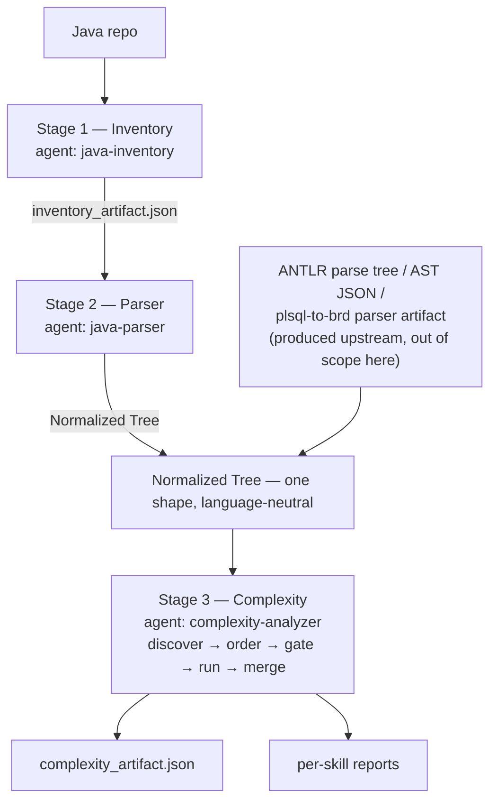

# System overview

## What this is

A language-agnostic harness that measures the complexity of legacy code and
consolidates the result into one artifact a modernization programme can act on.

The complexity stage takes a **parse tree**, not source code. For Java, this
repo now produces that tree itself, in two stages that precede complexity
scoring. For any other language, producing the tree is a separate, upstream
concern — the complexity stage starts where the parser finishes either way.



## Layout

Mirrors the `plsql_to_brd` project convention.

```
.claude/
  agents/
    1_inventory_agent.md           name: java-inventory   — stage 1
    2_parser_agent.md              name: java-parser      — stage 2
    3_complexity_agent.md          name: complexity-analyzer — stage 3
  inventory/
    scanner.py                     stage 1's deterministic scan
  parser/
    parser.py                      stage 2's deterministic tokenizer/scanner
  skills/
    <complexity-name>/SKILL.md     20 skills, one per complexity — what & why
  complexities/
    _core.py                       the shared contract
    01_..20_*.py                   deterministic implementation per skill
    run_pipeline.py                discover, order, run, consolidate
    _superseded_style_a/           original Style-A analyzers, preserved
docs/
  system-overview.md               this file
  inventory-contract.md            shape of inventory_artifact.json
  analyzer-contract.md             how to build a complexity
  architecture-decisions.md        why it is built this way
samples/
  cobol_payroll.tree.json          reference tree, exercises every field
tools/
  judge.py                         adversarial conformance audit
  99_canary_complexity.py          defective on purpose; validates the judge
  tree_bridge.py                   converts legacy Style-A trees
```

**`skills/` describes, `complexities/` implements.** A `SKILL.md` states what the
complexity measures, which tree fields it consumes, what it emits, and how it
fails. The matching `NN_*.py` is the deterministic implementation. Both are
generated from the same source, so they cannot drift apart.

## The twenty complexities

| Band | # | Complexity | Measures |
|---|---|---|---|
| size | 07 | Structural | Size and its distribution — where the mass sits |
| structural | 01 | Cyclomatic | Independent paths; the floor on test cases |
| | 02 | Cognitive | Readability cost; penalises nesting |
| | 03 | Control Flow | Unstructuredness; whether translation is viable |
| | 05 | Nesting | Control-structure depth |
| | 06 | NPath | Acyclic execution paths; what branch coverage misses |
| | 17 | Runtime | Growth class O(1)…O(2ⁿ) from loop nesting |
| data | 12 | Data Flow | How values and shared state move |
| coupling | 04 | Coupling | Fan-in/out; what can be extracted |
| | 08 | Cohesion | Whether a type's members belong together |
| | 09 | Dependency | Weight and kind of module dependencies |
| | 10 | Change Impact | Blast radius of a change |
| | 13 | Inheritance | Hierarchy depth and width |
| | 14 | Interface / API | Exposed contract surface |
| | 20 | Architectural | Cycles, Martin zones, layering violations, hubs |
| hazard | 15 | Database | SQL surface, dynamic SQL, N+1 patterns |
| | 18 | Configuration | External surface, build variants, hardcoding |
| composite | 11 | Maintainability | Maintainability Index |
| | 16 | Testability | Test burden vs test friction |
| | 19 | Migration | Volume vs blockers → migration strategy |

## Execution order

Dependency depth decides order first, not band. A skill that consumes another
skill's finished report — declared in its own `depends_on` — never runs
before that report exists, regardless of which band either one sits in. Band
is only the tie-break among skills that don't depend on anything:

```
size → structural → data → coupling → hazard → composite
```

Number (`sno`) is the final tie-break, so the plan is byte-identical across
runs of the same tree.

- **size ties first among depth-0 skills** — later bands use it as a
  denominator, so seeing it before any per-unit shape is useful, though it
  runs whenever nothing depends on it, same as any other depth-0 skill.
- **composite runs last in practice** — Maintainability consumes Cyclomatic
  and Structural; Testability consumes Cyclomatic and Coupling; Migration
  consumes Control Flow, Database, Testability, Runtime and Architectural.
  This is a consequence of today's `depends_on` declarations, not a rule the
  sort enforces by band.

## The rule everything rests on

**A skill starved of its declared inputs returns `insufficient_input` naming the
gap. It never returns a zero.**

This exists because of a real defect. Analyzers here once returned clean-looking
zeros — and one batch printed complete reports built from hardcoded sample data —
when handed input they could not read. Running the suite would have produced 7
genuine results and 13 fabricated ones with nothing distinguishing them. Zeros
look like good news.

The gate is enforced centrally in `_core.run()` before a skill is ever invoked,
so it cannot be forgotten by an individual author.

## Running it

```bash
# everything
python .claude/complexities/run_pipeline.py samples/cobol_payroll.tree.json -o out

# one skill
python .claude/complexities/17_runtime_complexity.py tree.json

# what is installed, and what each needs
python .claude/complexities/run_pipeline.py --list

# audit the skills themselves
python tools/judge.py samples/cobol_payroll.tree.json --self-test
```

Reference run on `samples/cobol_payroll.tree.json`:

```
measured 20/20 (100%)   not measured: 0   errors: 0
overall level L5   hotspots 3
```

## Extending

Adding complexity #21 is: drop `21_x_complexity.py` into `.claude/complexities/`,
add `.claude/skills/x-complexity/SKILL.md`. Nothing else changes — the agent and
pipeline discover it. See [analyzer-contract.md](analyzer-contract.md).
