# BankingSystem — Every Complexity Score Explained, Simply

Source: `outputs/BankingSystem/complexity_artifact.json`
Codebase: 38 methods (units), 1,149 lines, 21 Java classes, a Swing desktop banking app.

For every metric below: **what it means**, **how the number was actually calculated**, and **how BankingSystem's specific score was arrived at**.

---

## 1. Structural Complexity
**Score: 0.32 · Level: L2 (low) · Confidence: 0.85**

**What it means, simply:** Is the code's size spread out evenly across all 38 methods, or piled up into just a few giant ones?

**How it's measured:** Sort every method biggest → smallest by line count. Take the top 10% of that list. Add up how many of the total lines those top methods hold. That fraction is the score.

**How BankingSystem arrived at 0.32:** 38 methods → top 10% = the 3 biggest (`GUI.Menu.Menu` 129 lines, `GUI.AddStudentAccount` 121, `GUI.AddCurrentAccount` 116). Those 3 hold 32% of the codebase's 1,149 total lines → score 0.32. That crosses the "mildly lopsided" band (0.25–0.40) → L2. Confidence is 0.85 because the tree didn't include comment-line counts, so that one extra signal was unavailable.

**In pictures** — where the 1,149 lines actually sit:

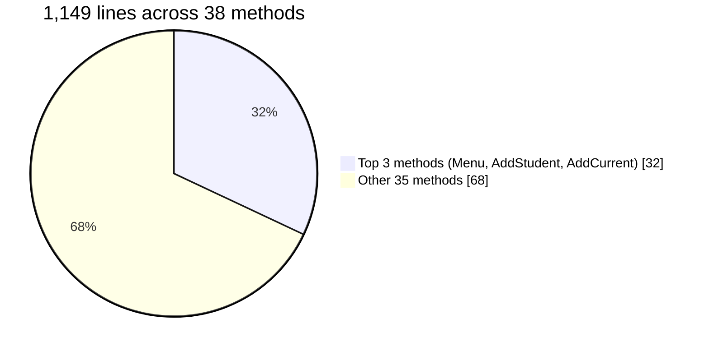

---

## 2. Cyclomatic Complexity
**Score: 5.0 · Level: L1 (trivial) · Confidence: 1.0**

**What it means, simply:** In the single most branch-heavy method in the codebase, how many `if`/`while`/`case` decisions does it make?

**How it's measured:** `v(G) = 1 + number of decision points` in a method. `else`/`default` don't count — that path already exists as the "not-taken" side of the branch above it.

**How BankingSystem arrived at 5.0:** The worst single method (`Bank.Bank.withdraw`) has 4 decision points → `1 + 4 = 5`. That's well under the "worth a second look" threshold of 10 → L1. Summed across all 38 methods, the whole codebase needs only 70 test cases total for full branch coverage — a small, healthy number.

**In pictures** — `Bank.withdraw`, 4 decisions → `v(G) = 1 + 4 = 5`:

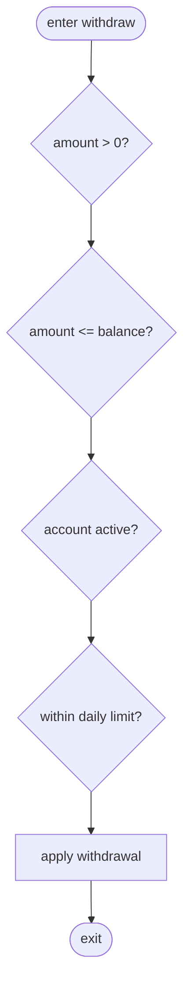

---

## 3. Cognitive Complexity
**Score: 8.0 · Level: L2 (low) · Confidence: 1.0**

**What it means, simply:** How hard is the hardest method to actually *read* and hold in your head? (Different from cyclomatic — this one punishes deep nesting extra, since a branch buried 4 levels deep is much harder to follow than one sitting flat.)

**How it's measured:** +1 for every branch/loop/catch/jump, **plus** extra points equal to how deeply nested it is at that point. `else` costs nothing (once you understand the `if` above it, the `else` is free).

**How BankingSystem arrived at 8.0:** The hardest unit (`Data.FileIO.Read`) scores 8 — driven by two `catch` blocks plus two `if` checks, not by deep nesting (nothing in this codebase nests more than 2 levels, so nesting adds little penalty here). Because the difficulty comes from branch *count* rather than *nesting*, it lands in L2 (low) rather than something worse.

**In pictures** — `FileIO.Read`: the cost comes from *how many* flow-breaks, not from depth. Each shallow break adds `1 + its_depth`:

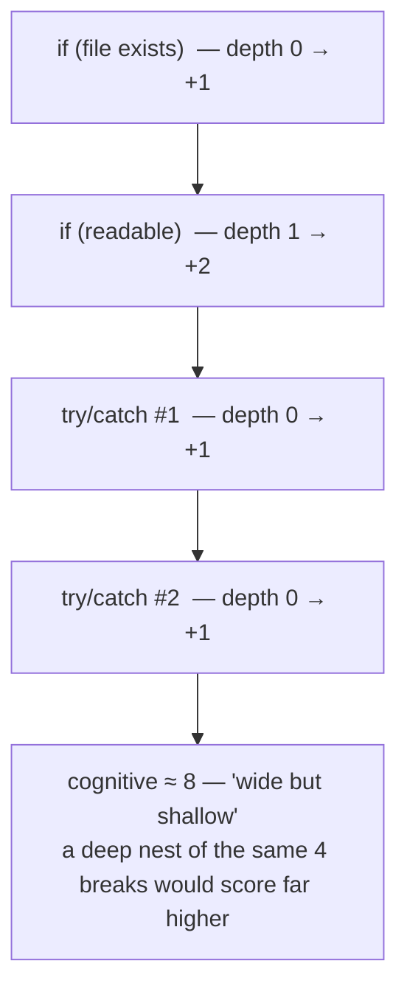

---

## 4. Control Flow Complexity
**Score: 0.0 · Level: L1 (trivial) · Confidence: 0.8**

**What it means, simply:** Does the code use clean, well-behaved `if`/`loop` structure, or does it contain "jump" constructs (like `goto`) that make automated translation to another language/platform impossible?

**How it's measured:** Looks for irreducible jump constructs — `GOTO`, `ALTER`, cross-boundary jumps, multiple exit points. Clean `if/else`/loops cost nothing; they can always be mechanically restructured.

**How BankingSystem arrived at 0.0:** Zero jump constructs were found anywhere in any of the 38 methods → score 0 → L1. Every method is "fully structured," meaning nothing here would block an automated code-translation tool. Confidence is 0.8 (not 1.0) because this analyzer approximates a formal metric (McCabe's "essential complexity") using a simpler proxy, since the parser's tree doesn't carry true graph edges to reduce.

**In pictures** — structured (translatable) vs. the jumps this codebase does *not* have:

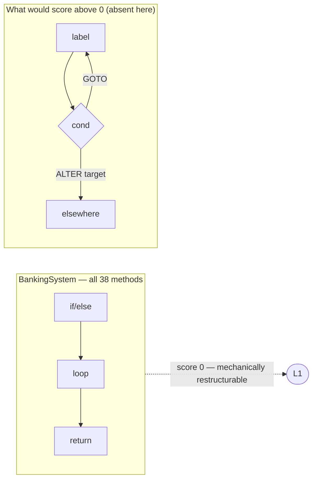

---

## 5. Nesting Complexity
**Score: 2.0 · Level: L1 (trivial) · Confidence: 1.0**

**What it means, simply:** How many layers deep does an `if`-inside-`if`-inside-`if` go, at its worst?

**How it's measured:** Walk every method and track how deep each branch/loop sits relative to the ones wrapping it. Report the single deepest point found anywhere.

**How BankingSystem arrived at 2.0:** The deepest nesting anywhere in the whole codebase is just 2 levels (e.g., an `if` inside another `if`). 33 of the 38 methods have *no* nesting at all — completely flat code. Far below the "getting hard to read" threshold of 4 → L1.

**In pictures** — the deepest point in the whole codebase is only 2 levels:

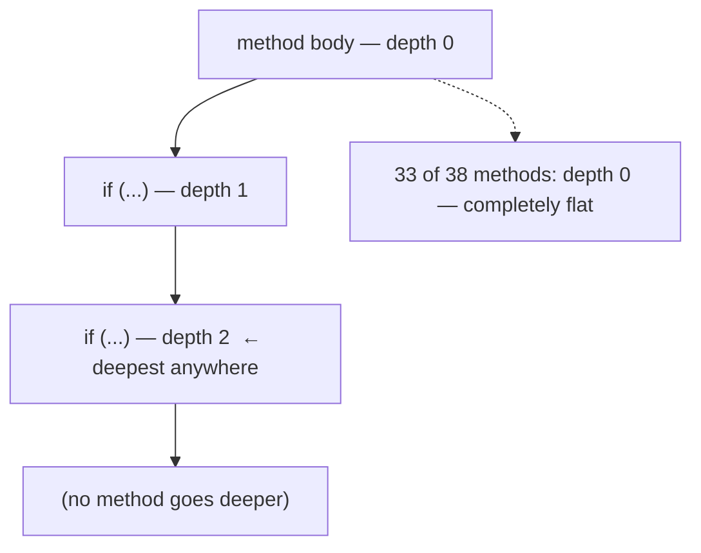

---

## 6. NPath Complexity
**Score: 16.0 · Level: L1 (trivial) · Confidence: 0.85**

**What it means, simply:** Cyclomatic complexity counts branches by *adding* them up (good for "how many tests do I need"). NPath counts by *multiplying* them (good for "how many actual distinct combinations of those branches can happen"). It's the gap between "we tested every branch" and "we tested every combination."

**How it's measured:** Every `if` contributes a factor of 2 (taken / not taken). When branches sit one after another, their path counts multiply.

**How BankingSystem arrived at 16.0:** The worst method has 4 independent binary decisions in sequence: `2 × 2 × 2 × 2 = 16` distinct combinations (this lines up with that same method's cyclomatic score of 5 = `1 + 4 decisions` — same 4 decisions, added vs. multiplied). 16 is small enough that a developer could realistically write a test for every single combination, not just every branch → L1. Confidence is 0.85 because the formula assumes each branch is fully independent, which slightly overstates the true number if some conditions are correlated.

**In pictures** — the same 4 decisions, *added* by cyclomatic vs. *multiplied* by NPath:

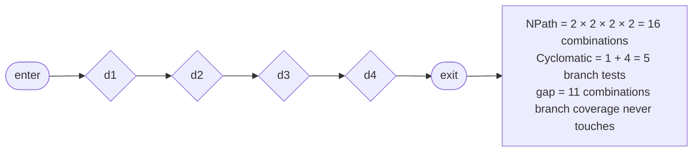

---

## 7. Runtime Complexity
**Score: 25.0 · Level: L3 (moderate) · Confidence: 1.0**

**What it means, simply:** Not "is this code hard to read" — but "will this code get slow or break down as the amount of data it processes grows?"

**How it's measured:** Looks at how deeply loops are nested (a loop inside a loop inside a loop scales very badly), whether expensive operations (database calls, file/network I/O) sit inside those loops, and whether any method calls itself (recursion), which is inherently unpredictable in cost.

**How BankingSystem arrived at 25.0:** No nested loops anywhere (max loop depth in the whole codebase is 1), and no database/file/network calls sit inside a loop — both good signs. But **1 method is recursive**, and recursion earns a flat +20-point penalty on its own, because the analyzer can't statically prove how deep that recursion will go at runtime (could be 2 calls deep, could overflow the stack — it genuinely doesn't know). That recursion penalty is what pushes the score to 25 and the level to L3 — it's not a "this code is slow" finding, it's a "this is the one place a human should double-check" finding.

**In pictures** — the score is almost entirely one recursion penalty, not slow loops:

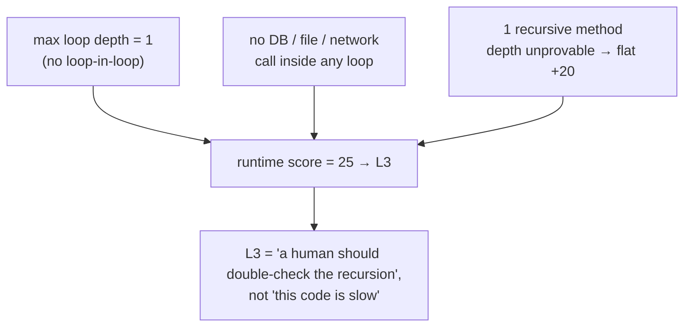

---

## 8. Data Flow Complexity ⚠️ (the most severe finding in this report)
**Score: 144.0 · Level: L5 (severe) · Confidence: 1.0**

**What it means, simply:** How much does a method depend on data (variables/fields) that *other methods also touch*? A method that only uses its own local variables is easy to move or change safely. A method that reads and writes the same shared state as 8 other methods is tightly, invisibly wired to all of them.

**How it's measured:** Per method: count its parameters, count distinct data elements it touches, count calls it hands data out through, and — weighted heaviest — count how many of the data elements it touches are *also* touched by other methods (shared state).

**How BankingSystem arrived at 144.0:** The worst method (`GUI.AddSavingsAccount.AddSavingsAccount`) scores 144 — the single highest score of any metric in this whole report. There are 11 shared data elements across the codebase (things multiple methods read/write), and 9 methods (all in the GUI package: the account-creation forms, withdraw/deposit screens, menu, login) are flagged as "data-heavy." This is a real, severe finding: these GUI forms wire together a lot of shared fields/labels/state directly rather than delegating that coordination elsewhere, which is exactly the pattern you'd expect from hand-built Swing forms.

**In pictures** — 9 GUI methods all reaching into the same 11 shared fields is the invisible wiring this metric exposes:

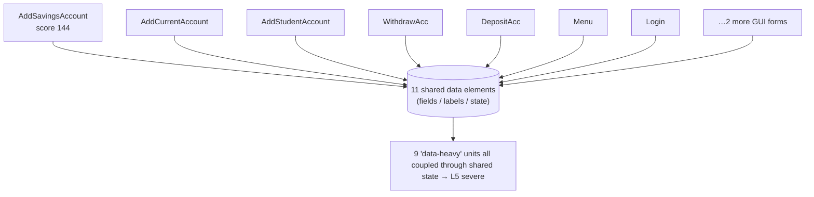

---

## 9. Coupling Complexity
**Score: 4.0 · Level: L1 (trivial) · Confidence: 1.0**

**What it means, simply:** How tightly is one method wired to other methods? A method that's called by many things *and* calls many things is a "hub" — pulling it out is a whole project, not a quick edit.

**How it's measured:** Count fan-in (who calls this method) and fan-out (what this method calls), then `(fan_in × fan_out)²`. The squaring is deliberate — a method that's both heavily-called AND calls widely is disproportionately hard to remove.

**How BankingSystem arrived at 4.0:** No method anywhere qualifies as a "hub" (max fan-in is 3, max fan-out is 6, and no method has both high fan-in and high fan-out at once). 35 of the 38 methods could be pulled out and moved independently with little friction, and 10 are entirely isolated (no calls in or out). Very loosely coupled at the method level → L1.

**In pictures** — the worst case is still not a hub, because high fan-in and high fan-out never coincide:

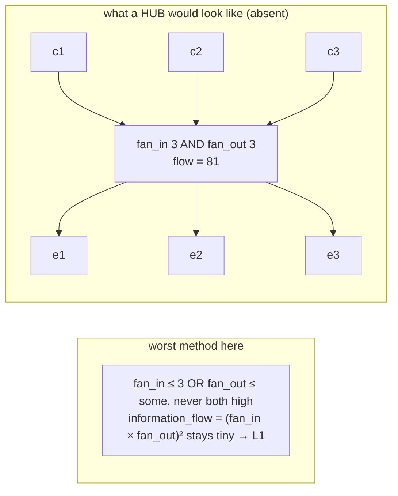

---

## 10. Cohesion Complexity
**Score: 2.0 · Level: L2 (low) · Confidence: 1.0**

**What it means, simply:** Within one class, do all its methods actually work together on the same job, or is the class secretly several unrelated things stuffed under one name?

**How it's measured (LCOM4):** Draw a graph where each method in a class is a dot; connect two dots if they share a field or call each other. Count how many separate, disconnected clusters that graph breaks into. 1 cluster = fully cohesive. 3+ clusters = the class is really several classes wearing a trench coat.

**How BankingSystem arrived at 2.0:** The worst class in the codebase splits into 2 disconnected clusters — mild, and below the "genuinely low cohesion" threshold of 3. All 21 classes hold together reasonably well internally → L2.

**In pictures** — LCOM4 counts disconnected clusters; the worst class here breaks into 2:

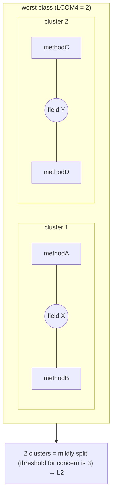

---

## 11. Dependency Complexity
**Score: 45.7 · Level: L3 (moderate) · Confidence: 1.0**

**What it means, simply:** How much does this codebase rely on things outside itself (other packages, libraries), and how deep/tangled are those dependency chains?

**How it's measured:** Classify every dependency edge (internal code vs. external library vs. database vs. platform, etc.), then blend: how much of it is external (40% of the score), how widely things depend on other things on average (25%), how deep the longest dependency chain runs (20%), and whether there are any circular dependencies — A needs B needs A — which are the truly dangerous kind (15%).

**How BankingSystem arrived at 45.7:** Of 141 total dependency edges, 115 are external library calls (overwhelmingly `javax.swing.*` and `java.awt.*` — the GUI toolkit), only 26 are internal. That's an 81.6% external ratio, which drives most of the score. The longest dependency chain is only 3 steps, and — importantly — **zero circular dependencies** anywhere. So the L3 rating reflects sheer *volume* of library surface (115 external dependencies vs. only 21 of your own classes), not any tangled or dangerous structure.

**In pictures** — the score is volume of external surface, not tangle (0 cycles):

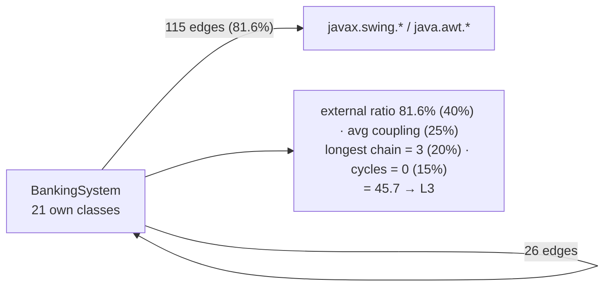

---

## 12. Change Impact Complexity
**Score: 0.11 · Level: L2 (low) · Confidence: 1.0**

**What it means, simply:** If you change one piece of code, how much of the rest of the system could break as a result — the "blast radius" of a change.

**How it's measured:** Build a graph of who-calls/depends-on-whom, then for every unit walk *backwards* to find everything that transitively depends on it. The bigger that reachable set relative to the whole system, the scarier that unit is to touch.

**How BankingSystem arrived at 0.11:** Across 85 components, the single worst-case change (touching a widely-used UI type) still only ripples out to about 10.7% of the system (`0.11` ≈ 11%), and nothing was classified as "high-impact" (the threshold is 30%). Notably, the widest-reaching components are library types (`java.awt.Font`, `javax.swing.JFrame`) — not BankingSystem's own code — meaning changes to your *own* logic stay even more contained than this number suggests.

**In pictures** — blast radius = walk *backwards* over dependents; worst case here is ~11%:

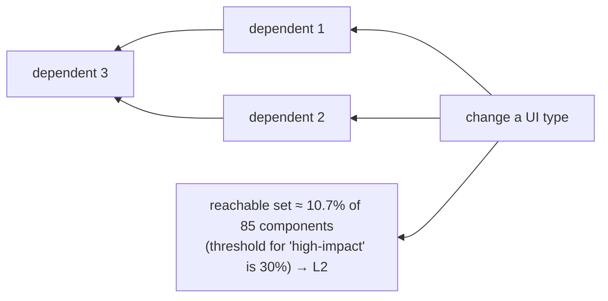

---

## 13. Inheritance Complexity
**Score: 2.0 · Level: L2 (low) · Confidence: 1.0**

**What it means, simply:** How deep does a `class extends class extends class` chain go? The deeper it is, the more ancestor classes you have to read to understand what a "leaf" class actually does.

**How it's measured:** DIT (Depth of Inheritance Tree — the longest chain from a class up to its root ancestor) and NOC (Number of Children — how many classes directly extend a given class).

**How BankingSystem arrived at 2.0:** The deepest chain anywhere is 2 levels — matching `BankAccount → SavingsAccount → StudentAccount`, and the four `Exceptions.*` classes each extending `Exception`. The widest base class has only 2 direct children. Shallow, easy-to-trace hierarchy → L2 (just above the "trivial" floor because a 2-level chain technically isn't zero).

**In pictures** — DIT (depth) = 2, NOC (widest fan of children) = 2:

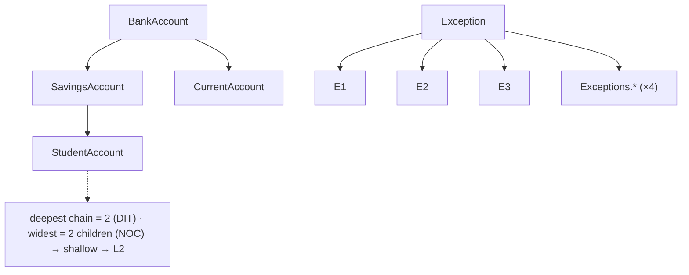

---

## 14. Interface / API Complexity
**Score: 36.2 · Level: L3 (moderate) · Confidence: 1.0**

**What it means, simply:** How big and complicated is the "public contract" this system exposes to callers — its public methods and their parameter lists?

**How it's measured:** Count exposed (public) operations, average parameters per operation, distinct data-transfer types (schemas), and external API integration edges — blended into one 0–100 score.

**How BankingSystem arrived at 36.2:** 34 of the 38 methods are exposed/public, but each averages under 1 parameter (0.88) — individually simple signatures. No schema/DTO types and no external API contracts were found (consistent with a self-contained desktop app, not a service). The L3 score comes almost entirely from *sheer count* — 34 exposed operations is a lot relative to a 38-method codebase — not from any single operation being complicated.

**In pictures** — wide surface (34 public ops) but each signature is trivial:

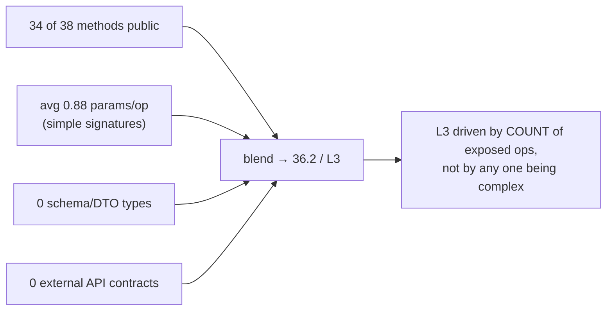

---

## 15. Architectural Complexity
**Score: 7.2 · Level: L1 (trivial) · Confidence: 0.9**

**What it means, simply:** Zoomed all the way out from individual methods — is the overall module/package structure clean and layered, or a tangled ball where nothing can be pulled apart?

**How it's measured:** Four separate checks, each with its own remedy: (1) dependency cycles — module A needs B needs A, which blocks extracting either one; (2) Martin's "zone of pain" — modules that are concrete and heavily depended-upon, so everything breaks when they change; (3) layering violations — a dependency pointing the "wrong way" through declared architectural layers; (4) god units/hubs — single points everything routes through.

**How BankingSystem arrived at 7.2:** Zero dependency cycles across all 50 modules, zero layering violations (though the tree has no explicit layer declaration, so this check is best-effort), and only 1 "hub" unit identified by fan-in/fan-out. That's a genuinely clean, decomposable top-level structure → L1. Confidence is 0.9 because the optional `layers` field wasn't present in the tree, so layering violations were checked against what the dependency graph *implies* rather than an authoritative layer definition.

**In pictures** — four independent checks, three of them clean:

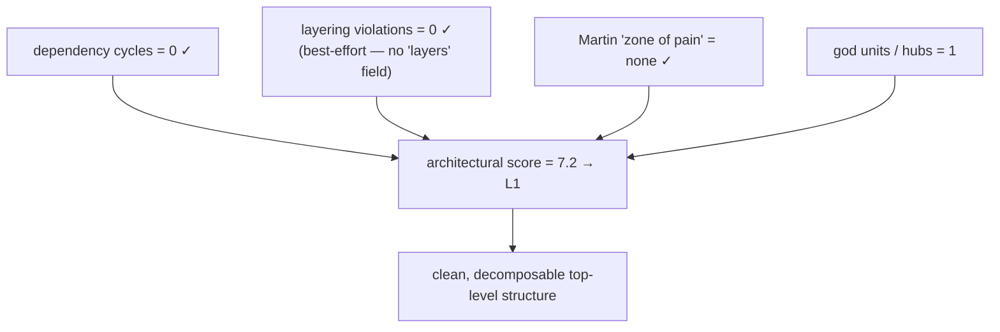

---

## 16. Database Complexity — NOT MEASURED
**Status: insufficient_input**

**What it would mean:** How entangled is the code with a database — SQL scattered through logic, implicit transaction boundaries, tables that many methods write to — the things a pure control-flow metric can't see.

**Why it didn't run:** The parsed tree carries none of `sql`, `cursors`, or `transactions` — at least one is required, and none was present. Rather than silently reporting "0" (which would falsely read as "no database risk"), the harness refuses to guess. Supporting evidence: the inventory scan explicitly found 0 SQL files, and `Data.FileIO` uses Java object serialization (`ObjectInputStream`/`ObjectOutputStream`) rather than any `java.sql.*` import — suggesting this app genuinely doesn't touch a relational database (it persists data to a file instead). Still just evidence, not a verdict — the parser might simply never have looked for SQL string literals buried inside method bodies.

**In pictures** — the central gate, not the analyzer, decides this — and it names the gap instead of faking a 0:

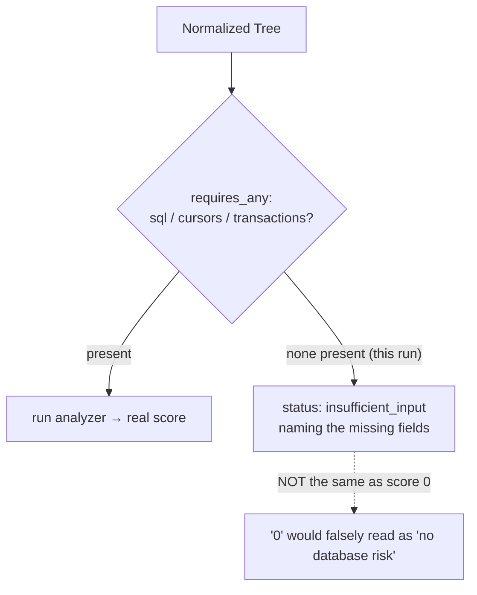

---

## 17. Configuration Complexity — NOT MEASURED
**Status: insufficient_input**

**What it would mean:** How much of the app's behavior is controlled from *outside* the source code (config files, environment variables, feature flags, compile-time switches) — a common cause of things that pass every test and then break in a different environment.

**Why it didn't run:** The tree carries none of `config_reads`, `literals`, `conditional_compilation`, or `feature_flags`. The inventory scan found 0 config files and 0 build files, consistent with this being a small standalone Swing app with nothing externally configurable — but the parser also never extracted general "literal" values from inside method bodies at all, so hardcoded constants (e.g., account limits) can't be confirmed present or absent either way.

**In pictures** — same honest gate, and note the ambiguity it refuses to paper over:

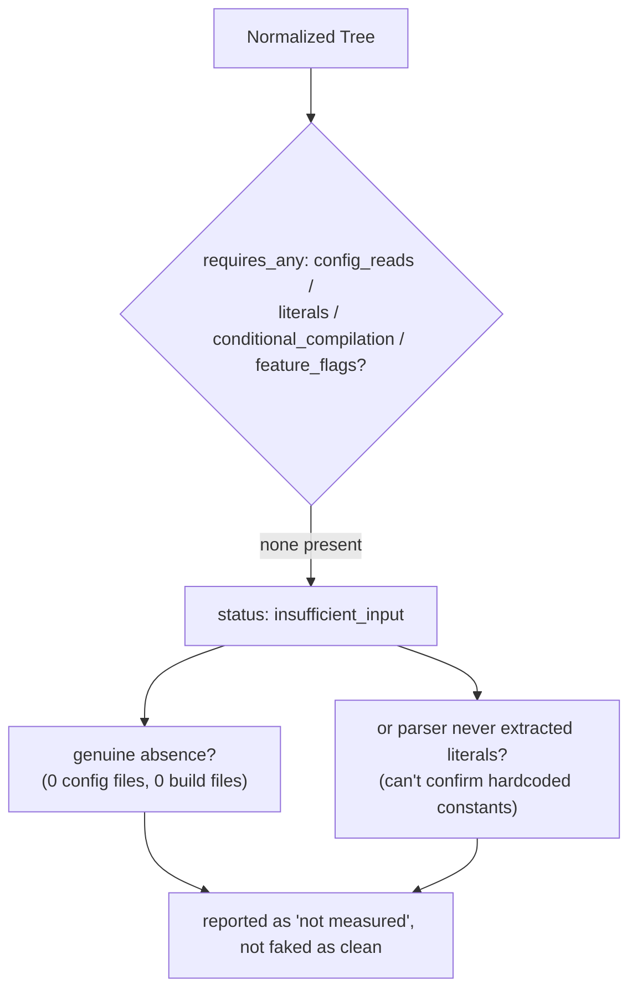

---

## 18. Maintainability Complexity (composite)
**Score: 37.8 · Level: L5 (severe) · Confidence: 0.7**

**What it means, simply:** A classic industry scale from 0–100 where **higher is better** (this is the opposite direction from every other metric above!). It combines size, branching complexity, code "volume," and comment density into one number that answers: "overall, how hard is this to maintain?"

**How it's measured:** `MI = 171 − 5.2×ln(volume) − 0.23×(cyclomatic complexity) − 16.2×ln(lines of code)`, rescaled to 0–100, plus a bonus for having comments. It reuses the same cyclomatic-complexity number as metric #2 above, so the two never disagree.

**How BankingSystem arrived at 37.8 / L5:** Averaged across all 38 methods (weighted by size), the Maintainability Index comes out to 37.8/100 — a *low* score on a scale where higher is healthier, so despite the number "37.8" not looking dramatic, it lands in the worst band (below 30... actually the overall L5 comes from the *worst individual method*, not the average — 12 of the 38 methods are individually severe enough to earn L5 on their own, and the report's level always reflects the worst case found, not the average). Confidence is only 0.7 because two optional inputs were missing: real "Halstead volume" (a measure of code complexity based on operators/operands) had to be *estimated* from size and branching rather than measured directly, and no comment data was available to apply the comment-density bonus — both of these push the estimate toward looking worse than it might actually be with real data.

**In pictures** — a transparent formula (higher = better), and why the level is worst-case not average:

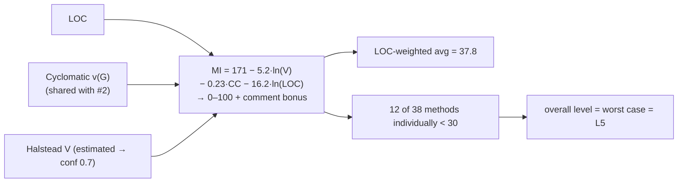

---

## 19. Testability Complexity (composite)
**Score: 24.0 · Level: L3 (moderate) · Confidence: 1.0**

**What it means, simply:** Not "how many tests would this need" (that's cyclomatic complexity) — but "how hard would it actually be to *write* those tests?" A method can need very few test cases and still be nearly impossible to test if it secretly depends on things you can't control (global state, hidden inputs, static calls).

**How it's measured:** Splits into two separate things: **burden** (test cases needed — same as cyclomatic, weighted lightly) and **friction** (obstacles that block writing a test at all — hidden inputs not passed as parameters, writes to shared state, environmental effects like file/DB/network calls, collaborators that need mocking, non-determinism, or a "static" method with no way to substitute a fake version — weighted much more heavily, since one blocking obstacle can stall testing indefinitely).

**How BankingSystem arrived at 24.0:** Total test-case burden across the codebase is ~70 (matches cyclomatic complexity's number exactly, as expected). The real finding is friction: 4 methods are classified "blocked" — few paths to test, but something about them makes them impossible to isolate (e.g., `Application.main` is flagged for being static with "no substitution seam"). Those 4 blocked units, plus generally widespread hidden-input usage (tied to the same shared-state pattern Data Flow Complexity found), are what pull the level to L3.

**In pictures** — burden (light) vs. friction (heavy); friction is what drives L3:

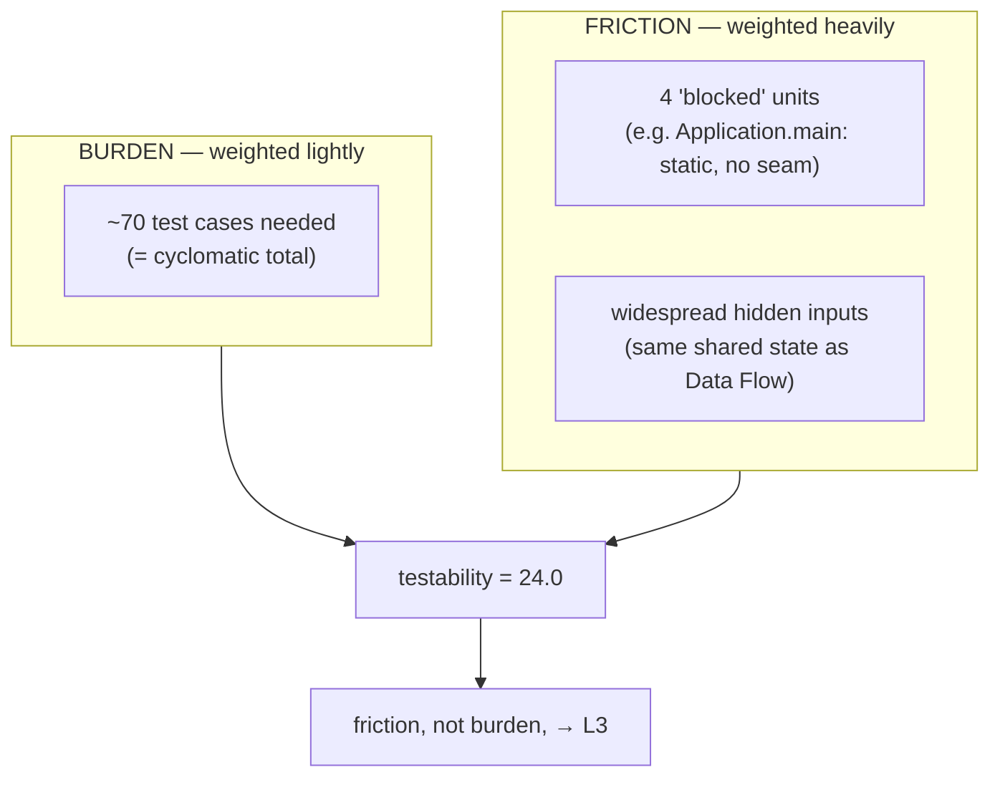

---

## 20. Migration Complexity (composite)
**Score: 23.6 · Level: L3 (moderate) · Confidence: 0.6**

**What it means, simply:** If you wanted to move this code to a different language or platform, how much of the work is mechanical copy-paste-translate, versus genuine redesign? Size alone doesn't predict this — a huge pile of plain `if` statements is tedious but automatable; a small pocket of dynamic SQL or reflection can be un-translatable no matter how few lines it is.

**How it's measured:** Scores two things *separately*: **volume** (how much code there is — scales with size, and shrinks as tooling improves) and **blockers** (constructs that defeat automatic translation entirely — dynamic SQL, reflection, runtime `eval`, platform-specific calls, unstructured jumps — these don't shrink no matter how good your tooling gets). The mix of the two decides which migration strategy applies: rehost (lift-and-shift) → replatform → refactor → rearchitect → rebuild.

**How BankingSystem arrived at 23.6:** Of the 38 methods, 28 are directly liftable as-is (rehost), 9 need refactoring first, and only 1 (`GUI.Menu.Menu`, the largest method by line count) needs a full rearchitecture — recommended because it's both large and a fan-out hotspot. Zero hard translation blockers were found anywhere (consistent with Control Flow Complexity's finding of zero jump constructs). Only about 12% of the total work is judged "plausibly automatable," but that low figure is driven by the sheer volume of hand-written Swing UI wiring, not by anything actually blocking automation. Confidence is only 0.6 — the lowest of any measured metric — because four optional signals it would use to detect real blockers (SQL, platform calls, dynamic constructs, conditional compilation) were all absent from the tree, and this metric also depends on Database Complexity, which itself couldn't run.

**In pictures** — volume vs. blockers decide the per-unit strategy; here it's almost all volume:

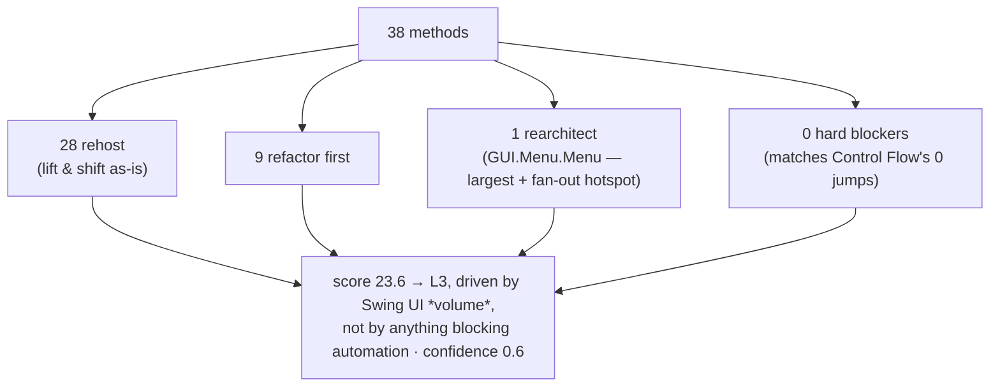

---

## The big picture

- **Almost everything about individual methods is genuinely simple:** low branching (cyclomatic), shallow nesting, no untranslatable jump constructs, loosely coupled, decent class cohesion, shallow inheritance, clean top-level architecture. Most scores land at L1–L2.
- **The one real problem is shared data**, concentrated in 9 GUI form-building methods (`AddAccount`, `AddSavingsAccount`, `WithdrawAcc`, `Menu`, etc.) that all read and write a lot of the same fields/state directly. That single pattern is what independently drags down Data Flow Complexity (L5), Maintainability (L5), and Testability (L3) — three different metrics converging on the same nine methods is a strong, corroborated signal, not three separate coincidences.
- **Two metrics (Database, Configuration) simply couldn't run** because this codebase doesn't appear to use a database or external config — that's evidence of a genuine absence, not a hidden problem, but it's honestly reported as "not measured" rather than faked as a clean "0."
