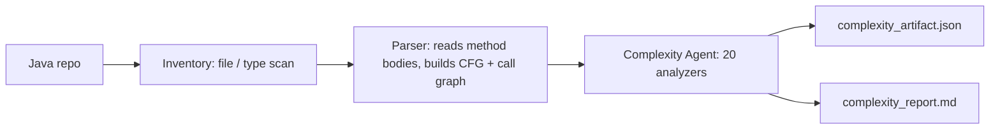

# Complexity Report — BankingSystem

Source codebase: `D:/adaptive-legacy-code-complexity-harness/input/BankingSystem`

---

## Table of contents

1. [About this report](#about-this-report)
2. [About this codebase](#about-this-codebase)
3. [Why we ran this analysis](#why-we-ran-this-analysis)
4. [From Java files to these numbers](#from-java-files-to-these-numbers)
5. [Overall complexity score](#overall-complexity-score)
6. [How we ordered the analysis](#how-we-ordered-the-analysis)
7. [What was measured, and why](#what-was-measured-and-why)
8. [Per-complexity deep dive](#per-complexity-deep-dive)
   - [Structural Complexity](#structural-complexity)
   - [Cyclomatic Complexity](#cyclomatic-complexity)
   - [Cognitive Complexity](#cognitive-complexity)
   - [Control Flow Complexity](#control-flow-complexity)
   - [Nesting Complexity](#nesting-complexity)
   - [NPath Complexity](#npath-complexity)
   - [Runtime Complexity](#runtime-complexity)
   - [Data Flow Complexity](#data-flow-complexity)
   - [Coupling Complexity](#coupling-complexity)
   - [Cohesion Complexity](#cohesion-complexity)
   - [Dependency Complexity](#dependency-complexity)
   - [Change Impact Complexity](#change-impact-complexity)
   - [Inheritance Complexity](#inheritance-complexity)
   - [Interface / API Complexity](#interface--api-complexity)
   - [Architectural Complexity](#architectural-complexity)
   - [Maintainability Complexity](#maintainability-complexity)
   - [Testability Complexity](#testability-complexity)
   - [Migration Complexity](#migration-complexity)
9. [Skills not measured](#skills-not-measured)
10. [Conclusion and recommended next steps](#conclusion-and-recommended-next-steps)

---

## About this report

This report is the plain-language companion to `complexity_artifact.json`, the machine-readable output of a harness that measures twenty different kinds of "complexity" in a codebase — twenty independent lenses on the same code, each answering a different question about what will hurt if this system has to be maintained, tested, or moved to a different platform.

A "complexity" measurement, in this harness, is a single number produced by reading the codebase's parsed structure (never the raw source text) and scoring it against a specific concern — for example, how many test cases a method needs, how deeply its logic is nested, or how much its behaviour depends on external configuration. Every measurement is banded into one of five severity levels, using this legend verbatim from the harness itself:

**L1 trivial | L2 low | L3 moderate | L4 high | L5 severe**

Each measurement also carries a **confidence** score between 0 and 1: how sure the analyzer is in the number it produced. Confidence drops below 1.0 only when an optional input the analyzer would have liked to use was missing or had to be estimated — never because the code itself was "confusing." A confidence of 0.7, for instance, means the analyzer is telling you plainly that part of its evidence was incomplete, not that its math is shaky.

Finally, **coverage** means how many of the twenty skills could actually run against this specific parsed tree. Some skills need tree fields — such as SQL statements, or configuration reads — that this particular parse simply does not carry, because the codebase genuinely may not use those constructs, or because the parser was never asked to extract them. When a skill's required input is missing, the harness never guesses a "clean" zero in its place — it reports the skill as not measured and names exactly what is missing.

---

## About this codebase

- **Language:** Java
- **Files scanned:** 21 (`inventory_artifact.json`, `meta.total_files_scanned`)
- **Types (classes):** 21 (`inventory_artifact.json`, `stats.types_total`; the same count appears in the Normalized Tree's `types`)
- **Packages:** 4 (`inventory_artifact.json`, `stats.packages`)
- **Units (methods/constructors) analyzed:** 38 (Normalized Tree `units`, confirmed by every per-unit skill's `metrics.units`)
- **Total lines of code across analyzed units:** 1,149 (`reports/07_structural_complexity.json`, `metrics.total_loc`)

**What this application appears to do (an inference from naming, not a verified fact).** Based on package and class names alone — `Bank.Bank`, `Bank.BankAccount`, `Bank.CurrentAccount`, `Bank.SavingsAccount`, `Bank.StudentAccount`, `Exceptions.AccNotFound`, `Exceptions.InvalidAmount`, `Exceptions.MaxBalance`, `Exceptions.MaxWithdraw`, `Data.FileIO`, and a `GUI` package containing `Login`, `Menu`, `AddAccount`, `AddCurrentAccount`, `AddSavingsAccount`, `AddStudentAccount`, `DepositAcc`, `WithdrawAcc`, and `DisplayList` — this reads as a small desktop banking application with a Swing-based graphical interface (the dependency graph shows heavy use of `javax.swing.*` and `java.awt.*`). It appears to model three account types (current, savings, student), support deposit/withdrawal operations with domain-specific exception handling for conditions like insufficient balance or exceeding a withdrawal limit, and persist account data through a `FileIO` class (which imports `java.io.ObjectInputStream`/`ObjectOutputStream`, i.e. Java object serialization) rather than a database. This is a reading of the names and import structure only; no source file was opened to confirm it, and nothing here should be treated as a verified specification of the application's actual business rules.

---

## Why we ran this analysis

This harness exists to answer one question defensibly: *which parts of this codebase will hurt, how badly, and why do we believe it.* It is built around a single hard rule — if we don't have what we need to measure something, we say so, instead of guessing and calling it a score. A skill that is missing a tree field it declared as required never returns a clean-looking zero in its place; it reports that it could not measure, and names the exact field it was missing. Every number that does appear in this report traces back to one specific skill's report, which itself names exactly which tree fields it read and how confident it is in the result — nothing here is asserted without that chain of evidence.

---

## From Java files to these numbers

This report is the last of three stages that ran, in order, to produce it.

- **Step 1 — Inventory** (`inventory_artifact.json`): scans the repository, records every top-level type, its package, and its import/extends/implements facts. This stage is deliberately shallow — it never opens a method body. This run scanned **21 files**, found **21 types** across **4 packages**.
- **Step 2 — Parsing** (`normalized_tree.json`): starts where inventory stops — reads inside each method/constructor, builds the control-flow graph (`cfg`), the resolved call graph, and the type dependency graph. This run produced **38 units** across **21 types**.
- **Step 3 — Complexity analysis** (this report and its artifact): reads that finished tree and never re-touches source code. Everything described from here on is this stage's output.

**What's inside the tree, and who reads it.** Only the fields marked `true` in the artifact's `tree.capabilities` were available to any skill this run:

| Tree field | Plain-English meaning | Consumed by (this run) |
|---|---|---|
| `units` | Every method/constructor as a discrete unit, with its owner type, location and line count | Nearly every skill in every tier — the baseline unit of measurement |
| `cfg` | The control-flow graph inside each unit's body: branches, loops, catches, calls in sequence | Cyclomatic, Cognitive, Control Flow, Nesting, NPath, Runtime (structural); Structural (size, optional); Data Flow (data, optional); Maintainability, Testability, Migration (composite) |
| `loc` | Line counts per unit | Cyclomatic, Cognitive (structural, optional); Structural (size, optional); Maintainability (composite, required); Migration (composite, optional) |
| `params` | Parameter lists per unit | Data Flow (data); Interface/API (coupling) |
| `references` | What each unit reads | Cohesion, Data Flow; Testability (optional) |
| `globals` | Global/shared state a unit touches | Testability (optional) |
| `writes` | What each unit writes or mutates | Testability (optional) |
| `meta` | Unit-level flags: static, exposed, constructor, abstract | Interface/API (optional); Testability (optional) |
| `types` | Class/type declarations with fields, methods, extends/implements | Cohesion, Inheritance, Interface/API (requires one of several); Architectural (optional) |
| `call_graph` | Resolved caller-to-callee edges | Coupling, Change Impact; Runtime (optional); Architectural (optional) |
| `dependency_graph` | Module-to-module dependency edges (imports, extends, implements) | Dependency, Architectural (required); Change Impact, Interface/API, Coupling, Migration (optional) |

**Why some skills don't run.** Each skill declares exactly which tree fields it needs before it can produce a trustworthy number, and the harness checks that declaration against the tree before invoking the skill at all — never after, and never with a fallback guess. A field that shows `false` in `tree.capabilities` (this run: `comment_lines`, `halstead`, `sql`, `cursors`, `transactions`, `platform_calls`, `dynamic_constructs`, `config_reads`, `feature_flags`, `conditional_compilation`, `literals`, `layers`) is why a dependent skill either runs in a lower-confidence degraded mode (if the field was only optional to it) or does not run at all (if the field was required). See [Skills not measured](#skills-not-measured) for the two skills this affected outright.

**What this pipeline produced:**

| Stage | File | What it holds |
|---|---|---|
| Inventory | `inventory_artifact.json` | Every type found, its package, import/extends/implements facts |
| Parser | `normalized_tree.json` | The Normalized Tree — units, call graph, dependency graph |
| Complexity (per skill, measured) | `reports/01_cyclomatic_complexity.json`, `02_cognitive_complexity.json`, `03_control_flow_complexity.json`, `04_coupling_complexity.json`, `05_nesting_complexity.json`, `06_npath_complexity.json`, `07_structural_complexity.json`, `08_cohesion_complexity.json`, `09_dependency_complexity.json`, `10_change_impact_complexity.json`, `11_maintainability_complexity.json`, `12_data_flow_complexity.json`, `13_inheritance_complexity.json`, `14_interface_api_complexity.json`, `16_testability_complexity.json`, `17_runtime_complexity.json`, `19_migration_complexity.json`, `20_architectural_complexity.json` | One JSON per skill that measured, with its own metrics, items, hotspots and confidence |
| Complexity (not measured) | `reports/15_database_complexity.json`, `reports/18_configuration_complexity.json` | Present on disk, `status: insufficient_input`, naming the missing tree field rather than a score |
| Complexity (consolidated) | `complexity_artifact.json` | All 20 results merged into one machine-readable artifact |
| Complexity (human) | `complexity_report.md` | This document |

---

## Overall complexity score

Two scores are reported, and they answer different questions:

- **Worst-case level: L5 (severe)** — this is `overall.level`, the *maximum* level across every skill that measured successfully. It exists so that one genuine problem cannot hide behind a pile of otherwise fine results — if even one dimension is severe, the codebase carries a severe risk somewhere, regardless of how calm everything else looks.
- **Average level: 2.28 — between low and moderate** — this is `overall.mean_level`, the *mean* of every measured skill's level. It exists so that a single outlier metric does not get mistaken for the health of the entire codebase — it answers "on a typical dimension, how bad is this?" rather than "what's the worst thing here?"

Both are shown together deliberately: the worst-case number protects against dilution (a bad hotspot averaged away by many clean scores), and the average number prevents one outlier from overstating the whole codebase. Here, the two diverge substantially — L5 versus a mean of 2.28 — and that divergence is itself meaningful, not a contradiction: it says this is a codebase that is mostly structurally simple (most of its eighteen measured dimensions land at L1–L3) but has a small, real cluster of severe findings concentrated in specific units, detailed in the hotspot list below and in the Data Flow and Maintainability sections.

- **Mean confidence across all measured skills: 0.93** (`overall.mean_confidence`) — high; six of the eighteen measured skills reported confidence below 0.95 (Structural 0.85, Control Flow 0.8, NPath 0.85, Architectural 0.9, Maintainability 0.7, Migration 0.6), each for a named reason detailed in its own section below — Maintainability and Migration are the two furthest from full confidence.
- **Coverage: 18 of 20 skills measured (90%)** — two skills, Database Complexity and Configuration Complexity, could not run because the tree carries none of the fields they need. This is explained fully in [Skills not measured](#skills-not-measured).

---

## How we ordered the analysis

The twenty skills did not run in an arbitrary order, and they did not run strictly tier-by-tier either. The actual sort applied by the pipeline is:

1. **Dependency depth, first.** A skill that consumes another skill's finished report — as declared in its own `depends_on` — never runs before that report exists. In this run, three skills declare dependencies: Maintainability Complexity depends on Cyclomatic Complexity and Structural Complexity (`depends_on: [1, 7]`); Testability Complexity depends on Cyclomatic Complexity and Coupling Complexity (`depends_on: [1, 4]`); Migration Complexity depends on Control Flow Complexity, Database Complexity, Testability Complexity, Runtime Complexity and Architectural Complexity (`depends_on: [3, 15, 16, 17, 20]`). Everything else declares no dependency and runs at depth 0.
2. **Tier band, second — used only to break ties among skills that don't depend on anything.** In ascending order: **size** (establish the scale of the codebase before judging any per-unit shape), **structural** (the shape of logic inside each unit — what makes it hard to read, test or execute), **data** (how values and shared state move between units), **coupling** (how units and types bind to each other, which decides what can be moved or extracted), **hazard** (external risk surfaces — database and configuration — that no amount of clean code structure can rule out), **composite** (synthesis: skills that read the finished reports of earlier tiers to answer takeover, testing-cost and migration-strategy questions).
3. **`sno`, last** — purely so the plan is byte-identical across runs of the same tree.

The three composite skills additionally wait on the *specific* reports named in their own `depends_on` above, not merely on "their tier having finished" — which is why they ran last of all in this run's actual execution order: `07 → 01 → 02 → 03 → 05 → 06 → 17 → 12 → 04 → 08 → 09 → 10 → 13 → 14 → 20 → (15, 18 skipped) → 11 → 16 → 19`.

---

## What was measured, and why

| Tier | Skills that ran | Why this band matters to a modernization read |
|---|---|---|
| Size (1) | Structural Complexity | Establishes the scale and shape of the estate — how much code there is and whether it's concentrated in a few large units — before any per-unit judgment is meaningful. |
| Structural (6) | Cyclomatic, Cognitive, Control Flow, Nesting, NPath, Runtime Complexity | Measures what makes each individual unit hard to read, test, mechanically restructure, or execute safely at production volume. |
| Data (1) | Data Flow Complexity | Reveals how values and shared state move across units — the coordination difficulty that control-flow metrics alone cannot see. |
| Coupling (7) | Coupling, Cohesion, Dependency, Change Impact, Inheritance, Interface/API, Architectural Complexity | Determines what can be moved, extracted or changed independently — the real basis of any decomposition or service-extraction plan. |
| Hazard (2) | *(none — see below)* | Would surface external risk surfaces (persistent data and externalized configuration) that are invisible to any metric reading only code structure. |
| Composite (3) | Maintainability, Testability, Migration Complexity | Synthesizes the primitives measured above into takeover cost, test-net feasibility, and a concrete migration strategy per unit. |

Neither hazard-tier skill ran. **Database Complexity** needs at least one of `sql`, `cursors`, or `transactions` in the tree; none is present. **Configuration Complexity** needs at least one of `config_reads`, `literals`, `conditional_compilation`, or `feature_flags`; none is present. Both are detailed, with supporting evidence toward whether this is a genuine absence or a parser gap, in [Skills not measured](#skills-not-measured).

---

## Per-complexity deep dive

Each section below covers a skill that measured successfully (`status: ok`), in the order the pipeline actually ran them.

### Structural Complexity

**What it is.** The shape and size of the codebase: how much there is, how it is distributed, and whether that distribution is healthy.

**Why it matters here.** Every other metric in this report scores a unit at a time. This is the only skill that reports the *shape* of the whole estate — and for BankingSystem specifically, it is what tells us whether the 1,149 lines of code are spread out or piled into a few large classes, which changes how a modernization plan should be built.

**What we looked at, and how.** This skill declared and used `units`, `cfg`, and `loc` from the tree (`inputs_used`); the optional `comment_lines` field was not present, which is exactly what pulled its confidence down from 1.0. Method: it measures size and statement counts per unit, then computes distribution measures over the whole tree — concentration (what share of the code sits in the largest units), spread, and a count of the outliers that dominate the estate.

**What we found.** Headline: *"38 unit(s), 1,149 line(s); top 3 unit(s) hold 32% of the code; 4 outlier(s)."* Score 0.32, level **L2 (low)**. The three largest single units by line count — `GUI.Menu.Menu` (129 lines), `GUI.AddStudentAccount.AddStudentAccount` (121 lines), and `GUI.AddCurrentAccount.AddCurrentAccount` (116 lines) — together hold 32% of all code in the codebase, and 4 units were flagged as outliers relative to the rest. L2 means this concentration is real but not severe: the codebase is not dominated by one or two giant paragraphs, but its size is noticeably weighted toward the GUI form constructors. Confidence is 0.85 because the optional `comment_lines` input was absent, so this skill could not factor comment density into its picture.

**Hotspots.** Ten units are listed as the largest in the codebase, all in the GUI package: `GUI.Menu.Menu` (129 LOC), `GUI.AddStudentAccount.AddStudentAccount` (121), `GUI.AddCurrentAccount.AddCurrentAccount` (116), `GUI.WithdrawAcc.WithdrawAcc` (115), `GUI.AddSavingsAccount.AddSavingsAccount` (111), `GUI.DepositAcc.DepositAcc` (101), `GUI.AddAccount.AddAccount` (76), `GUI.Login.initialize` (65), `Bank.Bank.display` (34), and `GUI.DisplayList.DisplayList` (29).

---

### Cyclomatic Complexity

**What it is.** The number of linearly independent paths through a unit.

**Why it matters here.** It is the lower bound on how many test cases each of BankingSystem's 38 units needs for full branch coverage, and it is the number every estimate conversation about this codebase would start with.

**What we looked at, and how.** This skill declared and used `units`, `cfg`, and `loc`. Method: v(G) = 1 + decision nodes, counted from each unit's control-flow graph; `ELSE` and `DEFAULT` branches deliberately add nothing, since that path already exists as the false arm of the branch above it.

**What we found.** Headline: *"38 unit(s); max v(G) 5; 70 test case(s) needed for branch coverage; 0 unit(s) above threshold."* Score 5.0, level **L1 (trivial)**, confidence 1.0. The single most branch-heavy method in the whole codebase — `Bank.Bank.withdraw` — needs only 5 test cases for full branch coverage, and covering every branch in every one of the 38 units requires 70 test cases in total. No unit crossed the threshold (10 independent paths) this analyzer flags as worth a second look. This is not a testing burden on its own terms.

**Hotspots.** None — no unit was severe enough to be flagged.

---

### Cognitive Complexity

**What it is.** How hard a unit is for a human to read and hold in their head.

**Why it matters here.** Cyclomatic complexity counts paths, not where they sit; this is the metric that would catch a unit made hard to read by nesting rather than by branch count, and it correlates with how long a change to that unit actually takes.

**What we looked at, and how.** This skill declared and used `units`, `cfg`, and `loc`. Method: three rules, after Campbell/SonarSource — +1 for each break in the linear flow (if, loop, catch, jump); +N extra where N is the current nesting depth; no increment for structures that don't break flow (else, shorthand chains), since reading them costs nothing extra once the branch above is understood.

**What we found.** Headline: *"38 unit(s); max cognitive 8; 0 unit(s) hard because of NESTING rather than branch count."* Score 8.0, level **L2 (low)**, confidence 1.0. The hardest single unit to read, `Data.FileIO.Read`, scores 8 — driven by its `try`/`catch` structure with two catch clauses plus two `if` checks rather than by deep nesting. No unit in the codebase was flagged as hard specifically *because* of nesting rather than branch count, meaning the small amount of difficulty that exists here is the ordinary kind a branch-coverage number already captures.

**Hotspots.** None flagged — the report's own hotspot list is empty; the highest-scoring unit found while reviewing items is `Data.FileIO.Read` (score 8, L2), followed by `Bank.Bank.findAccount` (score 5, L1).

---

### Control Flow Complexity

**What it is.** How structured the flow is — whether it reduces to clean nested blocks, or contains jumps that make it irreducible.

**Why it matters here.** This is the metric that decides whether BankingSystem's units could be mechanically translated to another language or platform at all, independent of how many tests they'd need.

**What we looked at, and how.** This skill declared and used `units` and `cfg`. Method: approximates McCabe's essential complexity — well-structured constructs (if/else, loops, case) reduce away and cost nothing; what remains after that reduction (GOTO, ALTER, PERFORM THRU ranges, paragraph fall-through, multiple exit points) is what makes flow irreducible.

**What we found.** Headline: *"38/38 unit(s) fully structured; 0 not mechanically translatable; 0 contain ALTER."* Score 0.0, level **L1 (trivial)**. Every one of the 38 units in BankingSystem is fully structured — none contains an unstructured jump construct that would block automated translation. Confidence is 0.8, and the reason is explicit: this analyzer computes an unstructuredness index from jump constructs found in the CFG node tree, rather than true McCabe essential complexity, because a CFG node tree (as produced by this parser) carries no edges to reduce the way a full control-flow graph would.

**Hotspots.** None — every unit is fully structured.

---

### Nesting Complexity

**What it is.** How deeply control structures are stacked inside one another.

**Why it matters here.** Nesting is the cheapest reliable predictor of reading difficulty and maps directly to a fix (flatten it) — and it's exactly what cyclomatic complexity is blind to, since flat branches and deeply nested ones can score the same v(G).

**What we looked at, and how.** This skill declared and used `units` and `cfg`. Method: maximum and mean nesting depth per unit, plus the amount of code sitting at excessive depth; it reports the deepest construct so the finding points somewhere specific.

**What we found.** Headline: *"38 unit(s); deepest nesting 2; 0 unit(s) at depth >= 4; 33 flat."* Score 2.0, level **L1 (trivial)**, confidence 1.0. The deepest any control structure nests in this codebase is 2 levels, and 33 of the 38 units are entirely flat (no nesting at all). No unit reaches the depth-4 threshold this analyzer treats as a readability concern. Nesting is not contributing any hidden difficulty here.

**Hotspots.** None — no unit crosses the depth threshold.

---

### NPath Complexity

**What it is.** The number of distinct acyclic execution paths that actually exist through a unit.

**Why it matters here.** Cyclomatic complexity counts the paths you must test to cover every edge; NPath counts the paths that actually exist, which is a different (and often much larger) number — the gap between "we have branch coverage" and "we tested every combination."

**What we looked at, and how.** This skill declared and used `units` and `cfg`. Method: paths multiply through sequence and add through branches — a unit with independent branches b1..bn has PROD(paths(bi)).

**What we found.** Headline: *"38 unit(s); worst NPath 16; 0 unit(s) beyond exhaustive path testing."* Score 16.0, level **L1 (trivial)**. The most path-heavy unit in the codebase has 16 distinct execution paths, well within what can be exhaustively tested, and no unit exceeded the threshold beyond which exhaustive combination testing becomes impractical. Confidence is 0.85: the reason given is that NPath's path counting assumes branches are independent, while correlated conditions in real code make the true reachable path count lower — so the reported number is an upper bound, not an exact count.

**Hotspots.** None — no unit is beyond exhaustive path testing.

---

### Runtime Complexity

**What it is.** The expected cost of executing the code — its algorithmic growth class and the work it does per unit of input.

**Why it matters here.** None of the readability-focused metrics above predict what happens under production volume; this is the one that would catch a unit that is trivial to read but will not survive a data-volume increase.

**What we looked at, and how.** This skill declared and used `units`, `cfg`, and `call_graph`. Method: derives a growth class per unit from loop-nesting depth (depth *d* implies O(n^d)), then adjusts for what happens inside those loops — recursion (self-recursion inside a loop, or mutual recursion in a cycle) implies exponential behaviour, and expensive operations (I/O, SQL, network) inside a loop are weighted far above pure computation, because a round trip costs orders of magnitude more than an instruction.

**What we found.** Headline: *"38 unit(s); 0 super-linear; 0 with I/O or SQL inside a loop; 1 recursive."* Score 25.0, level **L3 (moderate)**, confidence 1.0. The growth-class distribution across all 38 units is `O(1)`: 32 units, `O(n)`: 2 units, `O(n) recursive`: 3 units, and `O(2^n)`: 1 unit — that one exponential-growth unit is what drives the L3 score, since one recursive unit was identified overall and no unit performs I/O or SQL inside a loop. Maximum loop depth anywhere in the codebase is 1.

**Hotspots.** None listed in this report's own hotspot field.

---

### Data Flow Complexity

**What it is.** How values and data move across statements, functions and modules.

**Why it matters here.** This reveals transformations, side effects and data dependencies that make code hard to reason about — and for BankingSystem, it is the single most severe finding in the entire run.

**What we looked at, and how.** This skill declared and used `units` and `cfg`. Method: builds def-use style signals per unit — how many distinct data elements it touches, how many it passes to callees, and how much shared state it reads or writes — then aggregates the result per unit and per module.

**What we found.** Headline: *"38 unit(s); max data-flow score 144.0; 11 shared data element(s); 9 data-heavy unit(s)."* Score 144.0, level **L5 (severe)**, confidence 1.0. This is the highest level reported by any skill in this run. Nine units are data-heavy enough to be flagged, all of them in the GUI package: `GUI.AddSavingsAccount.AddSavingsAccount` (144.0, the worst), `GUI.AddCurrentAccount.AddCurrentAccount` (141.0), `GUI.AddStudentAccount.AddStudentAccount` (139.5), `GUI.WithdrawAcc.WithdrawAcc` (132.0), `GUI.Menu.Menu` (114.0), `GUI.DepositAcc.DepositAcc` (105.0), `GUI.Login.initialize` (97.0), `GUI.AddAccount.AddAccount` (75.0), and `GUI.DisplayList.DisplayList` (37.0). L5 means these units are severely burdened by the sheer amount of data they touch and the shared state (11 distinct shared data elements across the codebase) they coordinate — this is exactly what the account-creation and transaction forms would be expected to look like if they wire together many text fields, labels and validation checks directly, rather than delegating that coordination elsewhere.

**Hotspots.** The nine units named above are this skill's own flagged hotspots, and every one of them also appears in this report's cross-skill hotspot list (see [Conclusion](#conclusion-and-recommended-next-steps)) because Maintainability Complexity independently flags the same units.

---

### Coupling Complexity

**What it is.** How tightly units are bound to each other.

**Why it matters here.** Coupling decides what can be moved — a unit that is internally simple can still be impossible to extract if many other units call it, and every decomposition or service-extraction plan is really a coupling argument.

**What we looked at, and how.** This skill declared and used `units`, `call_graph`, and `dependency_graph`. Method: fan-in (who calls me) and fan-out (who I call) per unit, then Henry & Kafura information flow, `(fan_in * fan_out)^2` — the square is deliberate, since a unit that is both heavily called *and* calls widely is a routing hub whose removal is a project rather than a task, while a unit with high fan-in but low fan-out is usually a harmless leaf utility.

**What we found.** Headline: *"38 unit(s); 0 hub(s); 35 independently extractable; 10 isolated."* Score 4.0, level **L1 (trivial)**, confidence 1.0. No unit in BankingSystem qualifies as a coupling hub. 35 of the 38 units are independently extractable, and 10 units are entirely isolated (no callers, no callees resolved within the tree). Maximum fan-in anywhere is 3, maximum fan-out is 6. This is a codebase whose units are, individually, loosely coupled to each other at the method level.

**Hotspots.** None — no unit reached hub status.

---

### Cohesion Complexity

**What it is.** How closely related the responsibilities inside a class or module are.

**Why it matters here.** Low cohesion signals a class doing too many unrelated things, which is exactly the kind of structure that makes a class hard to split or safely modify — relevant given the size concentration already seen in the GUI package.

**What we looked at, and how.** This skill declared and used `units` and `types`. Method: for every type, it measures how much its methods share the same fields or state, using the LCOM (Lack of Cohesion of Methods) family of metrics.

**What we found.** Headline: *"21 type(s); worst LCOM4 2; 0 type(s) with low cohesion (>=3 components)."* Score 2.0, level **L2 (low)**, confidence 1.0. The worst LCOM4 score (a count of disconnected "components" of methods that don't share state) found anywhere is 2, and no type reaches the threshold of 3 or more disconnected components that this analyzer treats as genuinely low cohesion. All 21 types in BankingSystem hold together reasonably well internally.

**Hotspots.** None — no type crosses the low-cohesion threshold.

---

### Dependency Complexity

**What it is.** Internal, external, library, API, database and platform dependencies of the codebase.

**Why it matters here.** Dependencies are a major driver of both migration effort and upgrade risk — this tells us how much of BankingSystem's surface area is code the team owns versus code (mostly Swing/AWT here) it merely calls into.

**What we looked at, and how.** This skill declared and used only `dependency_graph`. Method: reads the dependency graph, classifies each edge, computes fan-in/fan-out per module, detects dependency cycles, and measures how deep the dependency chains run.

**What we found.** Headline: *"50 module(s); 115 external dependency/ies; longest chain 3; 0 dependency cycle(s)."* Score 45.7, level **L3 (moderate)**, confidence 1.0. Of 141 total dependency edges, 115 are library dependencies (overwhelmingly `javax.swing.*` and `java.awt.*`) and 26 are internal, an external ratio of 0.816 — meaning the vast majority of what this codebase depends on is the Swing/AWT UI toolkit rather than its own code. No dependency cycle exists anywhere, and the longest dependency chain is only 3 modules deep. The L3 level here reflects the sheer *volume* of library surface (115 external dependencies against only 21 source types), not any structural entanglement.

**Hotspots.** The ten modules with the highest fan-out (i.e. depending on the most other things): `GUI.WithdrawAcc` (fan-out 18), `GUI.DepositAcc` (16), `GUI.Menu` (15), `Data.FileIO` (fan-out 6, fan-in 7 — the only hotspot with meaningful incoming dependencies), `GUI.AddCurrentAccount` (13), `GUI.AddSavingsAccount` (12), `GUI.AddStudentAccount` (12), `GUI.DisplayList` (12), `GUI.AddAccount` (11), and `GUI.Login` (9).

---

### Change Impact Complexity

**What it is.** How widely a change to one component can ripple through the system — its "blast radius."

**Why it matters here.** This answers, concretely, "if I change this, what else can break?" — the question that decides regression scope for any modification to BankingSystem.

**What we looked at, and how.** This skill declared and used `call_graph`, `dependency_graph`, and `units`. Method: uses the caller/callee call graph and the dependency graph to compute, for each unit, the set of components that transitively depend on it (reverse reachability) — its impact set.

**What we found.** Headline: *"85 component(s); 0 high-impact; worst change reaches 10% of the system."* Score 0.11, level **L2 (low)**, confidence 1.0. Across 85 components and 169 edges, the single component with the widest blast radius reaches only 10.7% of the system if changed, and no component was classified as high-impact. This is a codebase where a change to almost any one piece stays fairly contained.

**Hotspots.** The ten components with the widest blast radius are all library types, not application code: `java.awt.Font` and `javax.swing.JFrame` and `javax.swing.JLabel` (each reaching 10.7% of the system, L2), followed by `Bank.*`, `java.awt.event.ActionEvent`, and others reaching 9.5% (L2). The fact that the widest-reaching "components" are UI library types rather than BankingSystem's own classes is itself informative: it means widely-shared library surface, not application logic, is where the largest blast radius lives.

---

### Inheritance Complexity

**What it is.** Complexity introduced by inheritance hierarchies.

**Why it matters here.** Deep or wide inheritance makes behavior hard to trace, since understanding a class requires following its whole chain — relevant given BankingSystem's `BankAccount → SavingsAccount → StudentAccount` chain.

**What we looked at, and how.** This skill declared and used only `types`. Method: from the class hierarchy it computes classic OO metrics — DIT (Depth of Inheritance Tree, how far up the chain), NOC (Number of Children, how many classes extend it), and multiple-inheritance/interface fan-in — then derives an L1–L5 level from them.

**What we found.** Headline: *"21 type(s); max inheritance depth 2; widest base has 2 child(ren); 0 deep hierarchy(ies)."* Score 2.0, level **L2 (low)**, confidence 1.0. The deepest chain in the codebase is 2 levels (matching `Bank.BankAccount → Bank.SavingsAccount → Bank.StudentAccount`, and the four `Exceptions.*` classes each extending `Exception`), and the widest base class has 2 direct children. No type was classified as a deep hierarchy. This is a shallow, easy-to-trace inheritance structure.

**Hotspots.** None — no hierarchy reaches the deep-hierarchy threshold.

---

### Interface / API Complexity

**What it is.** Complexity of the interfaces, endpoints and contracts a system exposes.

**Why it matters here.** Important for integration-heavy applications — for BankingSystem, this maps onto the public methods each GUI form and the `Bank` class expose to callers.

**What we looked at, and how.** This skill declared and used `units`, `meta`, and `dependency_graph`. Method: counts exposed operations (public interface/endpoint methods), parameters per operation, distinct schemas/DTOs referenced, and upstream/downstream contract edges.

**What we found.** Headline: *"34 exposed operation(s); avg 0.88 param(s)/op; 0 schema(s); 0 external API contract(s)."* Score 36.2, level **L3 (moderate)**, confidence 1.0. 34 of the 38 units are exposed operations, averaging fewer than one parameter each (0.88), with a maximum of 4 parameters on any single operation. No distinct schema/DTO types and no external API contracts were found — consistent with a self-contained desktop application rather than one exposing a service boundary. The L3 level here is driven by the sheer count of exposed operations relative to the size of the codebase, not by any one operation's complexity.

**Hotspots.** None — this report carries no hotspot list.

---

### Architectural Complexity

**What it is.** Structural quality of the system above the unit: how modules depend on each other, whether layers hold, and where the seams are.

**Why it matters here.** This is the question a modernization programme starts with — can BankingSystem be decomposed, and where would you cut it?

**What we looked at, and how.** This skill declared and used `dependency_graph`, `types`, `call_graph`, and `units`; the optional `layers` field was not present in the tree, which is what reduced its confidence below 1.0. Method: four independent structural signals — dependency cycles (modules that cannot be extracted separately until the cycle is broken), instability/abstractness in the Martin sense (modules in the "zone of pain" or "zone of uselessness"), layering violations (edges that skip or invert a declared layer order), and god units/hubs (single points everything routes through).

**What we found.** Headline: *"50 module(s); 0 dependency cycle(s) covering 0 module(s); 0 layering violation(s); 1 hub unit(s)."* Score 7.2, level **L1 (trivial)**, confidence 0.9. No dependency cycles exist anywhere in the 50-module dependency graph, and no layering violations were found — though that absence should be read with the caveat that the tree carries no explicit `layers` declaration, so layering violations could only be checked against what the dependency graph itself implies, not an authoritative layer definition. One "god unit" was identified by count (`metrics.god_units: 1`), but this skill's own hotspot list is empty this run, so it is not named directly by this report — the reader is left to cross-reference the fan-out ranking in Dependency Complexity above, where `GUI.WithdrawAcc` (fan-out 18) is the standout, though that is a different skill's number and this report does not confirm it is the same unit. Average efferent (outgoing) coupling per module is 2.82, maximum afferent (incoming) coupling is 9.

**Hotspots.** None listed in this report's own hotspot field.

---

### Maintainability Complexity

**What it is.** Overall difficulty of maintaining the code over time.

**Why it matters here.** This is the composite view of takeover cost for BankingSystem, and it's the second of two skills (alongside Data Flow) that independently flag the same set of units as severe — the clearest corroborated signal in this whole run.

**What we looked at, and how.** This skill declared and used `units`, `cfg`, and `loc` — and it also consumed the finished reports of Cyclomatic Complexity and Structural Complexity, per its `depends_on: [1, 7]`. The optional `halstead` and `comment_lines` fields were both absent, which is what drove its confidence down. Method: combines size (LOC), logic complexity (cyclomatic), Halstead volume, and comment density into the industry-standard Maintainability Index (MI), then derives an L1–L5 level from it — derived transparently from the underlying metrics, not invented.

**What we found.** Headline: *"38 unit(s); LOC-weighted Maintainability Index 37.8/100; 12 hard-to-maintain unit(s)."* Score 37.8, level **L5 (severe)**, confidence 0.7. A LOC-weighted MI of 37.8 out of 100 puts this codebase, on average across its 38 units, into the severe band on the maintainability scale — and 12 of the 38 units individually are classified as hard to maintain. Confidence is 0.7 for two named reasons: `halstead` (a measure of code volume based on operator/operand counts) was absent, so Halstead volume had to be estimated from size and branching rather than measured directly; and `comment_lines` was absent, so no comment-density bonus could be applied — both push the MI estimate toward the pessimistic side, since a codebase with real comments would likely score somewhat better than this estimate shows.

**Hotspots.** The worst unit is `GUI.AddStudentAccount.AddStudentAccount` (score 28.3, L5). Nine other units in the GUI package score in the L5/L4 range: `GUI.Menu.Menu` (28.6, L5), `GUI.AddCurrentAccount.AddCurrentAccount` (28.8, L5), `GUI.AddSavingsAccount.AddSavingsAccount` (29.4, L5), and `GUI.WithdrawAcc.WithdrawAcc` (30.1, L4), among others matching the same set flagged by Data Flow Complexity above.

---

### Testability Complexity

**What it is.** How hard it is to get a unit under test at all, and how many tests it would then take to cover it.

**Why it matters here.** Modernization is only safe behind a characterization-test net; this decides whether BankingSystem's GUI-heavy units can realistically be put under test before anyone tries to change them.

**What we looked at, and how.** This skill declared and used `units`, `cfg`, `references`, `globals`, `writes`, `call_graph`, `dependency_graph`, and `meta` — and it consumed the finished reports of Cyclomatic Complexity and Coupling Complexity, per its `depends_on: [1, 4]`. Method: separates test *burden* (how many paths need covering, i.e. cyclomatic complexity) from test *friction* (what stands between you and invoking the unit in isolation — hidden inputs, side effects, hard dependencies needing mocking, non-determinism, missing seams). Burden is linear and predictable; friction is what actually blocks a test being written, so it's weighted far harder.

**What we found.** Headline: *"38 unit(s); ~70 test case(s) for branch coverage; 4 unit(s) blocked or hostile to isolation."* Score 24.0, level **L3 (moderate)**, confidence 1.0. Roughly 70 test cases would be needed for full branch coverage across the codebase (matching the Cyclomatic Complexity figure it consumed), but the more consequential finding is friction: 24 of the 38 units have hidden inputs, and the distribution across testability profiles is 34 "tractable," 0 "laborious," 4 "blocked," 0 "hostile." Those 4 blocked units are what pull the level to L3.

**Hotspots.** The four blocked units, all scoring at the top of this metric: `Bank.BankAccount.BankAccount` (score 24.0), and the three GUI constructors `GUI.AddCurrentAccount.AddCurrentAccount`, `GUI.AddSavingsAccount.AddSavingsAccount`, and `GUI.AddStudentAccount.AddStudentAccount` (each score 21.5). `Application.main`, while only "tractable" at score 6.5, is flagged with a specific blocker: "static / no substitution seam - cannot be isolated."

---

### Migration Complexity

**What it is.** The effort and risk of moving this code to a different language, runtime or platform, and which migration strategy it can actually support.

**Why it matters here.** This is the question a modernization programme is funded to answer, and it is the last skill to run precisely because it synthesizes the primitives measured by every earlier skill it depends on.

**What we looked at, and how.** This skill declared and used `units`, `cfg`, `dependency_graph`, and `loc` — and it consumed the finished reports of Control Flow Complexity, Database Complexity, Testability Complexity, Runtime Complexity, and Architectural Complexity, per its `depends_on: [3, 15, 16, 17, 20]` (note Database Complexity itself did not measure, so this composite's view of database-driven migration blockers is necessarily incomplete — see below). Optional inputs `sql`, `platform_calls`, `dynamic_constructs`, and `conditional_compilation` were all absent, which is what drove confidence down. Method: scores volume (how much there is to move — scales linearly, shrinks with tooling) and blockers (what defeats automated translation entirely — doesn't scale with size, doesn't shrink with tooling) separately, then maps the result onto standard migration strategies: rehost, replatform, refactor, rearchitect, rebuild.

**What we found.** Headline: *"38 unit(s); 1 require rearchitecture or rebuild; ~12% of the work is plausibly automatable; 0 translation blocker(s) found."* Score 23.6, level **L3 (moderate)**, confidence 0.6 — the lowest confidence of any measured skill this run, precisely because four optional inputs it would use to detect concrete blockers (SQL, platform calls, dynamic constructs, conditional compilation) are all missing from the tree. Of the 38 units, 28 are assessed as directly rehostable, 9 require refactoring in place before a move, and 1 (`GUI.Menu.Menu`) requires rearchitecture first. Only about 12% of the total migration work is judged plausibly automatable — a low figure driven mainly by the volume of hand-written Swing UI wiring rather than by any detected translation blocker (none were found, consistent with the fully-structured result from Control Flow Complexity).

**Hotspots.** `GUI.Menu.Menu` is the standout (score 23.6, L3, recommended strategy **rearchitect**). Below it, all recommended **refactor**: `GUI.WithdrawAcc.WithdrawAcc` (21.8, L3), `GUI.DepositAcc.DepositAcc` (21.5, L3), `GUI.AddCurrentAccount.AddCurrentAccount` (20.8, L3), `GUI.AddStudentAccount.AddStudentAccount` (19.4, L2), `GUI.AddSavingsAccount.AddSavingsAccount` (19.2, L2), `GUI.AddAccount.AddAccount` (18.0, L2), `GUI.DisplayList.DisplayList` (17.1, L2), and `GUI.Login.initialize` / `GUI.Login.Login` (15.1 / 13.6, L2).

---

## Skills not measured

**Database Complexity** (`.claude/complexities/15_database_complexity.py`) would tell us how hard BankingSystem's relationship with persistent data is to understand, change and migrate — business rules embedded in SQL, transaction boundaries, and schema coupling are exactly the things control-flow metrics are blind to. It did not run because the tree carries none of `sql`, `cursors`, or `transactions` — at least one is required. There is real supporting evidence here, not just an absence: `inventory_artifact.json` reports `stats.sql_files: 0` and an explicitly present but empty `sql_registry: []` — meaning the inventory stage looked for SQL and found none, rather than never looking. Combined with `Data.FileIO` using Java object serialization (`ObjectInputStream`/`ObjectOutputStream`) rather than any `java.sql.*` import anywhere in the dependency graph, this is reasonably strong evidence toward a genuine absence of database usage in this codebase — but it remains evidence, not a verdict; a parser gap that never looks for embedded SQL string literals inside method bodies (as opposed to structured JDBC calls) cannot be ruled out from this alone.

**Configuration Complexity** (`.claude/complexities/18_configuration_complexity.py`) would tell us how much of BankingSystem's behaviour is decided outside its source code, and how tangled that external surface is — a common cause of migrations that pass every test and then break in production. It did not run because the tree carries none of `config_reads`, `literals`, `conditional_compilation`, or `feature_flags` — at least one is required. Supporting evidence: `inventory_artifact.json` reports `stats.config_files: 0` and `stats.build_files: 0`, with an explicitly present but empty `config_registry: []`. Given this is a small standalone Swing desktop application with no visible `.properties`, `.yml`, or build-tool configuration files in the inventory, a genuine absence of externalized configuration is plausible — but the parser stage also does not populate a general `literals` field for this tree at all (it is `false` in `tree.capabilities`), so hardcoded values inside method bodies (e.g. any magic numbers governing account limits) were never extracted either way, and their presence or absence cannot be confirmed from what's available here.

---

## Conclusion and recommended next steps

BankingSystem's overall level is **L5 (severe)** on a worst-case basis, driven entirely by two corroborating findings — Data Flow Complexity and Maintainability Complexity — that independently flag the same nine GUI units as severe or high. Its average level across all 18 measured dimensions is **2.28, between low and moderate**, meaning the severity is concentrated rather than pervasive: most of what was measured (branch complexity, nesting, path count, coupling, cohesion, inheritance) is genuinely simple. Coverage for this run was **18 of 20 skills (90%)** — Database and Configuration Complexity did not run, for the reasons and supporting evidence given above, and that gap should not be forgotten when reading "L5" as a headline; it is the worst finding among what could be measured, not a claim about the two dimensions that could not be.

The nine units flagged by two or more independent skills — `GUI.AddAccount.AddAccount`, `GUI.AddCurrentAccount.AddCurrentAccount`, `GUI.AddSavingsAccount.AddSavingsAccount`, `GUI.AddStudentAccount.AddStudentAccount`, `GUI.DepositAcc.DepositAcc`, `GUI.DisplayList.DisplayList`, `GUI.Login.initialize`, `GUI.Menu.Menu`, and `GUI.WithdrawAcc.WithdrawAcc` — are where the actual risk in this codebase lives, all of them GUI form constructors carrying heavy direct data-flow (per Data Flow Complexity's `per_module_score`) and a low Maintainability Index (per Maintainability Complexity's `hard_to_maintain_units`). Concretely:

- **Review `GUI.AddSavingsAccount.AddSavingsAccount`, `GUI.AddCurrentAccount.AddCurrentAccount`, and `GUI.AddStudentAccount.AddStudentAccount` first** — these three carry the highest data-flow scores in the codebase (144.0, 141.0, 139.5) and are among the lowest-MI units (29.4, 28.8, 28.3), and Testability Complexity separately calls all three "blocked" for isolation. They are near-duplicate account-creation forms; the maintainability and testability findings both point toward the same fix — extracting the shared field-wiring and validation logic they each currently hand-roll.
- **Treat `GUI.Menu.Menu` as the migration decomposition seam.** It is the one unit Migration Complexity recommends "rearchitect" rather than "refactor" or "rehost" (score 23.6, L3), it is also the largest single unit by LOC (129 lines) per Structural Complexity, and Dependency Complexity separately lists it among the top three modules by fan-out (15, behind only `GUI.WithdrawAcc` at 18 and `GUI.DepositAcc` at 16) — before any translation attempt, this is the unit to split apart.
- **Prioritize the parser team extracting `sql` literals and `config_reads`/`literals`** from method bodies, not just structural facts. Two full skills (Database and Configuration Complexity) and part of a third (Migration Complexity's blocker detection, currently at confidence 0.6) are blind without them, and the current evidence toward "this app genuinely has none of that" is suggestive but not conclusive, per the [Skills not measured](#skills-not-measured) section above.
