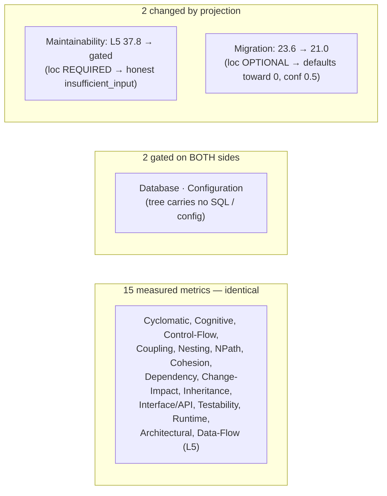

# BankingSystem — Source (Java) vs. Target (Python) Complexity Comparison

Side-by-side of the **source-side** complexity run and the **target-fit** run
produced by the `target-fit-complexity` skill.

- **Source artifact:** `outputs/BankingSystem/complexity_artifact.json` (language: Java)
- **Target artifact:** `outputs/BankingSystem/target/python/complexity_artifact.json` (target: Python)

> The target scores are **independently computed** by running the same 20
> analyzers against a *projected* tree — never carried over or reweighted from
> the Java numbers. The Java column is shown here for traceability only.
>
> ⚠️ The Python descriptor is **unreviewed**, so target scores are provisional
> (artifact confidence 0.6).

---

## Headline comparison

| | Source (Java) | Target (Python) |
|---|---|---|
| Overall level (worst case) | **L5** | **L5** |
| Average level | 2.28* | 2.12 |
| Coverage (measured / 20) | 18 / 20 | 17 / 20 |
| Units analysed | 38 | 38 (0 dropped in projection) |

\* Source average shifts slightly because the source measured Maintainability
(L5) which the target cannot.

---

## Per-metric, all 20

Legend: **=** identical · **▼** target lower · **gated** = insufficient_input.

| # | Complexity | Source (Java) | Target (Python) | Δ |
|---|---|---|---|---|
| 01 | Cyclomatic | L1 · 5.0 | L1 · 5.0 | = |
| 02 | Cognitive | L2 · 8.0 | L2 · 8.0 | = |
| 03 | Control Flow | L1 · 0.0 | L1 · 0.0 | = |
| 04 | Coupling | L1 · 4.0 | L1 · 4.0 | = |
| 05 | Nesting | L1 · 2.0 | L1 · 2.0 | = |
| 06 | NPath | L1 · 16.0 | L1 · 16.0 | = |
| 07 | Structural | L2 · 0.32 | L2 · 0.32 | = (target ran degraded, conf 0.85 → 0.85) |
| 08 | Cohesion | L2 · 2.0 | L2 · 2.0 | = |
| 09 | Dependency | L3 · 45.7 | L3 · 45.7 | = |
| 10 | Change Impact | L2 · 0.11 | L2 · 0.11 | = |
| 11 | **Maintainability** | **L5 · 37.8** | **gated** | ▼ requires `loc` (stripped) → honest gate |
| 12 | Data Flow | **L5 · 144.0** | **L5 · 144.0** | = (the shared finding) |
| 13 | Inheritance | L2 · 2.0 | L2 · 2.0 | = |
| 14 | Interface / API | L3 · 36.2 | L3 · 36.2 | = |
| 15 | Database | gated | gated | = (no SQL in tree, both sides) |
| 16 | Testability | L3 · 24.0 | L3 · 24.0 | = |
| 17 | Runtime | L3 · 25.0 | L3 · 25.0 | = |
| 18 | Configuration | gated | gated | = (no config in tree, both sides) |
| 19 | **Migration** | **L3 · 23.6** | **L3 · 21.0** | ▼ **−2.6** — artifact of stripped optional `loc`, not a real saving |
| 20 | Architectural | L1 · 7.2 | L1 · 7.2 | = |

**17 of 20 metrics are identical. Only 2 change, and both changes are caused by
the projection stripping volume fields — nothing else.**

---

## Why almost everything is identical

The 20 analyzers read a **Normalized Tree**, never source text. A faithful
Java→Python translation preserves:

- **decision points** → Cyclomatic, Cognitive, NPath, Control-Flow, Nesting
- **the call graph** → Coupling, Change-Impact, Architectural
- **shared data usage** → Data Flow (the L5 hotspot), Testability
- **the type hierarchy** → Inheritance, Cohesion, Interface/API

None of those depend on the language expressing them, so the projected Python
tree yields the same numbers. That is the whole point of computing target scores
from a projected tree rather than guessing them.

## Why the two that differ, differ — and how to read them

Projection **always strips `loc`, `comment_lines`, `halstead`** (there is no
honest way to project the size of code that doesn't yet exist). Two metrics
depend on `loc`, and they respond to its absence in opposite, *both correct*,
ways:

1. **Maintainability (#11) declares `loc` REQUIRED** → the central gate returns
   `insufficient_input` naming `loc`. This is the honest outcome: there is no
   Maintainability Index for code that hasn't been written. **Not a regression —
   the designed behavior.**

2. **Migration (#19) declares `loc` OPTIONAL** → the analyzer does *not* gate;
   its own existing code substitutes zero for the missing volume and keeps
   scoring, while confidence drops to **0.5** and names `loc` (plus `sql`,
   `platform_calls`, `dynamic_constructs`, `conditional_compilation`) in its
   reasons. The score falls 23.6 → 21.0 and "automatable" falls ~12% → ~3%
   **because a volume input defaulted toward zero — not because Python is easier
   to migrate to.**

> **Rule for reading any delta in this comparison:** before treating a lower
> target score as a real improvement, check that metric's own
> `confidence.reasons`. If it names a stripped field, the movement is a
> projection artifact, not a target-language finding. See
> `docs/target-fit-contract.md` → "The one sharp edge".

---

## Takeaway

Moving BankingSystem to Python changes **none** of its genuine complexity
findings: every unit is translatable (0 dropped), and the real problem — the
**shared-state data-flow hotspot in the 9 GUI Swing forms (Data Flow L5, 144)** —
is identical on both sides and is not fixed by a change of target language. The
only differences are the two `loc`-dependent metrics, both of which the harness
handles honestly rather than by inventing a number.
