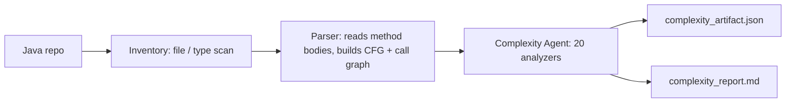
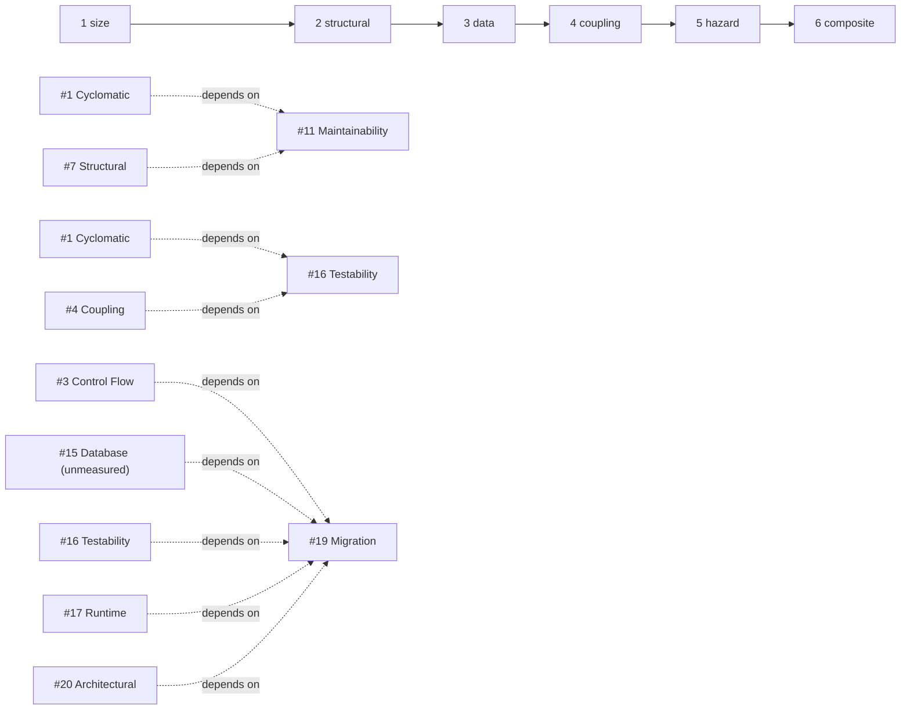

# Complexity Report — D:/adaptive-legacy-code-complexity-harness/samples/java_bank

## Table of contents

1. [About this report](#about-this-report)
2. [About this codebase](#about-this-codebase)
3. [Why we ran this analysis](#why-we-ran-this-analysis)
4. [From Java files to these numbers](#from-java-files-to-these-numbers)
5. [Overall complexity score](#overall-complexity-score)
6. [How we ordered the analysis](#how-we-ordered-the-analysis)
7. [What was measured, and why](#what-was-measured-and-why)
8. [Per-complexity deep dive](#per-complexity-deep-dive)
   - [07 Structural Complexity](#07-structural-complexity)
   - [01 Cyclomatic Complexity](#01-cyclomatic-complexity)
   - [02 Cognitive Complexity](#02-cognitive-complexity)
   - [03 Control Flow Complexity](#03-control-flow-complexity)
   - [05 Nesting Complexity](#05-nesting-complexity)
   - [06 NPath Complexity](#06-npath-complexity)
   - [17 Runtime Complexity](#17-runtime-complexity)
   - [12 Data Flow Complexity](#12-data-flow-complexity)
   - [04 Coupling Complexity](#04-coupling-complexity)
   - [08 Cohesion Complexity](#08-cohesion-complexity)
   - [09 Dependency Complexity](#09-dependency-complexity)
   - [10 Change Impact Complexity](#10-change-impact-complexity)
   - [13 Inheritance Complexity](#13-inheritance-complexity)
   - [14 Interface / API Complexity](#14-interface--api-complexity)
   - [20 Architectural Complexity](#20-architectural-complexity)
   - [11 Maintainability Complexity](#11-maintainability-complexity)
   - [16 Testability Complexity](#16-testability-complexity)
   - [19 Migration Complexity](#19-migration-complexity)
9. [Skills not measured](#skills-not-measured)
10. [Conclusion and recommended next steps](#conclusion-and-recommended-next-steps)

---

## About this report

A **complexity** measurement is a number produced by reading the codebase's
parsed structure — never the source text itself — and scoring one specific
way the code can be hard to work with: how many paths it has, how deeply it
nests, how many other units it is tangled up with, how expensive it might be
to run, and so on. Twenty such measurements ("skills") make up this harness.

Every skill bands its result into one of five levels, using the exact wording
this harness defines:

- **L1 trivial**
- **L2 low**
- **L3 moderate**
- **L4 high**
- **L5 severe**

**Confidence** is how sure a skill is in its own number, on a 0–1 scale. It
drops below 1.0 only when an optional input the skill would have liked to use
was missing from the parsed tree, or when a value had to be estimated rather
than read directly — never because "the code is confusing." A confidence of
1.0 means every input the skill wanted was present and used as-is.

**Coverage** is how many of the 20 skills could run at all, given what this
particular parsed tree actually contains. A skill that cannot run does not
report a zero — reporting a zero for something you never measured would be
indistinguishable from a genuine clean result, and this harness treats that
as a defect. Instead it reports `insufficient_input` and names exactly which
field of the tree it needed but didn't have.

---

## About this codebase

| Fact | Value | Source |
|---|---|---|
| Language | Java | `normalized_tree.json` `language` |
| Files scanned | 11 | `inventory_artifact.json` `meta.total_files_scanned` |
| Types | 12 | `normalized_tree.json` `types` (8 classes, 2 interfaces, 1 enum, and the nested `TransactionLog$Entry` class) |
| Packages | 2 | `inventory_artifact.json` `stats.packages` (`com.example.bank`, `com.example.bank.util`) |
| Units (methods/constructors) | 36 | `complexity_artifact.json` `tree.units` |
| Total lines of code across units | 184 | `reports/07_structural_complexity.json` `metrics.total_loc` |

**What the application appears to do (inference from naming, not a verified
fact).** The package and class names describe a small banking domain model:
`Account` and a `SavingsAccount` that extends it, a `Bank` that holds
accounts in a map and exposes `addAccount`, `findAccount`, `transfer` and
`classify`, a `Money` value type (cents + currency), a `TransactionLog` that
records transfers and can total them per account, an `InterestPolicy` /
`CompoundInterestPolicy` pair that computes monthly and annual interest
rates, an `AccountType` enum that classifies accounts by a balance
threshold (`BASIC`/`SILVER`/`GOLD`), an `InsufficientFundsException`, an
`Auditable` interface backing an audit trail on `Account`, and a
`util.Validation` helper for input checks. Read together, this is a
compact core-banking exercise — open accounts, deposit/withdraw with
validation and audit logging, transfer funds between accounts with logging,
classify accounts by balance tier, and accrue interest on savings — rather
than a fragment of a larger, unrelated system. At 11 files and 184 lines
this reads as a sample or teaching codebase, not a production estate, but
the domain vocabulary itself is unambiguous.

---

## Why we ran this analysis

This harness exists to answer one question defensibly: *which parts of this
codebase will hurt, how badly, and why do we believe it.* It is built to
support a modernization programme deciding what needs attention before code
like this is touched, migrated, or handed to a new team — and every score it
prints has to trace back to something a skill actually read in the parsed
tree, never to a guess dressed up as a measurement.

The commitment that shapes every number in this document: **if we don't have
what we need to measure something, we say so, instead of guessing and
calling it a score.** A skill that lacks its declared inputs reports
`insufficient_input` and names the missing field. It never prints a zero,
because a zero from a skill that never actually looked would be
indistinguishable from a skill that looked and found nothing — and only one
of those is a real finding.

---

## From Java files to these numbers

The pipeline that produced this report runs in three stages, each reading
only the output of the one before it.

**Step 1 — Inventory** (`inventory_artifact.json`). Scans the Java repository
file by file and records every top-level type, its package, and its
import/extends/implements facts. It is deliberately shallow — it never opens
a method body. This run scanned **11 Java files**, found **11 types** across
**2 packages** (`stats.types_total`, `stats.packages`,
`meta.total_files_scanned`).

**Step 2 — Parsing** (`normalized_tree.json`). Starts where inventory stops:
reads inside each method and constructor, builds the control-flow graph for
each one, the resolved call graph between methods, and the type dependency
graph between classes. This run produced **36 units** (methods/constructors)
across the **12 types** captured in the tree (one more than inventory's 11,
because the parser additionally resolves the nested `TransactionLog$Entry`
class that inventory's file-level scan does not surface as its own entry).

**Step 3 — Complexity analysis** (this report and `complexity_artifact.json`).
Reads the finished tree from Step 2 and never touches source code again.
Everything below this point is this stage's output.

**What's inside the tree, and who reads it.** Only the fields marked `true`
in `tree.capabilities` were available this run:

| Tree field | Plain meaning | Used by |
|---|---|---|
| `units` | One record per method/constructor: id, owner type, size, parameters | Nearly every skill |
| `cfg` | The control-flow graph inside each unit — branches, loops, calls, returns | Cyclomatic, Cognitive, Control Flow, Nesting, NPath, Runtime, Data Flow, Testability, Migration, Maintainability |
| `loc` | Lines of code per unit | Structural, Cyclomatic, Maintainability, Migration |
| `params` | Parameter names per unit | Data Flow, Interface/API |
| `references` | Variables/fields a unit reads or writes | Data Flow, Testability, Cohesion |
| `globals` | Shared/global state a unit touches | Testability |
| `writes` | State a unit mutates | Testability |
| `meta` | Flags per unit: exposed, static, constructor, abstract | Interface/API, Testability |
| `types` | Class/interface/enum hierarchy: fields, methods, extends, implements | Cohesion, Inheritance, Architectural, Interface/API |
| `call_graph` | Who calls whom between units | Coupling, Change Impact, Runtime, Cohesion, Architectural, Testability |
| `dependency_graph` | Module-to-module dependency edges, classified by kind | Dependency, Coupling, Change Impact, Architectural, Interface/API, Testability, Migration |

**Why some skills don't run.** Every skill declares exactly which tree
fields it needs before it is ever invoked, and the harness checks those
fields against `tree.capabilities` before running it — a field that is
`false` is why a skill is skipped, never a reason to guess at its value. In
this run, `sql`, `cursors`, `transactions`, `config_reads`, `literals`,
`conditional_compilation` and `feature_flags` are all `false`, which is the
direct cause of the two skills that did not run this time. See
[Skills not measured](#skills-not-measured) for the specifics.

**What this pipeline produced.** Every file actually on disk for this run:

| Stage | File | What it holds |
|---|---|---|
| Inventory | `inventory_artifact.json` | Every type found, its package, import/extends/implements facts |
| Parser | `normalized_tree.json` | The Normalized Tree — units, call graph, dependency graph |
| Complexity (per skill) | `reports/01_cyclomatic_complexity.json` … `reports/20_architectural_complexity.json` (20 files — 18 with `status: ok`, 2 with `status: insufficient_input`) | One JSON per skill, with its own metrics, items, confidence |
| Complexity (consolidated) | `complexity_artifact.json` | All 20 results merged into one machine-readable artifact |
| Complexity (human) | `complexity_report.md` | This document |

---

## Overall complexity score

Two numbers are shown, deliberately, because they answer different
questions and either one alone would mislead in a codebase this shape.

**Worst-case level: L3 (moderate)** — `overall.level` in the artifact, the
`max` across every skill that actually measured this run. This is the single
most severe finding anywhere in the codebase, so no one fine result can hide
a genuine problem elsewhere. Several skills independently reached L3 this
run (Runtime, Data Flow, Coupling, Cohesion, Interface/API, Maintainability,
Testability) — none reached L4 or L5.

**Average level: 1.94 — just under L2 (low)** — `overall.mean_level`, the
mean across every measured skill's level. This is the typical severity
across every dimension measured, and it is the better number for a
general-health read of the codebase as a whole.

Why both are shown: the worst-case number protects against dilution — a
handful of clean L1 results cannot average away one real L4/L5 finding
elsewhere. The average number does the opposite job — it prevents a single
L3 or L4 outlier from making the whole codebase look worse than it typically
is. Here the two numbers diverge only modestly (L3 worst-case vs. 1.94
mean), which is consistent with a codebase where several structural and
coupling skills land at "moderate" without any single skill flagging
something severe — not a contradiction, just confirmation that "moderate" is
spread across several dimensions rather than concentrated in one.

**Mean confidence: 0.93.** **Coverage: 18 of 20 skills measured (90%).** Two
skills — Database Complexity and Configuration Complexity — did not run
because the tree carries none of the fields they need; see
[Skills not measured](#skills-not-measured).

---

## How we ordered the analysis

The pipeline does not run skills in tier order first. It sorts them by
**dependency depth from `SPEC.depends_on` first** — an analyzer that needs
another skill's finished report never runs before that report exists.
**Tier band is the tiebreaker**, used only among skills that don't depend on
anything: size → structural → data → coupling → hazard → composite. **`sno`
is the final tiebreak**, purely so the plan is byte-identical on every run.

In practice, in this run, every skill except the three composites (11
Maintainability, 16 Testability, 19 Migration) has no declared dependency,
so tier band alone decided their order — and composites additionally wait on
the *specific* earlier skills named in their own `depends_on`, not just on
"composite" as a label: 11 depends on #1 and #7, 16 depends on #1 and #4, and
19 depends on #3, #15, #16, #17 and #20 (with #15 unavailable this run, so
19 ran with that one input estimated from the tree instead — see its
deep-dive section below).

The reading order the tiers give, one sentence each on why it makes sense
for a modernization read:

- **Size** comes first because scale sets context for everything that
  follows — a finding means something different in a 200-unit estate than
  in a 36-unit one.
- **Structural** comes next because it scores the shape of each unit on its
  own terms, before anything about how units relate to each other enters
  the picture.
- **Data** follows because it asks how values move once you already know
  how a unit's own control flow is shaped.
- **Coupling** comes after that because it is the first tier to look
  *between* units — what can be moved depends on what a unit calls and is
  called by.
- **Hazard** comes next because it scores external risk surfaces (database,
  configuration) that control-flow and coupling metrics are structurally
  blind to.
- **Composite** runs last because it synthesizes everything measured before
  it into overall maintainability, testability and migration judgments.

---

## What was measured, and why

| Tier | Skills that ran | Why this band matters here |
|---|---|---|
| 1 size | 07 Structural | Establishes scale (36 units, 184 LOC, 12 types) before any per-unit finding is read in context. |
| 2 structural | 01 Cyclomatic, 02 Cognitive, 03 Control Flow, 05 Nesting, 06 NPath, 17 Runtime | Scores each unit's own shape — branch count, readability, structuredness, nesting, path explosion, and execution cost. |
| 3 data | 12 Data Flow | Scores how values and shared state move through and between units, a dimension control-flow metrics don't see. |
| 4 coupling | 04 Coupling, 08 Cohesion, 09 Dependency, 10 Change Impact, 13 Inheritance, 14 Interface/API, 20 Architectural | Scores how units and modules bind to each other — what can be extracted, what breaks together, and where the seams are. |
| 5 hazard | none — both skills in this tier did not run | Would have scored external risk surfaces (database access, configuration) that this tree carries no evidence of either way. See [Skills not measured](#skills-not-measured). |
| 6 composite | 11 Maintainability, 16 Testability, 19 Migration | Synthesizes everything above into overall upkeep cost, test-readiness, and migration strategy. |

---

## Per-complexity deep dive

### 07 Structural Complexity

**What it is.** The shape and size of the codebase: how much there is, how
it is distributed, and whether that distribution is healthy.

**Why it matters here.** Every other skill in this report scores individual
units. This one reports the shape of the whole 36-unit, 184-line estate —
whether the code is spread evenly or concentrated in a few large units,
which is exactly the kind of thing an average complexity score cannot show.

**What we looked at, and how.** `inputs_used`: `units`, `cfg`, `loc`
(`inputs_missing_optional`: `comment_lines`). Method: size and statement
counts are taken per unit, then rolled up into concentration, spread and
outlier counts across the whole tree.

**What we found.** Headline: *"36 unit(s), 184 line(s); top 3 unit(s) hold
23% of the code; 3 outlier(s)"*. Score 0.23, level **L1 (trivial)**. The
top 10% of units by size (`concentration_top_decile` = 0.234) hold under a
quarter of the code, well short of the 0.60 threshold this skill treats as
"a handful of large units plus noise" — so the estate's size is genuinely
spread out rather than concentrated in a few units. Confidence is 0.85
because `comment_lines` was not present in the tree, so the comment-density
signal that would otherwise sharpen the outlier read is missing.

**Hotspots / items.** No corroborated hotspots (this skill reported none at
L4/L5), but its own top-10 largest units are `Bank.transfer` (16 LOC, 3
decision points), `TransactionLog.linked` (15 LOC), `Bank.describe` (12
LOC), `AccountType.forBalance` and `CompoundInterestPolicy.monthsToReach`
(9 LOC each), and `TransactionLog.totalFor` (9 LOC, the highest decision
density in the codebase at 33.33 decisions per 100 lines).

---

### 01 Cyclomatic Complexity

**What it is.** The number of linearly independent paths through a unit.

**Why it matters here.** It is the lower bound on how many test cases this
36-unit codebase needs for full branch coverage, and the number every
estimate conversation starts from.

**What we looked at, and how.** `inputs_used`: `units`, `cfg`, `loc`.
Method: v(G) = 1 + decision nodes per unit, counted from each unit's `cfg`.
`ELSE` and `DEFAULT` are deliberately not counted as decision points — the
path they represent already exists as the false arm of the branch above.

**What we found.** Headline: *"36 unit(s); max v(G) 4; 56 test case(s)
needed for branch coverage; 0 unit(s) above threshold"*. Score 4.0, level
**L1 (trivial)**, confidence 1.0. The most branch-heavy methods in the
codebase — `Bank.transfer` and `TransactionLog.totalFor` — each need only 4
test cases for full branch coverage, and covering every branch across all
36 units takes 56 test cases in total. No unit crossed this skill's
threshold for a second look.

**Hotspots / items.** No hotspots reported (none of the 36 units reached a
concerning band). The two units at the ceiling of this codebase, `v(G)=4`,
are `Bank.transfer` (an `IF`, an `OR`, and a `CATCH`) and
`TransactionLog.totalFor` (a `FOR`, an `IF`, and an `OR`).

---

### 02 Cognitive Complexity

**What it is.** How hard a unit is for a human to read and hold in their
head, as distinct from how many paths it has.

**Why it matters here.** Cyclomatic complexity does not care where branches
sit; cognitive complexity penalizes nesting, so it separates a flat branch
from a deeply nested one even when they'd score the same v(G).

**What we looked at, and how.** `inputs_used`: `units`, `cfg`, `loc`.
Method: +1 for each break in linear flow (if/loop/catch/jump), plus one
extra point per level of nesting depth at which that break sits; constructs
that don't break flow (like `else`) cost nothing.

**What we found.** Headline: *"36 unit(s); max cognitive 4; 0 unit(s) hard
because of NESTING rather than branch count"*. Score 4.0, level **L1
(trivial)**, confidence 1.0. The gap between cognitive and cyclomatic
complexity (`max_gap_vs_cyclomatic` = 0) shows every unit's difficulty here
comes from branch count itself, not from nesting making an otherwise-simple
branch hard to read — a flattening pass would not meaningfully help this
codebase, because there is nothing flattened to gain from.

**Hotspots / items.** No hotspots. The single most cognitively-loaded unit
is `TransactionLog.totalFor` at cognitive score 4 (matching its cyclomatic
score of 4), driven by branch count rather than nesting.

---

### 03 Control Flow Complexity

**What it is.** How structured the flow is — whether it reduces to clean
nested blocks, or contains jumps that make it irreducible.

**Why it matters here.** This is the skill that decides whether automated
translation of a unit is even mechanically possible, independent of how
many tests it would need.

**What we looked at, and how.** `inputs_used`: `units`, `cfg`
(`inputs_missing_optional`: none). Method: an unstructuredness index derived
from jump constructs present in the CFG (GOTO, ALTER, fall-through, multiple
exit points) — well-structured constructs like if/else, loops and case
reduce away and cost nothing.

**What we found.** Headline: *"36/36 unit(s) fully structured; 0 not
mechanically translatable; 0 contain ALTER"*. Score 1.0, level **L2 (low)**,
confidence 0.8. Confidence is reduced because this is computed as an
unstructuredness index from jump constructs rather than true McCabe ev(G) —
the CFG here is a node tree, not a graph with edges to reduce, so the true
essential-complexity calculation isn't available; this is a sound,
deliberately conservative proxy for it. Every one of the 36 units is fully
structured and mechanically translatable; the one unit that pulled the level
to L2 rather than L1 is `Bank.transfer`, flagged with an unstructuredness
index of 1.0 for having 3 exit points rather than a single return.

**Hotspots / items.** No hotspots list was populated, but `Bank.transfer` is
the only unit at L2 in this skill's own item list — every other unit sits at
L1 with an unstructuredness index of 0.0.

---

### 05 Nesting Complexity

**What it is.** How deeply control structures are stacked inside one
another.

**Why it matters here.** Nesting depth is the cheapest reliable predictor of
reading difficulty, and — unlike cyclomatic complexity — it directly maps to
a fix: flatten it.

**What we looked at, and how.** `inputs_used`: `units`, `cfg`. Method:
maximum and mean nesting depth per unit, plus the amount of code sitting
beyond a depth threshold; the deepest construct is reported by name and
line so a finding points somewhere specific.

**What we found.** Headline: *"36 unit(s); deepest nesting 2; 0 unit(s) at
depth >= 4; 31 flat"*. Score 2.0, level **L1 (trivial)**, confidence 1.0.
31 of the 36 units are entirely flat (no nesting at all), and the single
deepest unit in the codebase nests only 2 levels — well short of the depth-4
threshold this skill treats as worth a second look.

**Hotspots / items.** No hotspots. The deepest unit is
`TransactionLog.totalFor`, whose deepest construct is an `OR` at nesting
depth 2 (line 21); the next deepest units — `AccountType.forBalance`,
`Bank.transfer`, `CompoundInterestPolicy.monthsToReach` and
`util.Validation.requirePositive` — each nest only 1 level.

---

### 06 NPath Complexity

**What it is.** The number of distinct acyclic execution paths that
actually exist through a unit, as opposed to the number of paths a test
suite must exercise to hit every edge.

**Why it matters here.** It shows the gap between "we have full branch
coverage" and "we tested the combinations" — a gap that widens fast once
branches start compounding.

**What we looked at, and how.** `inputs_used`: `units`, `cfg`. Method:
paths multiply through sequence and add through branches — a unit with
independent branches b1..bn has PROD(paths(bi)) total paths.

**What we found.** Headline: *"36 unit(s); worst NPath 8; 0 unit(s) beyond
exhaustive path testing"*. Score 8.0, level **L1 (trivial)**, confidence
0.85. Confidence is reduced because NPath counting assumes branches are
independent; correlated conditions in real code make the true reachable
path count lower, so this number is technically an upper bound. Every unit
in this codebase remains exhaustively testable — none reached this skill's
cap or its concerning bands. The worst gap between "branch-covered" and
"combination-tested" is at `paths_per_branch_test` = 2.0, meaning the
worst unit here needs twice as many tests to cover every path combination
as it does to just cover every branch — a small, manageable gap.

**Hotspots / items.** No hotspots. `Bank.transfer` and
`TransactionLog.totalFor` are tied for the worst NPath in the codebase at 8
each (both v(G)=4).

---

### 17 Runtime Complexity

**What it is.** The expected cost of executing the code — its algorithmic
growth class and the work it does per unit of input.

**Why it matters here.** Every other structural skill measures how hard code
is to read or change; this is the only one that predicts what happens under
production data volume, which matters directly if this domain model is ever
put behind real account and transaction counts.

**What we looked at, and how.** `inputs_used`: `units`, `cfg`, `call_graph`
(`inputs_missing_optional`: none at the summary level, though individual
items note missing per-iteration cost signals). Method: a growth class per
unit is derived from loop-nesting depth (depth *d* implies O(n^d));
recursion overrides that — self-recursion inside a loop, or a mutual
recursion cycle, implies exponential behaviour, and I/O or SQL inside a
loop is weighted far above pure computation.

**What we found.** Headline: *"36 unit(s); 0 super-linear; 0 with I/O or
SQL inside a loop; 1 recursive"*. Score 20.2, level **L3 (moderate)**,
confidence 1.0 at the skill level. The growth-class distribution is 30
units at O(1), 5 at O(n), and 1 "O(n) recursive." That one recursive unit —
`CompoundInterestPolicy.rate`, which calls itself to accumulate a compound
rate — is what drives this skill's score to L3: it carries its own
per-item confidence of only 0.85 and is explicitly flagged with the reason
*"recursive - termination and depth need explicit review"*, because
recursion changes a unit's growth behaviour in a way structural nesting
alone cannot confirm is safely bounded. Several of the O(n) units (e.g.
`AccountType.forBalance`, `InterestPolicy.annualRate`,
`SavingsAccount.applyInterest`, `TransactionLog.totalFor`) also carry
reduced per-item confidence (0.65) because their loop nodes carry no
`bounded` flag, so growth is inferred from nesting alone and may overstate
units that actually iterate a small, fixed-size structure (like the
three-member `AccountType` enum).

**Hotspots / items.** No hotspots list populated, but the single item that
sets this skill's level is `CompoundInterestPolicy.rate` (score 20.2, level
L3) — every other unit in the codebase sits at L1 or L2.

---

### 12 Data Flow Complexity

**What it is.** How values and data move across statements, units and
modules — the transformations, side effects and data dependencies that make
code hard to reason about.

**Why it matters here.** It reveals which units are coupled through shared
state rather than through calls — state coupling is invisible to control-flow
metrics but just as real a barrier to moving code independently.

**What we looked at, and how.** `inputs_used`: `units`, `cfg`. Method:
def-use style signals are built per unit — how many distinct data elements
it touches, how many it passes to callees, and how much shared state it
reads or writes — then rolled up per unit and per module.

**What we found.** Headline: *"36 unit(s); max data-flow score 16.0; 10
shared data element(s); 0 data-heavy unit(s)"*. Score 16.0, level **L3
(moderate)**, confidence 1.0. `Bank.transfer` sets this skill's ceiling: it
fans out to 8 downstream calls even though it references only one piece of
data directly, which is exactly the "orchestrator moving data between many
collaborators" shape this skill is built to catch. 10 of the 16 distinct
data elements in the tree are shared — read or written by more than one
unit — which is what makes `Account` (per-module data-flow score 43.0, the
highest in the codebase) and `Bank` (33.5) the modules most entangled
through state rather than through calls.

**Hotspots / items.** No hotspots list populated (no unit reached L4/L5),
but the skill's own top item is `Bank.transfer` (score 16.0, L3), followed
by `Account.Account`'s constructor (score 12.0, L2, 3 shared data
references) and `Account.withdraw` (score 11.5, L2).

---

### 04 Coupling Complexity

**What it is.** How tightly units are bound to each other — what calls them
and what they call.

**Why it matters here.** Coupling decides what can be moved independently; a
unit that is internally trivial can still be impossible to extract if
enough other units depend on it.

**What we looked at, and how.** `inputs_used`: `units`, `call_graph`,
`dependency_graph`. Method: fan-in (who calls me) and fan-out (who I call)
per unit, combined via the Henry & Kafura information-flow formula
`(fan_in × fan_out)²` — squared because a unit that is both heavily called
*and* calls widely is a routing hub, and removing one of those is a project,
not a task.

**What we found.** Headline: *"36 unit(s); 0 hub(s); 33 independently
extractable; 15 isolated"*. Score 36.0, level **L3 (moderate)**, confidence
1.0. No unit in the codebase qualifies as a hub (called by many *and*
calling many), and 33 of 36 units (91.7%) are independently extractable.
The unit driving this skill's L3 score is `Account.withdraw`, with fan-in 2
and fan-out 3, giving an information-flow score of `(2×3)² = 36` — high
enough to set the ceiling, but still a single ordinary unit, not a
structural hub. `Account.audit` (fan-in 4) and `Money.Money`'s constructor
(fan-in 3) are flagged as "utility" units — called from many places but
calling out to nothing, which this skill's own role guide describes as
"safe while its contract holds." `Bank.transfer` is flagged as the
codebase's sole "orchestrator" (fan-out 6, fan-in 0) — the unit that moves
only together with everything it calls.

**Hotspots / items.** No hotspots list populated. The skill's own ceiling
item is `Account.withdraw` (score 36.0, L3); every other unit sits at L1.

---

### 08 Cohesion Complexity

**What it is.** How closely related the responsibilities inside a class are
— whether its methods actually share the same state.

**Why it matters here.** Low cohesion signals a class doing more than one
job, which is exactly the kind of thing that resists a clean split during
modernization.

**What we looked at, and how.** `inputs_used`: `units`, `types`. Method:
for every type, LCOM4 (the number of independent method clusters that share
no state with each other) and a normalized LCOM-HS score are computed from
which methods touch which fields.

**What we found.** Headline: *"12 type(s); worst LCOM4 3; 2 type(s) with
low cohesion (>=3 components)"*. Score 3.0, level **L3 (moderate)**,
confidence 1.0. Two of the 12 types in this codebase — `Bank` and
`util.Validation` — score an LCOM4 of 3, meaning each can be split into 3
independent clusters of methods along lines its own code already draws,
because those clusters share no state with one another. For `Bank` (5
methods, 2 fields, 1 shared pair out of 10 possible), most of its methods
don't actually touch its own `accounts`/`log` fields together. For
`util.Validation` (3 static methods, 0 fields), the LCOM4 of 3 simply
reflects that it is a stateless utility class where every method is already
its own independent unit — an LCOM4 finding here isn't a design flaw so
much as confirmation that this class holds no shared state to begin with.

**Hotspots / items.** Two hotspots: `Bank` (LCOM4 3, LCOM-HS 0.875, level
L3) and `util.Validation` (LCOM4 3, LCOM-HS 1.0, level L3).

---

### 09 Dependency Complexity

**What it is.** Internal, external, library, API, database and platform
dependencies of the codebase, and how they're structured.

**Why it matters here.** Dependencies are a major driver of both migration
effort and upgrade risk — every module this skill measures is a module that
has to be accounted for if the codebase moves.

**What we looked at, and how.** `inputs_used`: `dependency_graph`. Method:
reads the dependency graph, classifies each edge by kind, computes fan-in
and fan-out per module, detects dependency cycles, and measures how deep
the dependency chains run.

**What we found.** Headline: *"16 module(s); 6 external dependency/ies;
longest chain 2; 0 dependency cycle(s)"*. Score 29.6, level **L2 (low)**,
confidence 1.0. Of the 10 total dependency edges in the tree, 6 are
`library` edges (to `java.util.ArrayList`, `List`, `HashMap`, `Map`) and 4
are `internal` edges between the codebase's own classes — there are no
`external`, `api`, `db` or `platform` edges at all. No dependency cycles
exist anywhere, and the longest dependency chain is only 2 hops. `Bank`,
`TransactionLog`, `CompoundInterestPolicy` and `SavingsAccount` each carry
an instability of 1.0 (fan-out with no fan-in — nothing depends on them,
they only depend outward), which is unremarkable in a small, mostly-leaf
domain model like this one.

**Hotspots / items.** Ten modules listed with their fan-in/fan-out/
instability: `Account` (fan-out 4, instability 0.8) is the most-depended-on
internal module with meaningful outward reach; `Bank`, `TransactionLog`,
`CompoundInterestPolicy` and `SavingsAccount` are pure "instability 1.0"
leaves; `java.util.ArrayList` and `java.util.List` are the most-depended-on
library types (fan-in 2 each).

---

### 10 Change Impact Complexity

**What it is.** How widely a change to one component can ripple through the
system — its "blast radius."

**Why it matters here.** It answers, concretely, "if I touch this unit,
what else needs to be retested" — the direct input to sizing a regression
pass before any change.

**What we looked at, and how.** `inputs_used`: `call_graph`,
`dependency_graph`, `units`. Method: walks the call graph and dependency
graph *backwards* from each component to compute the full set of
components that transitively depend on it — its impact set.

**What we found.** Headline: *"52 component(s); 0 high-impact; worst change
reaches 9% of the system"*. Score 0.1, level **L2 (low)**, confidence 1.0.
Across the 52 components this skill tracks (units plus modules), no
component reaches this skill's "high-impact" band, and the single worst
blast radius in the codebase — `Account.audit`, with 4 direct callers and a
blast radius of 5 — still only reaches 9.8% of the system
(`impact_ratio` = 0.098). That is a small, well-contained regression
surface for any single change in this codebase.

**Hotspots / items.** Ten hotspots listed, topped by `Account.audit`
(impact ratio 0.098, L2), `util.Validation.requirePositive` (0.078, L2), and
three components tied at 0.059 (`InsufficientFundsException`'s constructor,
`Money.Money`'s constructor, and `java.util.ArrayList`/`java.util.List` as
shared library dependencies).

---

### 13 Inheritance Complexity

**What it is.** Complexity introduced by inheritance hierarchies — how far
you have to follow a chain to know what a class actually does.

**Why it matters here.** Deep or wide inheritance makes behaviour hard to
trace; this skill checks whether that risk exists in this codebase's class
hierarchy at all.

**What we looked at, and how.** `inputs_used`: `types`. Method: classic OO
hierarchy metrics computed from the class hierarchy — DIT (depth of
inheritance tree), NOC (number of children), and multiple-inheritance /
interface fan-in signals.

**What we found.** Headline: *"12 type(s); max inheritance depth 1; widest
base has 1 child(ren); 0 deep hierarchy(ies)"*. Score 1.0, level **L1
(trivial)**, confidence 1.0. The only inheritance relationship in the
codebase is `SavingsAccount extends Account` — a single level deep (DIT 1),
with `Account` having exactly one child (NOC 1). No type in this codebase
uses multiple inheritance, and there is nothing resembling a deep hierarchy
to trace.

**Hotspots / items.** No hotspots. `SavingsAccount` is the only type with a
non-zero score (1.0, L1) in this skill's item list; every other type scores
0.0.

---

### 14 Interface / API Complexity

**What it is.** Complexity of the interfaces, endpoints and contracts a
system exposes.

**Why it matters here.** A wide exposed surface is expensive to change and
expensive to integrate against — this skill measures how much of this
codebase's surface is public and how heavy each exposed operation is.

**What we looked at, and how.** `inputs_used`: `units`, `meta`,
`dependency_graph`. Method: counts exposed operations (public
interface/endpoint methods), parameters per operation, distinct
schemas/DTOs referenced, and upstream/downstream API contract edges.

**What we found.** Headline: *"33 exposed operation(s); avg 1.12 param(s)
/op; 0 schema(s); 0 external API contract(s)"*. Score 35.8, level **L3
(moderate)**, confidence 1.0. 33 of the codebase's 36 units are flagged
`exposed` (public), which is a genuinely wide surface for a codebase this
small, though the average operation carries only 1.12 parameters — this is
a breadth problem, not a depth problem. There are no distinct schemas/DTOs
and no external API contract edges at all, so nothing here crosses a
service boundary; the surface is entirely Java's own public-method
visibility. `SavingsAccount`'s constructor is the heaviest single operation
at 4 parameters, followed by `Account`'s constructor, `Bank.transfer` and
`TransactionLog.record` at 3 parameters each.

**Hotspots / items.** No hotspots list populated, but the skill's own top
items are `SavingsAccount.SavingsAccount` (4 params, score 4.0, L2),
`Account.Account`, `Bank.transfer` and `TransactionLog.record` (3 params
each, score 3.0, L2).

---

### 20 Architectural Complexity

**What it is.** Structural quality of the system above the unit level — how
modules depend on each other, whether layers hold, and where the natural
seams for decomposition are.

**Why it matters here.** A codebase of clean units can still be
architecturally unsplittable, and vice versa — this is the only skill that
answers "can this be decomposed, and where do we cut?" for the codebase as
a whole.

**What we looked at, and how.** `inputs_used`: `dependency_graph`, `types`,
`call_graph`, `units` (`inputs_missing_optional`: `layers`). Method: four
independent structural signals, each with a different remedy — dependency
cycles, Martin instability/abstractness zones, layering violations, and
hub/god units.

**What we found.** Headline: *"16 module(s); 0 dependency cycle(s) covering
0 module(s); 0 layering violation(s); 0 hub unit(s)"*. Score 0.9, level
**L1 (trivial)**, confidence 0.9. Confidence is reduced because the tree
carries no `layers` declaration, so the layering-violations dimension could
not be checked at all — its caveat states this plainly: *"No layer
declaration - layering violations not checked."* Every other dimension
this skill checks came back clean: no dependency cycles, no god units, no
hub units. This codebase, as a set of modules, is architecturally
unremarkable — there is nothing here resisting decomposition.

**Hotspots / items.** No hotspots and no god units or cycles listed. Every
one of the 16 modules is reported individually with its afferent/efferent
coupling; none crosses into a "zone of pain" or "zone of uselessness"
because `abstractness` could not be computed without a fuller type-role
signal for several modules (reported as `null` where not applicable).

---

### 11 Maintainability Complexity

**What it is.** Overall difficulty of maintaining the code over time,
expressed as the industry-standard Maintainability Index (0–100, higher is
easier to maintain).

**Why it matters here.** It is a transparent composite of size, cyclomatic
complexity, code volume and comment density — useful exactly because it
supports a takeover or technical-debt conversation without inventing a new
metric.

**What we looked at, and how.** `inputs_used`: `units`, `cfg`, `loc`
(`inputs_missing_optional`: `halstead`, `comment_lines`). This skill depends
on #1 (Cyclomatic) and #7 (Structural) having already run. Method: combines
LOC, cyclomatic complexity, Halstead volume and comment density into the
Microsoft/SEI Maintainability Index formula, then bands the LOC-weighted
result across the codebase.

**What we found.** Headline: *"36 unit(s); LOC-weighted Maintainability
Index 68.0/100; 0 hard-to-maintain unit(s)"*. Score 68.0, level **L3
(moderate)**, confidence 0.7. Confidence is reduced for two stated reasons:
`halstead` volume was not present in the tree, so it was estimated from
size and branching rather than read directly, and `comment_lines` was
absent, so the comment-density bonus this formula normally applies was
omitted entirely — both push the estimate toward the conservative side.
No unit crossed this skill's hard-to-maintain threshold. The single worst
unit is `Bank.transfer` at an MI of 54.3 — driven by its larger Halstead
volume (505.8, the highest in the codebase) rather than by its cyclomatic
complexity alone, which this skill's own interpretation note calls "a
simplify-the-logic problem" when volume dominates over LOC.

**Hotspots / items.** No hotspots list populated. `Bank.transfer` (MI 54.3,
L3) is this skill's own worst unit, followed by `TransactionLog.linked`
(MI 56.9), `Bank.describe` (MI 59.2), and `TransactionLog.totalFor` /
`AccountType.forBalance` (MI 61.9 and 62.4 respectively).

---

### 16 Testability Complexity

**What it is.** How hard it is to get a unit under test at all, separated
from how many tests it would then take to cover it.

**Why it matters here.** Modernization is only safe behind a
characterization-test net, and testability — not cyclomatic complexity — is
what predicts whether that net can actually be built for this codebase.

**What we looked at, and how.** `inputs_used`: `units`, `cfg`, `references`,
`globals`, `writes`, `call_graph`, `dependency_graph`, `meta`
(`inputs_missing_optional`: none). This skill depends on #1 (Cyclomatic)
and #4 (Coupling). Method: separates test *burden* (how many paths need
covering, from cyclomatic complexity) from test *friction* (hidden inputs,
shared-state writes, collaborators needing mocks, missing substitution
seams) — friction is weighted far harder than burden because it is what
actually blocks a test being written at all.

**What we found.** Headline: *"36 unit(s); ~56 test case(s) for branch
coverage; 0 unit(s) blocked or hostile to isolation"*. Score 19.0, level
**L3 (moderate)**, confidence 1.0. Every one of the 36 units is classified
"tractable" — callable in isolation once its paths are covered; none is
"blocked" (unreachable without a seam first) or "hostile" (many paths and
heavy friction together). That said, 26 of the 36 units (72%) have at least
one hidden input — state read without being passed as a parameter — which
is the most common single blocker recorded across the codebase. The unit
driving this skill's L3 ceiling is `Account`'s own constructor (test
friction 18.5: 3 hidden inputs plus 3 writes to shared state that a test
would need to reset), closely followed by the nested `TransactionLog$Entry`
constructor (friction 16.5, same shape).

**Hotspots / items.** No hotspots list populated. The skill's own worst
items are `Account.Account`'s constructor (score 19.0, L3, blocked by "3
hidden input(s)" and "3 write(s) to shared state") and
`TransactionLog$Entry.Entry`'s constructor (score 17.0, L3, same two
blockers). `AccountType.forBalance` and `util.Validation`'s two static
methods are separately flagged for having no substitution seam at all
(static methods cannot be swapped out for a test double).

---

### 19 Migration Complexity

**What it is.** The effort and risk of moving this code to a different
language, runtime or platform — and which of the standard migration
strategies (rehost / replatform / refactor / rearchitect / rebuild) it can
actually support.

**Why it matters here.** This is the question a modernization programme is
actually funded to answer; every other skill in this report is, in effect,
an input to this one.

**What we looked at, and how.** `inputs_used`: `units`, `cfg`,
`dependency_graph`, `loc` (`inputs_missing_optional`: `sql`,
`platform_calls`, `dynamic_constructs`, `conditional_compilation`). This
skill depends on #3, #15, #16, #17 and #20 — of those, `upstream_used`
records that Architectural (#20), Runtime (#17) and Testability (#16) were
actually supplied as finished reports this run, while Database (#15) was
not available (it did not measure — see
[Skills not measured](#skills-not-measured)) and its contribution to this
score was estimated from the tree instead. Method: scores volume (how much
code there is to move — scales linearly, shrinks with automation)
separately from blockers (what defeats automated translation entirely —
does not scale with size), then maps the pair onto a Gartner 5R migration
strategy.

**What we found.** Headline: *"36 unit(s); 0 require rearchitecture or
rebuild; ~18% of the work is plausibly automatable; 0 translation
blocker(s) found"*. Score 4.1, level **L1 (trivial)**, confidence 0.6.
Confidence is the lowest of any skill in this report, for a stated and
specific reason: four optional inputs this skill would use to sharpen its
read — `sql`, `platform_calls`, `dynamic_constructs`, and
`conditional_compilation` — are all absent from the tree, on top of the
Database report not being available to draw on. Every one of the 36 units
is recommended for the same strategy: `rehost` (lift-and-shift, code
substantially unchanged) — `strategy_distribution` shows 100% rehost, and
zero units require refactor, rearchitect or rebuild. The portfolio-wide
automatable fraction is 18%, and the unit with the highest migration score,
`Bank.transfer` (4.1, still L1), is only elevated because of its larger
code volume, not because it carries any translation blocker.

**Hotspots / items.** Ten hotspots listed, all at level L1, topped by
`Bank.transfer` (score 4.1) and `Account.withdraw` (score 3.4) — both
driven by volume score, not by blockers, since every unit's `blockers` list
is empty.

---

## Skills not measured

**15 Database Complexity** would have scored how hard this codebase's
relationship with persistent data is to understand, change and migrate —
SQL surface, schema reach, statement shape, dynamic SQL, and transaction
control, plus access-pattern penalties like SQL inside a loop. It did not
run because the tree carries none of `sql`, `cursors` or `transactions`,
and this skill requires at least one of them. `inventory_artifact.json`
does carry a `sql_registry` field — present as an empty list (`[]`) rather
than absent entirely — which is evidence toward this codebase genuinely
having no SQL access (`stats.sql_files` is also 0), though inventory is
deliberately shallow and never opens a method body, so this is evidence
toward a genuine absence, not a settled verdict.

**18 Configuration Complexity** would have scored how much of this
codebase's behaviour is decided outside the source code — config keys, env
vars, feature flags, conditional compilation, and hardcoded values that
should be config. It did not run because the tree carries none of
`config_reads`, `literals`, `conditional_compilation` or `feature_flags`,
and this skill requires at least one of them. `inventory_artifact.json`
carries a `config_registry` field, also present as an empty list rather
than absent, and its `stats.config_files` and `stats.build_files` are both
0 — again evidence toward genuine absence (a small domain-model sample with
no external configuration surface) rather than a confirmed parser gap, but
not a conclusive one, since the current parser does not extract literals or
`System.getProperty`/`System.getenv` calls at all, so a codebase that *did*
read configuration this way would currently look identical to this one.

---

## Conclusion and recommended next steps

Overall, this codebase sits at **L3 (moderate)** on its single worst
finding and **1.94 — just under L2 (low)** on its average across every
measured dimension: nothing reached L4 or L5 anywhere, and the harness
found zero corroborated hotspots (no unit was independently flagged L4/L5
by two or more skills). The complexities most worth a second look are
**Runtime Complexity**, because `CompoundInterestPolicy.rate` is the one
genuinely recursive unit in the codebase and is explicitly flagged as
needing "termination and depth" reviewed by a human rather than inferred
from structure alone; **Testability Complexity**, because 26 of 36 units
(72%) read hidden state rather than receiving it as a parameter, with
`Account`'s and `TransactionLog$Entry`'s constructors the most expensive to
isolate; and **Cohesion Complexity**, because `Bank` and `util.Validation`
both split cleanly into 3 independent method clusters (LCOM4 = 3), which is
a concrete, low-risk refactor target if this domain model grows. Coverage
was **18 of 20 skills (90%)** — Database and Configuration Complexity did
not run, for reasons stated plainly in this report rather than approximated,
so this is not a full 20/20 read of the codebase, and any conclusion about
its data or configuration risk surface should be treated as unknown, not as
"clean."

Concrete next steps:

1. Review `CompoundInterestPolicy.rate`'s recursion by hand — confirm it
   terminates for all realistic `month` inputs before this code is trusted
   under a wider range of account tenures than it has likely been tested
   against.
2. Treat `Account.Account` and `TransactionLog$Entry.Entry` (both flagged
   L3 by Testability, with the most hidden inputs and shared-state writes
   in the codebase) as the first candidates for characterization tests
   before any refactor, since they are the hardest units to isolate today.
3. If this codebase grows, split `Bank` and `util.Validation` along the
   method clusters Cohesion Complexity already identified (LCOM4 = 3 each)
   rather than letting either accumulate more unrelated responsibilities.
4. If a costing-grade migration estimate is ever needed, prioritize having
   the parser emit `sql`, `config_reads`/`literals`, `platform_calls`,
   `dynamic_constructs`, `conditional_compilation` and `halstead` — five of
   the six skills with reduced confidence or non-measurement this run
   (Control Flow, Runtime items, Maintainability, Migration, Database,
   Configuration) trace directly back to one of these fields being absent
   from the tree.
